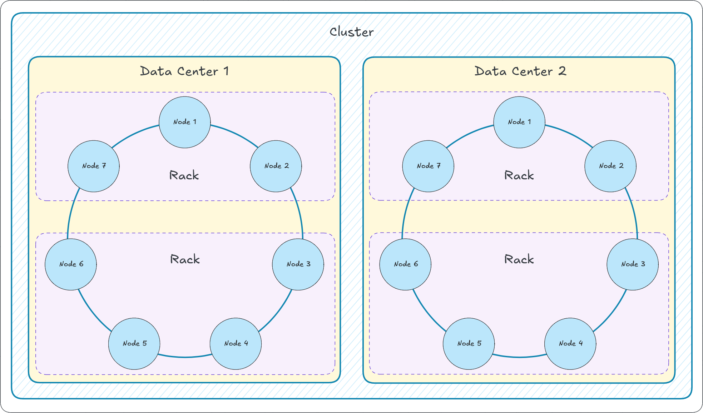
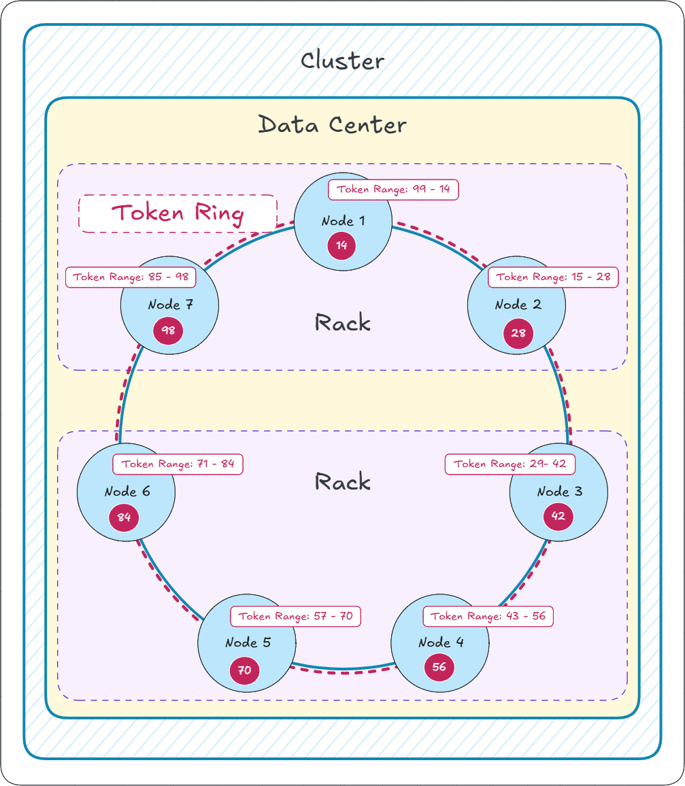

# Apache Cassandra - Introduction

- [Overview](#overview)
- [History and Origins](#history-and-origins)
- [Why Cassandra and The Problems It Solves](#why-cassandra-and-the-problems-it-solves)
- [Key Features](#key-features)
- [Use Cases and Advantages](#use-cases-and-advantages)
- [Architecture Overview](#architecture-overview)
  - [Key Components](#key-components)
    - [Data Center](#data-center)
    - [Cluster](#cluster)
    - [Rack](#rack)
    - [Node](#node)
    - [Virtual Node](#virtual-node)
    - [Token and Token Ring](#token-and-token-ring)
  - [Component Interactions](#component-interactions)
- [Data Modeling Best Practices](#data-modeling-best-practices)
- [Operations \& Management](#operations--management)
- [Security and Compliance](#security-and-compliance)
- [Ecosystem \& Tooling](#ecosystem--tooling)
- [Common Pitfalls \& Anti-patterns](#common-pitfalls--anti-patterns)
- [Further Reading \& Resources](#further-reading--resources)

## Overview

Apache Cassandra is an open-source, distributed NoSQL database management system designed to handle large amounts of data across multiple commodity servers or data centers with high availability and no single point of failure. It uses a partitioned wide-column storage model, which allows for flexible schema design where data is organized into rows and columns, but columns can vary per row. Unlike traditional relational databases, Cassandra is non-relational (NoSQL), emphasizing scalability, performance, and fault tolerance over strict ACID compliance, opting instead for eventual consistency.

 

> [!NOTE]
>
> 📚 **See Official Documentation:**
>
> - [Cassandra Documentation](https://cassandra.apache.org/doc/latest)
> - [Cassandra Basics](https://cassandra.apache.org/_/cassandra-basics.html)

 

---

## History and Origins

Cassandra was originally developed at Facebook in 2007 to address the need for a highly scalable inbox search system capable of managing petabytes of data. It combines elements from Amazon's DynamoDB (for distribution and availability) and Google's Bigtable (for the data model). In 2008, Facebook open-sourced it, and it became an Apache Incubator project, graduating to a top-level Apache project in 2010. Today, it's maintained by the Apache Software Foundation and widely used by companies like Netflix, Apple, and Uber for applications requiring real-time data processing and high throughput.

| Year                 | Event/Milestone                                 | Significance                                                                                                                                                                                                                                                                          |
| :------------------- | :---------------------------------------------- | :------------------------------------------------------------------------------------------------------------------------------------------------------------------------------------------------------------------------------------------------------------------------------------ |
| **2007**             | **In-house development at Facebook**            | Developed by Avinash Lakshman and Prashant Malik to power the Facebook **Inbox Search** feature, addressing massive scalability and high-availability requirements. It was designed as a hybrid of Google's **Bigtable** data model and Amazon's **Dynamo** distributed architecture. |
| **2008 (July)**      | **Released as Open Source**                     | Facebook released the code on Google Code, marking the start of its life as an open-source project.                                                                                                                                                                                   |
| **2009 (March)**     | **Accepted into Apache Incubator**              | The project was moved to the Apache Software Foundation for governance and community growth, increasing its credibility and adoption.                                                                                                                                                 |
| **2010 (February)**  | **Graduates to Apache Top-Level Project (TLP)** | This graduation signified a mature project with an active, self-governing community, fully under the Apache umbrella.                                                                                                                                                                 |
| **2011 (June)**      | **Cassandra 0.8 / Introduction of CQL**         | The **Cassandra Query Language (CQL)** was introduced. CQL provided a more familiar, SQL-like interface, abstracting away the initial, more complex Thrift API, which significantly lowered the barrier to entry for developers.                                                      |
| **2011 (October)**   | **Cassandra 1.0 Release**                       | A major milestone focused on improved read performance, compression, and **Leveled Compaction**, enhancing disk space management and read efficiency.                                                                                                                                 |
| **2013 (September)** | **Cassandra 2.0 Release**                       | Introduced **Lightweight Transactions (LWTs)** based on the Paxos consensus protocol, allowing for conditional updates and enabling more complex application logic while preserving eventual consistency for most operations.                                                         |
| **2015 (November)**  | **Cassandra 3.0 Release**                       | Featured significant improvements to the storage engine, including a new **SSTable format**, and introduced **Materialized Views** (initially experimental), which simplified some data modeling challenges.                                                                          |
| **2021 (July)**      | **Cassandra 4.0 Release**                       | One of the most tested releases, focusing heavily on **stability, operational manageability, and performance**. Key features included **Zero-Copy Streaming** (for faster node repair and data movement), **Audit Logging**, and support for **Java 11**.                             |
| **2023 (March)**     | **Cassandra 4.1 Release**                       | Introduced **Storage-Attached Indexing (SAI)**, which is an improved secondary indexing mechanism. It also enhanced **virtual tables** and added initial **Vector Search** capabilities, preparing Cassandra for AI/ML workloads.                                                     |
| **2024 (January)**   | **Cassandra 5.0 Release**                       | Includes Storage Attached Indexes (SAI) as default, Trie memtables and SSTables for efficiency, full JDK 17 support (up to 20% performance gains), Unified Compaction Strategy, vector search for ANN, and dynamic data masking for security.                                         |

 

> [!NOTE]
>
> Key Takeaways
> 
> - **Origins:** Cassandra's initial strength came from combining the best ideas of two pioneering distributed systems: **Dynamo** (decentralized, high-availability architecture) and **Bigtable** (column-family data model).
> - **Ease of Use:** The introduction of **CQL** in version 0.8/1.0 was critical, making the database far more accessible to a broader developer audience.
> - **Maturity:** Major releases (especially 4.0 and 5.0) have focused on operational robustness, modernizing the codebase, and adding cutting-edge features like **Vector Search** for AI applications.

 

---

## Why Cassandra and The Problems It Solves

In the era of massive data volume (petabytes) and continuous uptime requirements, traditional relational databases (RDBMS) often hit their limits due to their architecture, which typically relies on vertical scaling and complex distributed transactions. Cassandra was built from the ground up to overcome the limitations of relational database management systems. For example:

- **Global Scale and Linear Scalability:**
  
  Cassandra is a distributed database designed to spread data across many commodity servers, forming a cluster known as a ring. You increase capacity and throughput simply by adding more nodes (commodity servers), without downtime. This is known as horizontal or linear scalability.

- **Always On Architecture (No Single Point of Failure (SPOF)):**
  
  Unlike traditional master-slave setups, Cassandra uses a peer-to-peer design where every node is equal. Data is automatically replicated across multiple nodes and even multiple data centers, ensuring your application remains available even if entire servers or data centers fail.

- **Speed for Writes:**
  
  For write-heavy workloads (e.g., logging sensor data from IoT devices or real-time user interactions), a relational database (RDBMS) can slow down due to locking or indexing overhead. Cassandra uses a log-structured merge-tree (LSM-tree) with write-ahead logging (WAL) for fast, sequential writes, making it perfect for streaming data pipelines.

- **Handling Massive, Diverse Data Volumes:**
  
  It manages structured, semi-structured, or unstructured data across petabytes without schema rigidity, solving issues in big data environments like banking fraud detection or content recommendation systems where data formats evolve. 

Cassandra is not suitable for every use case, and should be avoided for the following scenarios:

- if you need full ACID transactions
- if you need complex joins
- if you need relational integrity

 

> [!IMPORTANT]
> &nbsp;  
> Cassandra prioritizes availability and partition tolerance ([per CAP theorem](https://en.wikipedia.org/wiki/CAP_theorem)) over strict consistency.
> &nbsp;  
> &nbsp;  

 

---

## Key Features

Briefly, the key features and characteristics of Cassandra are summarised as follows:

 

| Category            | Feature                             | Description                                                                                                                                  |
| ------------------- | ----------------------------------- | -------------------------------------------------------------------------------------------------------------------------------------------- |
| Architecture        | Decentralised and Masterless design | A peer-to-peer architecture where every node is equal. This eliminates any Single Point of Failure (SPOF), ensuring continuous availability. |
| Scalability         | Linear horizontal growth            | Throughput increases proportionally (linearly) as new, commodity nodes are added to the cluster without downtime.                            |
| Fault Tolerance     | Replication & repair                | Automatic recovery from failures                                                                                                             |
| Consistency         | Tunable levels                      | Balance availability and accuracy                                                                                                            |
| Data Model          | Wide-column store                   | Flexible rows and sparse data support                                                                                                        |
| Query Language      | CQL (Cassandra Query Language)      | SQL-like interface with NoSQL scalability                                                                                                    |
| Performance         | High throughput                     | Optimized for large writes and reads                                                                                                         |
| Global Distribution | Multi–data center support           | Active-active deployment worldwide                                                                                                           |
| Schema Design       | Dynamic data structure              | Add columns without schema migration                                                                                                         |
| Ecosystem           | Analytics and streaming             | Integration with Spark, Kafka, Hadoop                                                                                                        |

 

A more detailed view of the key features and characteristics of Cassandra are further expanded below:

- **Distributed, Peer-to-Peer Architecture**

  Cassandra operates on a **masterless, peer-to-peer** model where every node in a cluster is equal. Any node can accept read or write requests, which eliminates single points of failure and enables continuous availability even when nodes fail.

- **Linear and Horizontal Scalability**

  The system scales **horizontally and linearly**, meaning performance increases proportionally as more nodes are added. This allows Cassandra to handle growing data volumes without downtime or complex configurations, suitable for both local and global deployments.

- **High Availability and Fault Tolerance**

  Cassandra provides **automatic data replication** across nodes and data centers to ensure resilience. Even if individual nodes or entire data centers go offline, the cluster continues operating without service interruption.

- **Tunable Consistency**

  Operates on an Eventual Consistency model. However, users can configure the desired **Consistency Level (CL)** for reads and writes—from strong (requiring all replicas to agree) to eventual (prioritizing availability). This allows application-specific tradeoffs between consistency, latency, and throughput.

- **Wide-Column Store Model**

  Cassandra uses a **wide-column data model**, derived from Google Bigtable, allowing flexible schema designs. Unlike rigid relational schemas, each row can have a different set of columns, enabling efficient storage of structured, semi-structured, and unstructured data.

- **Cassandra Query Language (CQL)**

  The **CQL** interface offers SQL-like syntax, making Cassandra accessible to users familiar with relational databases. It supports built-in features like user-defined types, collections (lists, sets, maps), and lightweight transactions (LWT).

- **Seamless Multi–Data Center Replication**

  Cassandra’s architecture supports **multi–data center deployment**, enabling replication across geographically dispersed sites. This ensures low-latency access for distributed users and disaster recovery capabilities without downtime.

- **High Write and Read Performance**

  Cassandra is optimized for **fast, concurrent writes** using commit logs, memtables, and SSTables. Its append-only storage engine minimizes disk seeks and provides predictable performance, even under heavy load.

- **Schema Flexibility**

  The **schema-less design** allows adding or modifying columns without downtime. This flexibility supports agile development and evolving data models as business or application needs change.

- **Integration and Ecosystem**

  Cassandra integrates with tools like **Apache Spark**, **Kafka**, and **Hadoop MapReduce**, supporting powerful analytics and streaming use cases. Features like **Storage-Attached Indexing (SAI)** and **materialized views** extend querying capabilities.

---

## Use Cases and Advantages

Cassandra excels in scenarios like big data analytics, real-time recommendations, fraud detection, and content management systems where downtime is unacceptable and data volumes are enormous. Its advantages include linear scalability, multi-data center support, and open-source nature, though it requires careful data modeling to avoid performance pitfalls in complex queries.

 

> [!TIP]
>
> 📚 See [Planet Cassandra Use Case Catalog](https://planetcassandra.org/usecases/) that provides a collection of real-life examples demonstrating how Apache Cassandra solutions are applied in different situations.
> 

 

---

## Architecture Overview

At its core, Cassandra operates as a peer-to-peer cluster where every node is equal, ie., having no master/slave setup. Data is partitioned using a primary key, with each partition replicated (using a replication factor) across a configurable number of nodes. It employs a log-structured storage engine for efficient writes, committing changes to memtables and SSTables (Sorted String Tables) on disk. For reads, it merges data from memory and disk while handling compaction in the background to optimize storage.

### Key Components

 

🎨 The following diagram provides a high-level overview of the primary components that comprise a Cassandra setup:

 

#### Data Center

A Data Center (abbreviated as DC) is a logical set of Racks (consisting of at least one rack). Because a Rack consists of a set of Nodes, one could consider a Cassandra Data Center as a logical grouping of Nodes within a cluster that typically represents a physical or geographical location, such as a region or facility. A Data Center is primarily used to define how data is replicated and to isolate different types of workloads.

#### Cluster

A **Cluster** is the highest-level organizational unit in Cassandra, consisting of one or more Data Centers. It represents a cohesive, fault-tolerant environment where data is partitioned and replicated for high availability and scalability, without relying on a central master or single point of failure. Clusters can range from a single node for development to thousands of nodes spanning global data centers for production workloads.

#### Rack

A **Rack** is a physical or logical grouping of nodes inside a data center (for example: a set of servers in the same cabinet, connected to the same top-of-rack switch, or sharing common power/cooling). In Cassandra's topology-aware architecture, racks are used to spread replicas across failure domains so that a hardware, power, or network fault affecting one rack doesn't simultaneously take down all replicas for the same data. When combined with an appropriate replication strategy (for example, NetworkTopologyStrategy), rack-awareness improves availability and reduces the blast radius of correlated failures.

#### Node

A **Node** is the fundamental infrastructure component of an Apache Cassandra cluster. It is a single instance of the Cassandra software running on a physical or virtual server. It serves as the primary storage unit where data is actually persisted, managed, and replicated across the cluster. Each Node operates independently (and has same role), handling read and write operations, gossip communication for cluster state, and coordination tasks without relying on a central master Node, which contributes to Cassandra's decentralized and fault-tolerant architecture. Cassandra arranges Nodes in a peer-to-peer structure.

#### Virtual Node

A Virtual Node (vnode) is a logical subdivision of a physical node representing smaller, more granular segments of the token ring used for data distribution. Introduced in Cassandra 1.2, vnodes allow a single physical machine (a Node) to own and manage multiple disjoint token ranges on the ring, rather than a single contiguous range. This design promotes even data distribution, reduces the risk of hotspots, and simplifies cluster operations like adding or removing nodes.

#### Token and Token Ring

**Token:**

A Token is a numeric value (typically a 64-bit integer generated using a hash function like the default Murmur3Partitioner) that represents a specific position on the virtual Token Ring. It serves as the key mechanism for determining data ownership. When a row is inserted or queried, Cassandra hashes its partition key to produce a Token, which identifies the Node(s) responsible for storing or retrieving that data. Tokens define the boundaries of data ranges, ensuring even distribution across the cluster. With virtual nodes (vnodes) enabled, each physical node manages multiple tokens (e.g., 16 by default), allowing it to own several disjoint ranges for finer-grained load balancing.

**Token Ring:**

A **Token Ring** is Cassandra's core data distribution model, visualized as a circular structure (like a clock) where all nodes in the cluster are logically arranged based on their assigned tokens. This ring-based architecture, inspired by [Dynamo](https://en.wikipedia.org/wiki/Dynamo_(storage_system)), uses consistent hashing to partition data. The entire keyspace is mapped onto the ring, and each token marks a point where a node's responsibility for data ranges begins or ends. Data for a given partition key is placed at the "successor" node(s) on the ring after its hashed token position, with replicas distributed clockwise (or per topology strategy) to ensure fault tolerance based on the replication factor. The ring enables horizontal scalability—adding nodes automatically reassigns token ranges—without a central coordinator, making Cassandra highly available and decentralized. In multi-datacenter setups, each datacenter maintains its own ring for topology-aware replication.

Example to Calculate Logical View:

For a logical view based on a hypothetical range of 1 to 100. I choose this range for demonstration purposes only. The logic is as follows:

1.  **Total Range Size:** Use 100 as the maximum, or a maximum of 98 (14 x 7), so the range is 1-98.
2.  **Number of Nodes ($N$):** 7
3.  **Range Size Per Node:** $100 / 7 \approx 14.28$. We'll use an interval of $\mathbf{14}$ for simplicity.
4.  **Token Assignment:** Each node is assigned a token (the endpoint of its range) that is a multiple of the interval. The ring is a circle, so the range wraps around.

The token range is defined as: **(Predecessor's Token, Node's Token]** (exclusive of the starting token, inclusive of the ending token).

| Node | Previous Token | Node's Token | Range Start | Range End | Size |
| :---: | :---: | :---: | :---: | :---: | :---: |
| **Node 1** | 98 (Node 7) | **14** | 99 (or -$\infty$) | 14 | $\approx 14$ |
| **Node 2** | 14 (Node 1) | **28** | 15 | 28 | 14 |
| **Node 3** | 28 (Node 2) | **42** | 29 | 42 | 14 |
| **Node 4** | 42 (Node 3) | **56** | 43 | 56 | 14 |
| **Node 5** | 56 (Node 4) | **70** | 57 | 70 | 14 |
| **Node 6** | 70 (Node 5) | **84** | 71 | 84 | 14 |
| **Node 7** | 84 (Node 6) | **98** | 85 | 98 | 14 |

 

> [!NOTE]
>
> Please take note that in the above example, the "Range Start" for "Node 1" is $\mathbf{99}$. You may be thinking that it should start at $\mathbf{1}$. Logically, the ring starts at the minimum value (like $\mathbf{1}$ in our example). However, due to the way Cassandra defines the token ranges, Node 1's range must wrap around from the maximum back to its own token.

 

🎨 Visually, the Token Ring and Tokens are illustrated below:

 

### Component Interactions

Next we explore how the aformentioned Cassandra architecture components work together. This will help in terms of understanding how data is stored and moved.

- **Nodes, Cluster, and Ring:** Cassandra clusters are composed of nodes arranged in a logical ring. Each node is equal (no master) and responsible for a range of tokens which map to data partitions.

- **Partitioner & Tokens:** The partitioner determines how keys are hashed to tokens. Tokens define which node stores which partition; modern defaults use `Murmur3Partitioner`. Token allocation and virtual nodes (vnodes) influence data distribution.

  > 💡🤓
  >
  > The `Murmur3Partitioner` is the default partitioning strategy in Apache Cassandra (since version 1.2), responsible for hashing a row's partition key to determine its position on the token ring, ensuring even data distribution across cluster nodes. It uses the MurmurHash3 (Murmur3) algorithm—a non-cryptographic, fast, and high-quality hash function—to generate a 64-bit integer token from the partition key, which is then mapped to a BigIntegerToken for the ring.

- **Replication & Replication Strategy:** Data is replicated to multiple nodes according to the replication factor. Strategies include `SimpleStrategy` (single DC) and `NetworkTopologyStrategy` (multi-DC-aware placement).

- **Gossip Protocol:** Nodes exchange membership and state information using the gossip protocol to detect node status and cluster topology changes.

- **Hinted Handoff, Read/Write Path & Repairs:** Hinted handoff helps with short-term failover by saving write hints on other nodes. Writes go to the commit log and memtable, later flushed to immutable SSTables. Repairs (nodetool repair) reconcile inconsistent replicas; anti-entropy repairs are essential in production.

- **Commit Log, Memtable, SSTables & Compaction:** Cassandra uses an LSM-based storage engine: fast sequential writes to the commit log + memtable, with periodic flush to SSTables. Compaction merges SSTables and affects read performance and disk usage.

---

## Data Modeling Best Practices

Cassandra is a "query-driven" database: design tables to match your queries rather than normalize data as in relational databases.

- **Query-first design:** Start from the queries your application needs. For each query, design a table (or materialized view) optimized for that access pattern.

- **Partition key and clustering columns:** Choose a partition key that evenly distributes data and prevents hot partitions. Use clustering columns to sort and range-scan rows within a partition.

- **Denormalization and duplication:** Duplicate data across tables to support different queries. This reduces costly joins (which Cassandra doesn't support efficiently).

- **Time-series patterns:** Use bucketing strategies (time buckets in partition keys) to avoid unbounded partitions for time-series workloads.

- **Tombstones and TTLs:** Deletions and TTLs create tombstones. Large numbers of tombstones can hurt read performance; design with appropriate compaction strategies and avoid frequent deletes.

- **Avoid secondary indexes for high-cardinality fields:** Secondary indexes work for low-cardinality attributes. For high-cardinality searches, design query tables or use external search/index systems.

- **Lightweight Transactions (LWT):** Use LWT (Paxos) sparingly for conditional updates—LWTs are more expensive and can limit throughput.

---

## Operations & Management

Operational concerns are crucial for running Cassandra in production. This section outlines common operational tasks and tools.

- **nodetool:** The primary administration tool for monitoring and maintenance (status, repair, compact, ring, tpstats).

- **Repairs:** Regular anti-entropy repairs are required to keep replicas consistent. Options include incremental repair and repair scheduling—repairs are critical if hinted handoff or speculative retries miss updates.

- **Backups & Snapshots:** Use snapshots for backups (nodetool snapshot) and incremental approaches or running periodic snapshots to object storage for long-term retention.

- **Monitoring & Metrics:** Monitor JVM, heap, compaction, latency, disk usage, and tombstone metrics. Popular monitoring stacks include Prometheus + Grafana, or Datadog with Cassandra integrations.

- **Scaling & Rolling Upgrades:** Add and decommission nodes with care. Use rolling upgrades for software updates and follow upgrade paths for JVM and Cassandra versions.

- **Hardware Recommendations:** Prefer SSDs for latency-sensitive workloads, provision sufficient RAM for memtables and page cache, and size disks to accommodate SSTable growth and compaction headroom.

---

## Security and Compliance

Cassandra supports enterprise-grade security features which should be enabled in production:

- **Authentication & Authorization:** Pluggable authenticators (PasswordAuthenticator) and authorizers (CassandraRoleManager) provide RBAC.

- **Encryption:** TLS for in-transit encryption and transparent data-at-rest encryption via disk-level solutions or built-in encryption features.

- **Audit Logging:** Audit logging (added and improved in 4.x) helps meet compliance requirements.

---

## Ecosystem & Tooling

Cassandra's ecosystem includes drivers, tools, and integrations that make it useful in modern architectures:

- **Drivers:** Official drivers exist for Java, Python, Node.js, Go, C#, and others—use the DataStax drivers for broader features and compatibility.

- **Analytics & Streaming:** Integrations with Apache Spark, Kafka Connect, and Flink enable analytics and streaming pipelines.

- **Indexing & Search:** Storage-Attached Indexing (SAI) improves secondary indexing. For full-text search use cases, integrate with Elasticsearch or Solr.

- **Vector Search & ML:** Newer releases include vector search and improved support for AI/ML patterns—use cases include similarity search and recommendation engines.

---

## Common Pitfalls & Anti-patterns

- **Hot partitions:** Caused by skewed partition keys; design to spread load and consider bucketing.

- **Tombstone storms:** Frequent deletes and TTLs can cause read timeouts—minimize deletes and tune compaction.

- **Overuse of secondary indexes:** Leads to unpredictable performance at scale.

- **Expecting RDBMS behavior:** Avoid relying on joins, multi-row transactions, or strict ACID semantics for complex relational logic.

---

## Further Reading & Resources

Documentation:

- Official Apache Cassandra docs: https://cassandra.apache.org/doc/latest

- Cassandra Query Language (CQL): https://cassandra.apache.org/doc/latest/cql/index.html

- Planet Cassandra (community resources): https://planetcassandra.org

- DataStax docs and drivers: https://docs.datastax.com

Videos:

- Cassandra in 100 seconds: https://youtu.be/ziq7FUKpCS8

- Apache Cassandra Database - Full Course for Beginners: https://youtu.be/J-cSy5MeMOA

- Cassandra Tutorial - Complete NoSQL Database Course: https://youtu.be/8g-f9uPzW04

---
