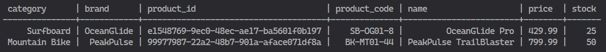
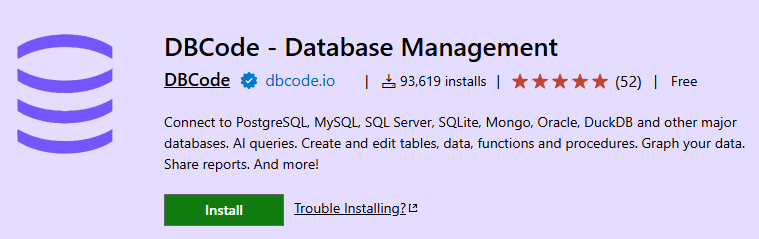
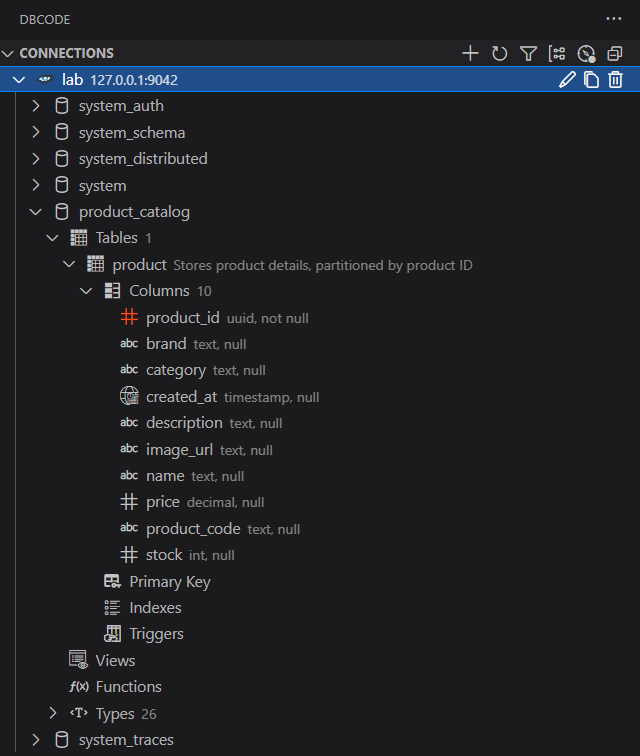

# Cassandra Quickstart

This quickstart uses Docker Compose setup to run a single Cassandra node for local development and testing.

<br />

💡 For an introduction to Cassandra, see the [accompanying introductory guide](../introduction/introduction.md) that provides a comprehensive introduction to Apache Cassandra.

<br />

💡 Additional Resources:

   - [Get Started with Apache Cassandra](https://cassandra.apache.org/_/quickstart.html)
   - [Apache Cassandra Quickstart](https://cassandra.apache.org/doc/4.1/cassandra/getting_started/quickstart.html)

<br />

---

## Prerequisites

- Operating System: Linux or Windows using WSL (Linux distribution)
- Docker: Install Docker Desktop for Mac/Windows or Docker on Linux
- Basic command-line familiarity
- No prior Cassandra knowledge required

---

## Files

- **compose.yaml** — Compose file that starts a Cassandra container, an `init` helper container that runs initialization CQL, and a bastion container that can be used as a jump host to run CQL statements against Cassandra.

See [Docker official Cassandra image](https://hub.docker.com/_/cassandra).

   ```yaml
   name: cassandra-stack
   services:
   cassandra:
      image: cassandra:5
      container_name: cassandra
      restart: unless-stopped
      ports:
         - "9042:9042"
      volumes:
         - cassandra_data:/var/lib/cassandra
      networks:
         - default
      environment:
         - CASSANDRA_CLUSTER_NAME=MyCluster
         - CASSANDRA_SEEDS=cassandra
      healthcheck:
         test: ["CMD", "cqlsh", "cassandra", "9042", "-e", "DESCRIBE cluster"]
         interval: 10s
         timeout: 5s
         retries: 10

   cassandra-init:
      image: cassandra:5
      container_name: cassandra-init
      volumes:
         - ./init.sh:/init.sh:ro
         - ./init.cql:/init.cql:ro
      networks:
         - default
      depends_on:
         - cassandra
      command: ["/bin/bash", "/init.sh"]
   
   cassandra-client:
      image: cassandra:5
      container_name: cassandra-client
      volumes:
         - ./:/workspace:ro
      networks:
         - default
      depends_on:
         - cassandra
      # Keep container running for interactive use
      command: ["tail", "-f", "/dev/null"]
      # Optional: add any development tools you commonly use
      environment:
         - CQLSH_HOST=cassandra
         - CQLSH_PORT=9042

   volumes:
   cassandra_data:

   networks:
      default:
         name: cassandra

   ```

- **init.sh** — Script that waits for Cassandra and runs `/init.cql` using `cqlsh`.
  
  ```bash
  #!/bin/bash

  # makes script exit on errors (-e) and on references to unset variables (-u)
  set -eu
  # wait for cassandra to be ready
  echo "Waiting for Cassandra to accept CQL connections..."
  until cqlsh cassandra 9042 -e "DESCRIBE KEYSPACES" >/dev/null 2>&1; do
  echo "Cassandra not ready yet; retrying in 5s..."
  sleep 5
  done
  # apply CQL with retries to ensure table exists before INSERTs run
  MAX_ATTEMPTS=10
  attempt=1
  delay=2
  while [ "$attempt" -le "$MAX_ATTEMPTS" ]; do
  echo "Attempt $attempt: applying /init.cql"
  if cqlsh cassandra 9042 -f /init.cql; then
     echo "CQL applied successfully"
     exit 0
  else
     echo "CQL apply failed. Will retry after ${delay}s..."
     sleep "$delay"
     attempt=$((attempt + 1))
     delay=$((delay * 2))
  fi
  done
  echo "Failed to apply CQL after $MAX_ATTEMPTS attempts" >&2
  exit 1
  ```

- **init.cql** — CQL file with schema/data initialization statements.
  
  ```sql
  -- idempotent approach to create keyspace
  -- 'IF NOT EXISTS' makes the script safe to re-run
  CREATE KEYSPACE IF NOT EXISTS product_catalog WITH REPLICATION ={'class': 'SimpleStrategy', 'replication_factor': 1};
  -- idempotent approach to create table
  -- 'IF NOT EXISTS' makes the script safe to re-run
  -- create table using fully-qualified name (keyspace_name.table_name)
  CREATE TABLE IF NOT EXISTS product_catalog.product (
     created_at TIMESTAMP,
     product_id UUID PRIMARY KEY,
     product_code TEXT,
     name TEXT,
     description TEXT,
     price DECIMAL,
     brand TEXT,
     category TEXT,
     stock INT,
     image_url TEXT
  ) WITH comment = 'Stores product details, partitioned by product ID';
    -- insert sample data using fully-qualified table name so we don't relyon 'USE product_catalog'
    INSERT INTO product_catalog.product (created_at, product_id, product_code, name, description, price, brand, category, stock, image_url) VALUES (toTimestamp(now()), uuid(), 'BK-MT01-44', 'PeakPulse TrailBlaster', 'A blue mountain bike for rugged trails, size 44', 799.99, 'PeakPulse', 'Mountain Bike', 50, 'https://example.com/imagespeakpulse_trailblaster.jpg');
    INSERT INTO product_catalog.product (created_at, product_id, product_code, name, description, price, brand, category, stock, image_url) VALUES (toTimestamp(now()), uuid(), 'SB-OG01-8', 'OceanGlide Pro', 'A yellow surfboard for pro surfers, 8ft', 429.99, 'OceanGlide','Surfboard', 25, 'https://example.com/images/oceanglide_pro.jpg');
  ```

- **list-products.cql** - CQL file with query to retrieve all products from product table in product_catalog schema

  ```sql
  SELECT
    category
    ,brand
    ,product_id
    ,product_code
    ,name
    ,price
    ,stock
  FROM product_catalog.product LIMIT 10;
  ```

---

## Usage

1. Start the stack:

   ```bash
   docker compose up -d
   ```

2. Watch logs (optional):

   ```bash
   docker compose logs -f cassandra
   ```

3. If you need to run the init step manually:

   ```bash
   docker compose up -d cassandra
   # wait for cassandra to be ready (see logs or use cqlsh)
   docker compose run --rm init
   ```

4. Connect to Cassandra and run some queries
   
   1. Connect to `cqlsh` prompt

      ```bash
      docker exec -it cassandra-client cqlsh cassandra
      ```

      ```bash
      # list keyspaces
      describe keyspaces
      ```

      ```bash
      # list all tables in all keyspaces
      describe tables
      ```

      ```bash
      # list all products from product table in product_catalog keyspace
      select * from product_catalog.product
      ```

   2. Run specific `CQL` file

      ```bash
      docker exec -it cassandra-client cqlsh cassandra -f ./list-products.cql
      ```

      

   3. Get interactive shell in the `cassandra-client` container

      ```bash
      docker exec -it cassandra-client bash
      ```

5. Stop the stack
   
   ```bash
   docker compose down --volumes --remove-orphans
   ```

---

## Troubleshooting

- If `cqlsh` fails to connect, check `docker compose logs cassandra` and ensure Cassandra finished booting. The first startup can take a minute or two.

- If the `init` container appears to exit immediately with errors, run it interactively to inspect output:

   ```bash
   docker compose run --rm init /bin/bash
   ```

---

## Install cqlsh locally

If you prefer to connect to Cassandra using a local Cassandra client, you can try the following options:

   - Install CQLSH locally
   - Install Visual Studio Code extension

### Install CQLSH locally

You can install `cqlsh` independently of the Cassandra server using either the Snap package (recommended for simplicity and isolation) or pip (Python package manager). Both methods avoid installing the server components. Both options are covered, assuming Ubuntu 24.04 LTS (or similar) with Python 3.12+. The Snap method is generally easier and handles dependencies automatically. If you are using the Windows operating system, you can setup Ubuntu on Windows Subsystem for Linux. See the [WSL Getting Started Guide](../../wsl/getting-started.md).

#### Option 1: Install via Snap (Easiest, Recommended)

Snaps are self-contained, so no Python version conflicts.

**Prerequisites**:

- Snapd should be pre-installed on Ubuntu 16.04+ (including 24.04). If not:
  
  ```
  sudo apt update
  sudo apt install snapd
  ```
  
  Then log out and back in (or restart) for path updates.

**Steps**:

1. Install cqlsh:
   
   ```
   sudo snap install cqlsh
   ```

2. Verify:
   
   ```
   cqlsh --version
   ```
   
   Expected output: Something like `cqlsh 6.x.x`.

**Notes**:

- This installs a recent version (e.g., 6.x) compatible with Apache Cassandra 5.x.

- To use: `cqlsh <host> <port>` (defaults to localhost:9042). You'll need a running Cassandra instance to connect to.

#### Option 2: Install via pip (For Python Users)

This pulls the standalone `cqlsh` package from PyPI.

**Prerequisites**:

- Python 3.6+ (Ubuntu has 3.12 by default).

- pip3 (if not installed):
  
  ```
  sudo apt update
  sudo apt install python3-pip
  ```

**Steps**:

1. Install (use `--user` for local install without sudo, or omit for system-wide):
   
   ```
   pip3 install --user cqlsh
   ```
   
   - Add `~/.local/bin` to your PATH if using `--user` (edit `~/.bashrc` with `export PATH=$PATH:~/.local/bin` and `source ~/.bashrc`).

2. Verify:
   
   ```
   cqlsh --version
   ```

**Notes**:

- Latest version (6.x+) supports Python 3.6–3.12+ and works as a lightweight CLI client.

- If you encounter Python 3.12 compatibility issues (rare in 2025), try the Snap method or pin to `pip3 install cqlsh==6.1.2`.

- For virtual environments: `python3 -m venv cqlsh-env`, activate it, then `pip install cqlsh`.

#### Troubleshooting

- **Command not found**: Ensure PATH includes snap/bin or ~/.local/bin.

- **Connection errors**: cqlsh needs a Cassandra server running elsewhere (local or remote). Test with `cqlsh localhost 9042` if you have one.

- **Uninstall**:
  - Snap: `sudo snap remove cqlsh`
  - Pip: `pip3 uninstall cqlsh`

### Install Visual Studio Code extension

There are a few Cassandra extension options available in Visual Studio Code. However, my preference is [DBCode - Database Management](https://github.com/dbcodeio/public).



See more details at the [DBCode Market Place](https://marketplace.visualstudio.com/items?itemName=DBCode.dbcode).

Once installed, you can create a connection to your Cassandra DB instance and view/manage the database.



---
