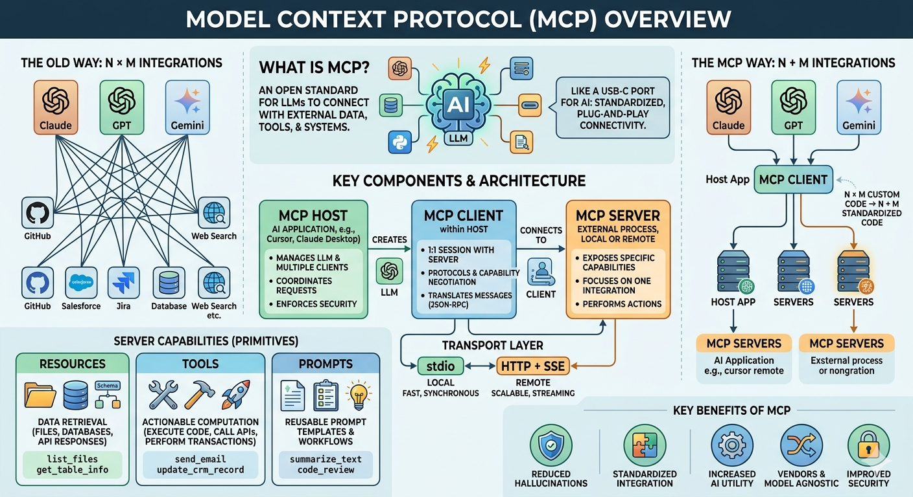
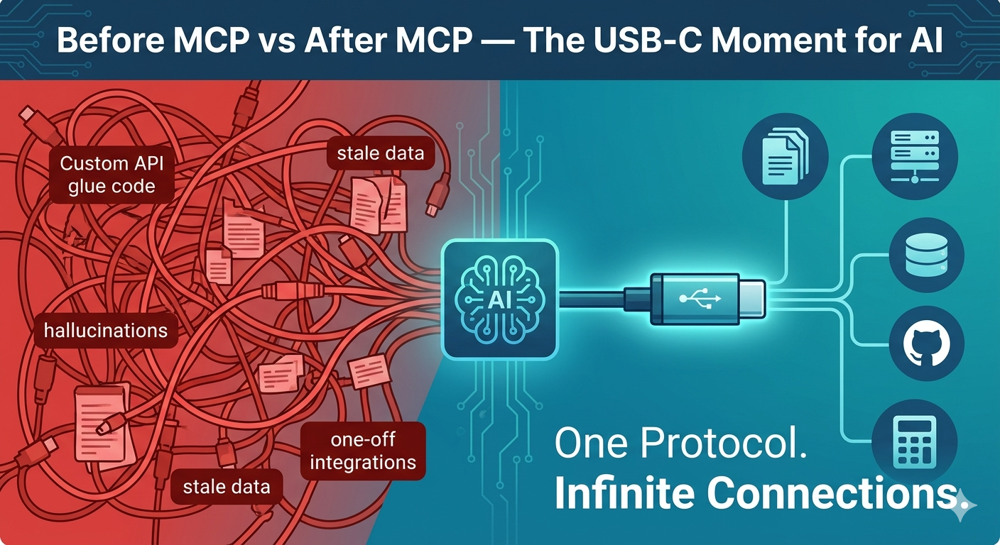

# Introduction to the Model Context Protocol (MCP)

> [!NOTE] TL;DR:
> MCP is like USB-C for AI — a single, open standard that lets AI applications plug into any data source, tool, or workflow without custom integrations for each one.

---

## 📖 Table of Contents

- [Introduction to the Model Context Protocol (MCP)](#introduction-to-the-model-context-protocol-mcp)
  - [📖 Table of Contents](#-table-of-contents)
  - [✨ Overview](#-overview)
  - [☝️🤓 What is Model Context Protocol (MCP)?](#️-what-is-model-context-protocol-mcp)
  - [🔄 How It Works (Simply)](#-how-it-works-simply)
  - [💡 The Problem MCP Solves](#-the-problem-mcp-solves)
  - [🔌 The USB-C Analogy](#-the-usb-c-analogy)
  - [↔️ Before and After MCP: The Integration Explosion Problem](#️-before-and-after-mcp-the-integration-explosion-problem)
    - [Before MCP:  M models × N tools = M×N integrations](#before-mcp--m-models--n-tools--mn-integrations)
    - [With MCP:  M models + N tools = M+N integrations](#with-mcp--m-models--n-tools--mn-integrations)
  - [📐 MCP Architecture Overview](#-mcp-architecture-overview)
    - [Hosts](#hosts)
    - [Clients](#clients)
    - [Servers](#servers)
  - [🧩 Core Primitives](#-core-primitives)
    - [🛠️ Tools — The "Verbs"](#️-tools--the-verbs)
    - [📦 Resources — The "Nouns"](#-resources--the-nouns)
    - [📝 Prompts — The "Templates"](#-prompts--the-templates)
    - [🗺️ Primitive Comparison](#️-primitive-comparison)
    - [Client Primitives](#client-primitives)
  - [🔄 How Information Flows](#-how-information-flows)
  - [🚌 Transport Layer: How MCP Talks](#-transport-layer-how-mcp-talks)
    - [STDIO (Local)](#stdio-local)
    - [HTTP + SSE (Server-Sent Events)](#http--sse-server-sent-events)
    - [Streamable HTTP (Modern Standard)](#streamable-http-modern-standard)
  - [🌍 Real-World Examples](#-real-world-examples)
    - [🖥️ Example 1: AI-Powered IDE (VS Code + GitHub Copilot)](#️-example-1-ai-powered-ide-vs-code--github-copilot)
    - [🏪 Example 2: Retail Analytics Assistant](#-example-2-retail-analytics-assistant)
    - [🔬 Example 3: Developer Workflow Automation](#-example-3-developer-workflow-automation)
  - [🧠 MCP Mental Models](#-mcp-mental-models)
    - [Example 1](#example-1)
    - [Example 2](#example-2)
  - [⚖️ MCP vs REST vs GraphQL](#️-mcp-vs-rest-vs-graphql)
  - [💻 A Quick Look at Code](#-a-quick-look-at-code)
    - [TypeScript](#typescript)
    - [C#](#c)
  - [🚀 Why MCP Matters](#-why-mcp-matters)
    - [What MCP Can Enable Today](#what-mcp-can-enable-today)
  - [✅ Key Takeaways](#-key-takeaways)
  - [📚 Additional Resources](#-additional-resources)
      - [📖 Reference](#-reference)
      - [🎓 Courses](#-courses)
      - [🛠️ SDKs \& Dev Tools](#️-sdks--dev-tools)
      - [🎥 Videos](#-videos)

---

## ✨ Overview



---

## ☝️🤓 What is Model Context Protocol (MCP)?

The **Model Context Protocol (MCP)** is an open-source standard created by **Anthropic (in November 2024)** and has since been adopted across the AI industry for connecting AI applications to external systems. It defines a universal way for Large Language Models (LLMs) to discover and interact with:

- 📂 **Data sources** — files, databases, APIs
- 🔧 **Tools** — search engines, calculators, code runners
- 📝 **Workflows** — reusable prompt templates and interaction patterns

Think of it as a **common language** — a contract between AI models and the world around them.

MCP is supported across a growing ecosystem including **Claude**, **ChatGPT**, **Visual Studio Code (Copilot)**, **Cursor**, and many more.

> [!NOTE] Here's the one-liner:  
> _MCP lets any AI model talk to any tool, using the same protocol, regardless of who built either of them._

---

## 🔄 How It Works (Simply)

There are just **3 characters** in the story:

| Character        | Real Name               | Job                               |
| ---------------- | ----------------------- | --------------------------------- |
| 🧠 The Thinker    | **MCP Client** (the AI) | Asks questions, uses tools        |
| 🔌 The Translator | **MCP Server**          | Wraps a tool so the AI can use it |
| 🛠️ The Tool       | Gmail, Files, DB...     | Does the actual work              |

The conversation looks like this:

```
🧠 AI:     "Hey, can you get my emails?"
🔌 Server: "Sure! Let me call Gmail..."
📧 Gmail:  "Here are 10 emails!"
🔌 Server: "Here you go, AI!"
🧠 AI:     "Great, I'll summarize them for you!"
```

---

## 💡 The Problem MCP Solves

Imagine you're building an AI assistant. Your LLM is brilliant — it can reason, write, summarise, and plan. But it lacks complete awareness of required context to fulfill its tasks. It can't check today's weather, query your database, run a script, or send an email. It only knows what's in its training data.

So you start _wiring_ things up yourself:

```
Claude / GPT / Gemini
  ├── custom weather integration ──▶ Weather API
  ├── custom DB integration ───────▶ Your Database
  ├── custom GitHub integration ───▶ GitHub API
  └── custom file integration ─────▶ File System
```

Suddenly you have a **spaghetti nightmare**. Every tool needs its own connector. Every new model you adopt breaks half your integrations. Your codebase is a museum of one-off hacks.

> [!TIP] Sound familiar?
> This was the reality for every AI developer before November 2024. See further down for a deep dive ([Before and After MCP: The Integration Explosion Problem](#before-and-after-mcp-the-integration-explosion-problem)).

---

## 🔌 The USB-C Analogy

The official MCP documentation uses the **USB-C analogy** to explain the value of a standardized protocol. 

Before USB-C, every device had its own charging cable. Your laptop needed one plug, your phone another, your tablet yet another. It was chaos.

USB-C changed everything — one standard connector that works everywhere.



```
Before USB-C:                    After USB-C:
──────────────                   ──────────────────────────────
Laptop → proprietary charger      Laptop ──┐
Phone  → micro-USB                Phone  ──┤── USB-C ──▶ Any Power Source
Tablet → lightning                Tablet ──┘
Camera → mini-USB
```

**MCP is USB-C for AI.** One protocol. Any model. Any tool.

```
Before MCP:                      After MCP:
──────────────                   ──────────────────────────────
Claude  → custom Weather code    Claude  ──┐
GPT-4   → custom GitHub code     GPT-4   ──┤── MCP ──▶ Any MCP Server
Gemini  → custom DB code         Gemini  ──┘
```

The following table further summarizes the analogy:

| USB-C                                 | MCP                                        |
| ------------------------------------- | ------------------------------------------ |
| Standardized physical connector       | Standardized communication protocol        |
| Connects devices to peripherals       | Connects AI apps to external systems       |
| One port, many devices                | One protocol, many integrations            |
| Replaced a mess of proprietary cables | Replaces a mess of custom API integrations |

Just as USB-C ended the era of carrying five different cables, MCP aims to end the era of writing five different AI integrations.

> 🎯 **The win:** Build your MCP server once. Every MCP-compatible AI model can use it immediately — no changes needed.

---

## ↔️ Before and After MCP: The Integration Explosion Problem

Having covered the basics above on the problem that MCP is and the problem it solves. Let's take a deeper look at the **Integration Explosion problem** and how MCP solves it.

Before MCP, every AI application that needed to talk to an external system required a **custom integration**. Want your AI assistant to read from a database *and* search the web *and* access your calendar? That's three separate, bespoke connectors — each with its own authentication, data format, and error handling. Suddenly you have a **spaghetti nightmare**. Every tool needs its own connector. Every new model you adopt breaks half your integrations. Your codebase is a museum of one-off hacks.

This is known as the **"Integration Explosion problem"** (AKA the **M × N problem**). If you have M AI models and N tools, you need to build M×N custom integrations to connect them all. The number of integrations grows **quadratically** as you add more models and tools.

### Before MCP:  M models × N tools = M×N integrations

> [!NOTE] Example 1:

```
Before MCP:  M models × N tools = M×N integrations

AI App A ──┬── Custom connector ── Database       
           ├── Custom connector ── Web Search     
           └── Custom connector ── Calendar       

AI App B ──┬── Custom connector ── Database       
           ├── Custom connector ── Web Search     
           └── Custom connector ── Calendar       

3 apps × 3 services = 9 custom integrations 😱
```

> [!NOTE] Example 2:

```
Before MCP:  M models × N tools = M×N integrations

  Claude ──── Weather API          (1 integration)
  Claude ──── GitHub API           (1 integration)
  Claude ──── Database             (1 integration)
  GPT-4  ──── Weather API          (1 integration)  ← duplicate!
  GPT-4  ──── GitHub API           (1 integration)  ← duplicate!
  GPT-4  ──── Database             (1 integration)  ← duplicate!
  Gemini ──── Weather API          (1 integration)  ← triplicate!
  ...
  
  3 models × 3 tools = 9 integrations 😱
```

### With MCP:  M models + N tools = M+N integrations

With MCP, every app and every service speaks the **same protocol**:

> [!NOTE] Example 1:

```
After MCP:  M models + N servers = M+N implementations

AI Model A ──┐                 ┌── Database Server
             │                 │                    
AI Model B ──┼── MCP Protocol ─┼── Web Search Server
             │                 │                    
AI Model C ──┘                 └── Calendar Server  

3 models + 3 servers = 6 implementations 🎉
  (Each model implements MCP once. Each tool server implements MCP once.)
```

> [!NOTE] Example 2:

```
After MCP:  M models + N servers = M+N implementations

Claude ──┐                 ┌── Postgresql MCP Server
         │                 │                    
GPT-4  ──┼── MCP Protocol ─┼── Weather MCP Server
         │                 │                    
Gemini ──┘                 └── GitHub MCP Server  

3 models + 3 servers = 6 implementations 🎉
  (Each model implements MCP once. Each tool server implements MCP once.)
```

> [!CAUTION] 📈 At scale:
> 20 models × 50 tools = **1,000 integrations** (before) vs **70 implementations** (after MCP). That's a 93% reduction in integration code.

> [!NOTE] The magic of MCP:
> Build your server once, and every MCP-compatible AI application can use it immediately. No more custom connectors, no more spaghetti code — just a thriving ecosystem of interoperable tools and models.

---

## 📐 MCP Architecture Overview

MCP follows a **client-host-server architecture** with three key participants:

```
┌────────────────────────────────────────────────────┐
│                      MCP HOST                      │
│           (e.g., VS Code, Claude Desktop)          │
│                                                    │
│   ┌────────────┐  ┌────────────┐  ┌────────────┐   │
│   │ MCP Client │  │ MCP Client │  │ MCP Client │   │
│   │     1      │  │     2      │  │     3      │   │
│   └─────┬──────┘  └─────┬──────┘  └─────┬──────┘   │
│         │               │               │          │
└─────────┼───────────────┼───────────────┼──────────┘
          │               │               │
    ┌─────▼──────┐  ┌─────▼──────┐  ┌─────▼──────┐
    │ MCP Server │  │ MCP Server │  │ MCP Server │
    │  (Local)   │  │  (Local)   │  │  (Remote)  │
    │ Filesystem │  │  Database  │  │   External |
    │            │  |            │  │   API's    │
    └────────────┘  └────────────┘  └────────────┘
```

> [!NOTE] Think of it this way:
> The Host is the *orchestra conductor*, Clients are the *communication lines*, and Servers are the *musicians* — each bringing their own instrument (capability) to the performance.

### Hosts

The **Host** is the AI application the user interacts with directly. It orchestrates everything — managing LLM interactions, creating MCP clients, controlling the UI, and enforcing security.

**Examples:** `Claude Desktop`, `VS Code with Copilot`, `Claude Code`, `custom AI agents`

**Key responsibilities:**
- Orchestrate AI model interactions
- Create and manage one MCP client per server connection
- Handle the user interface and conversation flow
- Enforce security policies and user consent

### Clients

**Clients** are protocol connectors that live *inside* the host. Each client maintains a **dedicated 1:1 connection** with a single MCP server. This is usually your application — a chat UI, an IDE plugin, an automation script. The client is what the end user interacts with.

**Key responsibilities:**
- Send JSON-RPC 2.0 requests to servers
- Negotiate capabilities during initialization
- Manage tool execution requests and responses
- Handle real-time notifications from servers

### Servers

**Servers** are lightweight programs that expose specific capabilities through MCP. They can run **locally** (on the same machine) or **remotely** (on external platforms).

**Key responsibilities:**

- Register and expose tools, resources, and prompts
- Process incoming requests from clients
- Provide contextual data to enhance model responses
- Send real-time notifications about capability changes

| Server Type     | What It Does             | Example             |
| --------------- | ------------------------ | ------------------- |
| Web Search      | Fetches live information | Brave Search MCP    |
| Database        | Queries structured data  | PostgreSQL MCP      |
| File System     | Reads/writes files       | Local FS MCP        |
| Code Execution  | Runs scripts             | Python Sandbox MCP  |
| Calendar        | Manages events           | Google Calendar MCP |
| Version Control | Git operations           | GitHub MCP          |

---

## 🧩 Core Primitives

MCP servers expose three fundamental building blocks — called **primitives** — that define what they can offer:

```
┌────────────────────────────────────────────────────────────┐
│                    SERVER PRIMITIVES                       │
│                                                            │
│  ┌──────────────┐  ┌──────────────┐  ┌──────────────┐      │
│  │   🔧 Tools   │  │ 📦 Resources │ │ 📝 Prompts  │      │
│  │              │  │              │  │              │      │
│  │  Executable  │  │  Data that   │  │  Reusable    │      │
│  │  functions   │  │  provides    │  │  templates   │      │
│  │  the model   │  │  context to  │  │  for LLM     │      │
│  │  can invoke  │  │  the model   │  │  interactions│      │
│  └──────────────┘  └──────────────┘  └──────────────┘      │
│                                                            │
│  Examples:         Examples:         Examples:             │
│  - API calls       - File contents   - System prompts      │
│  - DB queries      - DB schemas      - Few-shot examples   │
│  - Calculations    - API responses   - Task templates      │
└────────────────────────────────────────────────────────────┘
```

### 🛠️ Tools — The "Verbs"

Tools are **executable functions** that models can invoke to perform actions in the real world. Each tool has a name, description, and a JSON Schema defining its parameters.

```
tools/list  → Discover available tools
tools/call  → Execute a specific tool
```

```
Tool: calculate_mortgage
Input:  { principal: 500000, rate: 0.065, years: 30 }
Output: { monthly_payment: 3160.34, total_paid: 1137722 }
```

Tools are like API endpoints — the AI provides arguments, the server executes the operation and returns a result.

### 📦 Resources — The "Nouns"

Resources are **data sources** that provide contextual information. They're identified by URIs and can be static or dynamic.

```
resources/list  → Discover available resources
resources/read  → Retrieve resource content

Example URIs:
  file://documents/project-spec.md
  database://production/users/schema
  api://weather/current
```

Resources are like documents in a filing cabinet. The AI can *read* them to gain context but can't modify them directly (that would require a Tool).

### 📝 Prompts — The "Templates"

Prompts are **reusable interaction templates** that structure how the model engages with information. They support variable substitution for dynamic content.

```
prompts/list  → Discover available prompts
prompts/get   → Retrieve a specific prompt template
```

Example:

```yaml
Prompt Name:  "code-review"
Description:  "Review code for quality and security issues"
Arguments:
  - language: "Programming language"
  - code:     "Code to review"

Template: |
  You are a senior {language} developer.
  Review the following code for bugs, security vulnerabilities,
  and style issues. Be specific and actionable.
  
  Code:
  {code}
```

### 🗺️ Primitive Comparison

```
┌─────────────────────────────────────────────────────────┐
│                  MCP PRIMITIVES                         │
├────────────┬──────────────┬────────────────┬────────────┤
│            │    TOOLS     │  RESOURCES     │  PROMPTS   │
├────────────┼──────────────┼────────────────┼────────────┤
│ Initiated  │ AI Model     │ AI Model       │ User/App   │
│    By      │              │                │            │
├────────────┼──────────────┼────────────────┼────────────┤
│ Has Side   │     Yes      │      No        │    No      │
│  Effects?  │              │                │            │
├────────────┼──────────────┼────────────────┼────────────┤
│  Analogy   │ Function     │ File/Document  │ Template   │
│            │   Call       │                │            │
├────────────┼──────────────┼────────────────┼────────────┤
│  Examples  │ send_email() │ README.md      │ code-review│
│            │ query_db()   │ db-schema      │ summarise  │
│            │ run_test()   │ config.json    │ translate  │
└────────────┴──────────────┴────────────────┴────────────┘
```

### Client Primitives

MCP also defines primitives that **clients** expose back to servers:

| Primitive       | Purpose                                                                                    |
| --------------- | ------------------------------------------------------------------------------------------ |
| **Sampling**    | Lets servers request LLM completions from the host — no need to bundle their own model SDK |
| **Elicitation** | Lets servers ask the user for additional input or confirmation                             |
| **Roots**       | Exposes filesystem boundaries so servers know where they can operate                       |
| **Logging**     | Lets servers send structured log messages for debugging and monitoring                     |

---

## 🔄 How Information Flows

Below is a simplified but typical lifecycle of an MCP interaction:

```
    User                Host               Client             Server
     │                   │                   │                   │
     │  1. Enter prompt  │                   │                   │
     │——————————————————>│                   │                   │
     │                   │  2. Initialize    │                   │
     │                   │——————————————————>│                   │
     │                   │                   │  3. Negotiate     │
     │                   │                   │  capabilities     │
     │                   │                   │──────────────────>│
     │                   │                   │<──────────────────│
     │                   │                   │                   │
     │                   │ 4. Discover tools │                   │
     │                   │——————————————————>│  tools/list       │
     │                   │                   │——————————————————>│
     │                   │                   │<──────────────────│
     │                   │                   │                   │
     │                   │  5. LLM decides   │                   │
     │                   │  to use a tool    │                   │
     │                   │——————————————————>│  tools/call       │
     │                   │                   │——————————————————>│
     │                   │                   │      Execute      │
     │                   │                   │<——————————————————│
     │                   │                   │                   │
     │                   │  6. LLM generates │                   │
     │ 7. Display result │  response with    │                   │
     │◄──────────────────│  tool output      │                   │
     │                   │                   │                   │
```

**Step by step:**

1. **User sends a prompt** to the host application
2. **Host initializes** an MCP client connection to the server
3. **Capability negotiation** — client and server exchange supported features and protocol versions
4. **Tool discovery** — the client asks the server what tools, resources, and prompts are available
5. **Tool execution** — when the LLM determines it needs external data or actions, it triggers a tool call
6. **Response generation** — the LLM incorporates the tool's output into its response
7. **Result presentation** — the host displays the final response to the user

> [!NOTE] EXAMPLE:
> Let's trace exactly what happens when a user asks: **"What are the top-selling products in our database this month?"**

```
  User          MCP Client        MCP Host          AI Model        DB MCP Server
   │                │                 │                 │                 │
   │  1. "Top       │                 │                 │                 │
   │   selling      │                 │                 │                 │
   │   products?"   │                 │                 │                 │
   │───────────────>│                 │                 │                 │
   │                │  2. Forward     │                 │                 │
   │                │     request     │                 │                 │
   │                │────────────────>│                 │                 │
   │                │                 │  3. Message +   │                 │
   │                │                 │     tool list   │                 │
   │                │                 │────────────────>│                 │
   │                │                 │                 │                 │
   │                │                 │  4. Tool call:  │                 │
   │                │                 │  query_database │                 │
   │                │                 │  (sql="SELECT…")│                 │
   │                │                 │<────────────────│                 │
   │                │                 │                 │                 │
   │                │                 │  5. Auth        │                 │
   │                │                 │     Route to    │                 │
   │                │                 │     DB server   │                 │
   │                │                 │──────────────────────────────────>│
   │                │                 │                 │                 │
   │                │                 │  6. Execute SQL │    Execute &    │
   │                │                 │     Return rows │    return rows  │
   │                │                 │<──────────────────────────────────│
   │                │                 │                 │                 │
   │                │                 │  7. Formatted   │                 │
   │                │                 │     results     │                 │
   │                │                 │────────────────>│                 │
   │                │                 │                 │                 │
   │                │                 │  8. Human-      │                 │
   │                │                 │  friendly answer│                 │
   │                │                 │<────────────────│                 │
   │                │                 │                 │                 │
   │                │  9. Response    │                 │                 │
   │                │<────────────────│                 │                 │
   │  "Top products │                 │                 │                 │
   │   this month:  │                 │                 │                 │
   │   1. Widget…"  │                 │                 │                 │
   │<───────────────│                 │                 │                 │
   │                │                 │                 │                 │
```

> [!NOTE] The beautiful part?
> **Steps 5–7 are standardised by MCP.** The AI model doesn't need to know if it's talking to PostgreSQL, MySQL, or MongoDB — it just calls a tool and gets back data in a consistent format.

---

## 🚌 Transport Layer: How MCP Talks

MCP is **transport-agnostic** — it can run over different communication channels depending on your deployment scenario. For example, it supports a the following transport mechanisms for communication:

- **STDIO (Local)** — ideal for servers running on the same machine as the host (e.g., local file system access, dev tools)
- **HTTP + SSE (Remote)** — the original transport used by early MCP implementations
- **Streamable HTTP (Remote)** — the modern standard for remote communication.

&nbsp;

> [!IMPORTANT]
> All communication uses **JSON-RPC 2.0** message format regardless of transport — so the same protocol works identically whether the server is local or remote.

&nbsp;

### STDIO (Local)

Uses standard input/output streams for direct process communication. Best for servers running on the **same machine** as the host.

```

MCP Host
    │
    ├──(stdin)  ──────────────────────────────▶  MCP Server Process
    └──(stdout) ◀──────────────────────────── MCP Server Process
                   (same machine, no network)

```

✅ Simple, secure (no network exposure), fast  
✅ Recommended for local desktop tools like Claude Desktop, Cursor  
⚠️ Only works locally — no remote access

&nbsp;

> [!NOTE] Use case:  
> File system access, local database queries, dev tools  

### HTTP + SSE (Server-Sent Events)

Best for **remote/cloud deployments** where the server runs elsewhere.

```

MCP Client/Host
    │
    ├──HTTP POST  ──────────────────────────────▶  MCP Server (any machine)
    └──SSE Stream ◀──────────────────────────────  MCP Server (streaming responses)
                          (across the network)
```


✅ Works across networks  
✅ Supports streaming responses  
✅ Can be deployed to cloud (Azure, AWS, GCP)  
⚠️ Requires proper authentication (API keys, OAuth, etc.)  

### Streamable HTTP (Modern Standard)

The **latest transport**, replacing SSE for most use cases. Uses HTTP POST for client-to-server messages with optional **Server-Sent Events (SSE)** for streaming. Ideal for servers running on **external platforms**.

```

MCP Client/Host
    │
    ├──HTTP POST   ──────────────────────────────▶ MCP Server
    └──HTTP Stream ◀────────────────────────────── MCP Server (chunked responses)

```

✅ Simpler than SSE  
✅ Better tooling support (proxies, load balancers)  
✅ Preferred for new implementations  

&nbsp;

> [!NOTE] Use case:
> Cloud APIs, SaaS integrations (Sentry, GitHub, Slack)

---

## 🌍 Real-World Examples

### 🖥️ Example 1: AI-Powered IDE (VS Code + GitHub Copilot)

You're coding and ask: *"Refactor this function and update the unit tests."*

```
You (in VS Code)
    │
    ▼
MCP Client (Copilot extension)
    │
    ▼
MCP Host (VS Code AI runtime)
    │
    ├──▶ File System MCP Server   → reads your current file
    ├──▶ Git MCP Server           → checks changed files
    └──▶ Test Runner MCP Server   → runs tests to verify refactor
    │
    ▼
AI Model generates:
  1. Refactored code
  2. Updated unit tests
  3. Confirmation that tests pass ✅
```

All of this happens through standardised MCP calls — no custom integration needed.

---

### 🏪 Example 2: Retail Analytics Assistant

A store manager asks: *"Which products are running low and need reordering?"*

```
Manager's Chat UI (MCP Client)
    │
    ▼
MCP Host
    │
    ├──▶ Database MCP Server      → queries inventory levels
    ├──▶ Sales History MCP Server → fetches recent sales velocity
    └──▶ Supplier API MCP Server  → checks supplier lead times
    │
    ▼
AI synthesises:
  "3 products need urgent reordering:
   - Widget A: 5 units left, sells 10/day, 3-day lead time ⚠️
   - Gadget B: 2 units left, sells 4/day, 7-day lead time 🚨
   ..."
```

---

### 🔬 Example 3: Developer Workflow Automation

A developer asks Claude Desktop: *"Create a GitHub issue for the bug I just found, assign it to the on-call dev, and add it to the current sprint."*

```
Claude Desktop (MCP Host + Client)
    │
    ├──▶ GitHub MCP Server     → creates issue, assigns developer
    ├──▶ Jira MCP Server       → adds to current sprint board
    └──▶ Slack MCP Server      → notifies the assigned dev
    │
    ▼
Single natural language request → 3 coordinated tool calls ✨
```

---

## 🧠 MCP Mental Models

Below are a few mental models and analogies to help you understand the core concepts of MCP. These are not official definitions but rather ways to think about the protocol in a more intuitive way.

### Example 1

```
MCP is like a RECEPTIONIST at a company              
                                                      
The AI is a VISITOR who needs things done            
                                                      
MCP Servers are DEPARTMENTS (Accounts, IT, HR...)    
                                                      
The MCP Host is the FRONT DESK

  • Knows which departments exist                       
  • Verifies the visitor's identity                     
  • Routes requests to the right department            
  • Returns results in a consistent format              
                                                      
The visitor doesn't need to know WHERE each department is or HOW they work internally.

They just ask the receptionist.
```

### Example 2

```
Imagine you have a really smart toy robot (that's the AI).

The robot is great at talking and thinking, but it lives in a box
and can't touch anything in the real world.

Your robot wants to help you, but it can't:
- 📁 Look at your files
- 📅 Check your calendar
- 📧 Read your emails
- 🔍 Search the internet

It's stuck in its box, just thinking.

MCP (Model Context Protocol) is a special plug that lets your robot reach
outside its box and connect to things in the real world.

Think of it like USB — one standard plug that works with any device:

🤖 AI Robot
    |
   [MCP plug]
    |
    ├── 📁 Your Files
    ├── 📅 Google Calendar  
    ├── 📧 Gmail
    └── 🗄️ Your Database

Instead of teaching the robot a different language for every single tool,
MCP is one common language they all speak.

```

---

## ⚖️ MCP vs REST vs GraphQL

A common question: *"Why not just use REST APIs?"*  


Here's the key distinction:

```
┌───────────────────────────────────────────────────────────────┐
│                   PROTOCOL COMPARISON                         │
├──────────────┬─────────────────┬────────────────┬─────────────┤
│              │      REST       │    GraphQL     │     MCP     │
├──────────────┼─────────────────┼────────────────┼─────────────┤
│ Designed For │ Human devs      │ Human devs     │ AI Models   │
│              │ calling APIs    │ querying data  │ using tools │
├──────────────┼─────────────────┼────────────────┼─────────────┤
│ Discovery    │ OpenAPI/Swagger │ Schema         │ Built-in    │
│              │ (separate)      │ Introspection  │ (automatic) │
├──────────────┼─────────────────┼────────────────┼─────────────┤
│ Tool Schema  │ Manual          │ Manual         │ Auto-       │
│              │ documentation   │ documentation  │ advertised  │
├──────────────┼─────────────────┼────────────────┼─────────────┤
│ Streaming    │ Optional        │ Subscriptions  │ Built-in    │
├──────────────┼─────────────────┼────────────────┼─────────────┤
│ AI Context   │ None            │ None           │ First-class │
│ Management   │                 │                │ citizen     │
├──────────────┼─────────────────┼────────────────┼─────────────┤
│ Auth Pattern │ API Key / OAuth │ API Key /      │ Pluggable   │
│              │ (manual)        │ OAuth (manual) │ (built-in)  │
└──────────────┴─────────────────┴────────────────┴─────────────┘
```

> [!TIP] The key insight:
> REST and GraphQL are designed for *human developers* writing code to call APIs. MCP is designed for *AI models* to discover and use capabilities **at runtime** without pre-written integrations.

An MCP server tells the AI model: *"Here are the tools I have, here's what each one does, here's the schema for inputs and outputs."* The AI figures out when and how to use them dynamically.

---

## 💻 A Quick Look at Code

Let's see what building an MCP server actually looks like. You don't need to fully understand this yet — but let's demystify what a basic MCP server looks like in both `C#` and `Typescript` languages. Just enough to make it feel real.

Here's a simple weather server in **TypeScript** and **C#**.

### TypeScript

```typescript
import { McpServer } from "@modelcontextprotocol/sdk/server/mcp.js";
import { StdioServerTransport } from "@modelcontextprotocol/sdk/server/stdio.js";
import { z } from "zod";

// 1. Create the server
const server = new McpServer({
  name: "calculator",
  version: "1.0.0",
});

// 2. Register a Tool — this is what the AI can call
server.tool(
  "add",                          // Tool name
  "Add two numbers together",     // Description (the AI reads this!)
  {
    a: z.number().describe("First number"),
    b: z.number().describe("Second number"),
  },
  async ({ a, b }) => ({
    content: [{ type: "text", text: `${a} + ${b} = ${a + b}` }],
  })
);

// 3. Start the server over stdio transport
const transport = new StdioServerTransport();
await server.connect(transport);
```

**What's happening here:**
- We create a named server (`"calculator"`)
- We register a `"add"` tool with a clear description and typed parameters
- The AI model reads the description and schema to know *when* and *how* to call this tool
- The server responds with a result in the standardised MCP format

### C#

```csharp
using Microsoft.Extensions.Hosting;
using ModelContextProtocol.Server;
using System.ComponentModel;

// 1. Build the host with MCP server support
var builder = Host.CreateApplicationBuilder(args);

builder.Services
    .AddMcpServer()               // Register MCP server
    .WithStdioServerTransport()   // Use stdio transport
    .WithTools<CalculatorTools>(); // Register our tools class

await builder.Build().RunAsync();

// 2. Define tools as a class with attributes
[McpServerToolType]
public class CalculatorTools
{
    [McpServerTool]
    [Description("Add two numbers together")]  // The AI reads this description
    public static string Add(
        [Description("First number")]  double a,
        [Description("Second number")] double b)
    {
        return $"{a} + {b} = {a + b}";
    }
}
```

**What's happening here:**
- We use dependency injection (very .NET!) to wire everything up
- The `[McpServerTool]` and `[Description]` attributes auto-generate the tool schema
- The AI sees the description and knows this tool adds numbers
- Clean, idiomatic C# — no boilerplate JSON schemas to write manually

> [!IMPORTANT] Notice the pattern:
> Both examples follow the same structure — create a server, register tools with schemas, connect a transport. That's the beauty of a standardized protocol.

---

## 🚀 Why MCP Matters

| Stakeholder         | Benefit                                                                                                                                                  |
| ------------------- | -------------------------------------------------------------------------------------------------------------------------------------------------------- |
| **Developers**      | Build one MCP server → works with every MCP-compatible AI app. No more writing separate plugins for Claude, ChatGPT, VS Code, etc.                       |
| **AI Applications** | Instant access to a growing ecosystem of servers — databases, APIs, dev tools, productivity apps — without custom integration work.                      |
| **End Users**       | More capable AI assistants that can actually *do things* — read your files, query your databases, manage your calendar — securely and with your consent. |

### What MCP Can Enable Today

- 🗓️ AI agents that access your **Google Calendar and Notion** for personalized assistance
- 🎨 Claude Code generating a full web app from a **Figma design**
- 🏢 Enterprise chatbots connected to **multiple databases** across an organization
- 🖨️ AI models creating **3D designs in Blender** and sending them to a 3D printer

---

## ✅ Key Takeaways

Let's consolidate what we've covered:

```
                  📌 CHAPTER SUMMARY                     
─────────────────────────────────────────────────────────
                                                         
  🔌  MCP is the "USB-C for AI" — one standard           
      protocol connecting any model to any tool          
                                                         
  🏗️  Three actors: Client (UI) → Host (orchestrator)   
      → Server (capability provider)                    
                                                         
  🧱  Three primitives:                                  
      • Tools    → Things the AI can DO                  
      • Resources → Things the AI can READ               
      • Prompts  → Pre-built workflow templates          
                                                         
  🚌  Three transports:                                  
      • stdio          → Local (subprocess)              
      • HTTP + SSE     → Remote (legacy)                 
      • Streamable HTTP → Remote (modern)                
                                                         
  📈  Reduces M×N integrations to M+N implementations   
                                                         
  🤝  Open protocol — build once, works everywhere
```

---

## 📚 Additional Resources

#### 📖 Reference

- [Official MCP documentation](https://modelcontextprotocol.dev/docs) — The source of truth for the protocol, with quickstarts, reference docs, and best practices.
- [MCP GitHub repo](https://github.com/modelcontextprotocol/mcp) — The official repository for MCP, including source code, issues, and community discussions.
- [MCP For Beginners](https://github.com/microsoft/mcp-for-beginners) 
- [MCP Dev Days Events](https://developer.microsoft.com/en-us/reactor/series/S-1563/)

#### 🎓 Courses

- [Anthropic's Introduction to MCP](https://anthropic.skilljar.com/introduction-to-model-context-protocol) — A free course covering the basics of MCP, hosted by Anthropic.

#### 🛠️ SDKs & Dev Tools

- [MCP SDKs](https://modelcontextprotocol.io/docs/sdk) — Official SDKs for building MCP servers and clients.
- [C# SDK](https://github.com/modelcontextprotocol/csharp-sdk) — The official C# SDK for building MCP servers and clients.
- [TypeScript SDK](https://github.com/modelcontextprotocol/typescript-sdk) — The official TypeScript SDK for building MCP servers and clients.
- [MCP Inspector](https://modelcontextprotocol.dev/inspector) — A local testing tool for MCP servers, allowing you to simulate hosts and debug interactions without needing an actual AI provider connection.

#### 🎥 Videos

- [Why MCP really is a big deal | Model Context Protocol](https://youtu.be/FLpS7OfD5-s)
- [Agent Skills or MCP in the era of Claude Code?](https://youtu.be/pvxNcQTcIy4)
- [.NET Meets MCP: Build Your Own AI-Powered Service with C# - NDC London 2026](https://youtu.be/1MAvdjpew1g)
- [Beginner's Guide to Building a MCP Server with C# and .NET](https://youtu.be/MKD-sCZWpZQ)
- [Build an MCP server with .NET 10](https://youtu.be/kqcLWcpXb10)
- [The Ultimate MCP Crash Course - Build From Scratch](https://youtu.be/ZoZxQwp1PiM)
- [Let's Learn MCP: C#](https://www.youtube.com/live/4zkIBMFdL2w?si=BbIG2dhUBVRG7KBU)
- [Old API, New Tricks: Add MCP to Existing .NET REST Endpoints](https://youtu.be/K-ntHsFriuI)
- [Getting Started with MCP (Model Context Protocol)](https://youtu.be/DpyjAKmNwpI)

---
