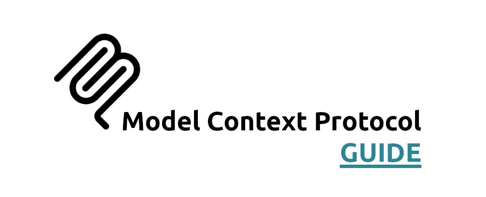

# 🚀 Model Context Protocol (MCP) Guide

This guide provides an overview of the Model Context Protocol (MCP) and how to use it effectively in your applications.

The intention of this guide is to be used as a companion guide to existing MCP documentation like:

- [Official MCP documentation](https://modelcontextprotocol.dev/docs) — The source of truth for the protocol, with quickstarts, reference docs, and best practices.
- [MCP For Beginners](https://github.com/microsoft/mcp-for-beginners) — A great resource for learning how to build MCP servers and clients, with sample code and tutorials.

## 🆕 What's different?

This guide is meant to be a more detailed, narrative-driven introduction to MCP, with a focus on practical examples and real-world use cases. It will cover the same core concepts as the official documentation, but with more in-depth explanations, code walkthroughs, and best practices.

Specifically, this guide will focus on:

- Using `C# .NET` and `TypeScript` to build MCP servers and clients.
- Using mental models to explain the concepts in a more intuitive way.
- Using a lot of diagrams and visuals to help explain the concepts.
- Using tables and comparisons to clarify the differences between MCP concepts and other similar non-related MCP concepts.

Lastly, this guide will be updated regularly as MCP evolves and new features are added, so be sure to check back often for the latest information! I am using this guide as a way to solidify my own understanding of MCP, so I will be updating it as I learn more about the protocol and its applications.

## 📌 Topics

This guide covers the following topics:

1. [Introduction to MCP](./01-introduction-to-mcp/README.md)

   Provides an overview of what MCP is, its purpose, and the problems it aims to solve.

---
