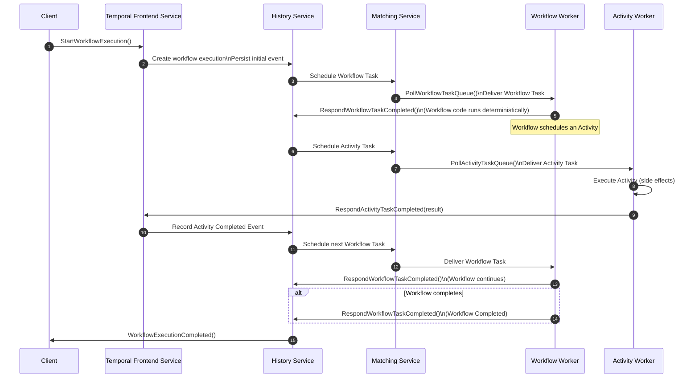

# 🏛️ Temporal - Architecture

## 🧐 Overview

Temporal’s architecture is intentionally designed to make distributed, long‑running, stateful workflows reliable and fault‑tolerant by default. Temporal provides a durable execution engine that ensures application logic continues running correctly despite failures, restarts, or infrastructure issues. It does this by separating orchestration logic from execution, persisting state, and replaying workflow histories deterministically.

> [!NOTE]
> &nbsp;  
> Think of Temporal as a "fault-tolerant sidekick" for your code. It ensures that your application logic runs to completion, regardless of network flickers, server crashes, or even months-long wait times.  
> &nbsp;

 

> [!IMPORTANT]
> &nbsp;  
> See:  
> - [Temporal Documentation - Introduction to Temporal's system architecture and internal implementation](https://github.com/temporalio/temporal/blob/main/docs/architecture/README.md) on the official Temporal gihub repository.
> - [Temporal Documentation - Understanding Temporal](https://docs.temporal.io/evaluate/understanding-temporal)
> &nbsp;

---

## 🗺️ The High-Level Topology

Temporal uses a **Client-Server architecture**, but with a twist: your application code doesn't actually run *inside* the Temporal server. Instead, the server acts as an orchestrator (the brain) while your binaries act as workers (the muscles).

> [!IMPORTANT]
> 
> The key points of a _Client-Server Architecture_ center around dividing roles between clients requesting resources and servers providing them, with communication over a network using standard protocols.
>
> - See [Client-Server Model](https://grokipedia.com/page/Client%E2%80%93server_model) on Grokipedia for more information.  
> - See [Glossary - Client-Server Model](/detailed-guides/temporal/glossary/glossary.md#client-server-model).

 

 

With relation to diagram above:

- The Temporal Server consists of a frontend service with multiple backend services that work together to execute application code. It acts as a gateway.

- Both frontend and backend services are horizontally scalable and can be deployed accross multiple machines to help ensure availability and reliability.

- Typical clients include the `temporal CLI`, `temporal Web UI`, and `application code` using the temporal SDK's

The diagram below illustrates how application code (using the temporal SDK) connects to the Temporal Server `frontend service` via Port 7333.

---

## 🧱 The Primary Components

- **Temporal Cluster:** The backend engine. It manages state, queues, and timers.

- **Worker Service:** This is **your code**. Workers host the Workflow and Activity implementations and poll the Cluster for tasks.

- **Persistence Store:** Usually Cassandra, MySQL, or PostgreSQL. This is where the "Event History" lives—the immutable record of every step your code has taken.

---

## 🖧 The Temporal Cluster

The cluster is comprised of the following four primary internal services:

- **Frontend Service:** The gatekeeper. It handles incoming gRPC requests from your SDKs and the Web UI. It handles rate limiting, routing, and authorization.

- **History Service:** The heart of the system. It maintains the state of workflows, manages the event history, and ensures data consistency.

- **Matching Service:** A specialized queuing system. It matches "Tasks" (things that need to be done) with "Workers" (services waiting to do them).

- **Worker Service (Internal):** A background service that handles internal system workflows (like replication or garbage collection).

---

## ⚡ How Execution Works: The "Event Loop"

Temporal doesn't store a "snapshot" of your local variables. Instead, it uses **Event Sourcing**.

When you write a Workflow, the SDK records every side effect (like calling an API or starting a timer) as an **Event** in the Cluster. If a worker crashes mid-execution, a new worker pulls that history, "replays" the code, and skips the steps that already have a recorded result.

### Key Concepts:

* **Workflows:** Orchestration logic. Must be **deterministic** because they are subject to replay.
* **Activities:** Where the "real world" happens (API calls, DB writes). These can be non-deterministic and are retried automatically on failure.
* **Task Queues:** The "mailbox" where the Cluster drops tasks and Workers pick them up. This provides natural load balancing and flow control.

### Workflow Execution Sequence Diagram

---

## 📥 The Persistence Layer

Temporal is essentially a state machine backed by a database. It ensures that even if the entire Cluster is restarted, your workflows pick up exactly where they left off.

> [!IMPORTANT]
> Because Temporal persists every event, you don't need to write manual "save points" or complex state-recovery logic. If the DB is up, your workflow is alive.

Temporal persists workflow state in a database (Cassandra, MySQL, PostgreSQL, or Elasticsearch for visibility).

The **History Service** is responsible for:

- Appending workflow events
- Managing workflow state transitions
- Ensuring consistency and replayability

This is what gives Temporal its “ultimate autosave” capability.   [Temporal Documentation](https://docs.temporal.io/evaluate/understanding-temporal)

---

## 👷🏻‍♂️📐 Worker Architecture

Workers are application‑level processes that run your workflow and activity code.

They:
- Poll task queues
- Execute workflow logic deterministically
- Execute activities with retries and timeouts
- Communicate with the Temporal Server via SDKs (Go, Java, TypeScript, Python, etc.)

Workers can be scaled independently based on workload.

---

## 🧩 Integration in Distributed Systems

Temporal is often used in event‑driven or microservices architectures.

Durable execution engines like Temporal:
- Automate long‑running, stateful, machine‑to‑machine workflows
- Provide fault‑tolerant coordination
- Integrate well with event platforms like Kafka for complex business processes (e.g., order processing, fraud detection)

---

## ☁️ Deployment Models

Temporal can be deployed:

- **Self‑hosted** (Kubernetes, VMs)
- **Managed** via Temporal Cloud
- **Hybrid** (workers in your environment, server in the cloud)

---

## 🧠 Why This Architecture Works

Temporal’s architecture solves the hardest problems in distributed systems:

- **State persistence** ensures no progress is lost.
- **Deterministic replay** guarantees correctness.
- **Task queues** decouple orchestration from execution.
- **Automatic retries and timeouts** reduce boilerplate.
- **Horizontal scalability** supports massive workloads.

---
