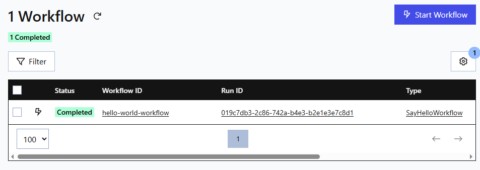
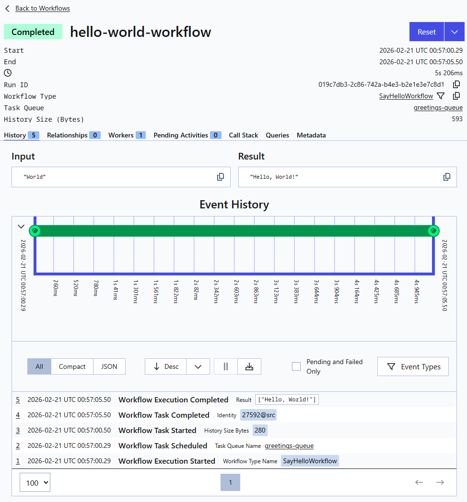
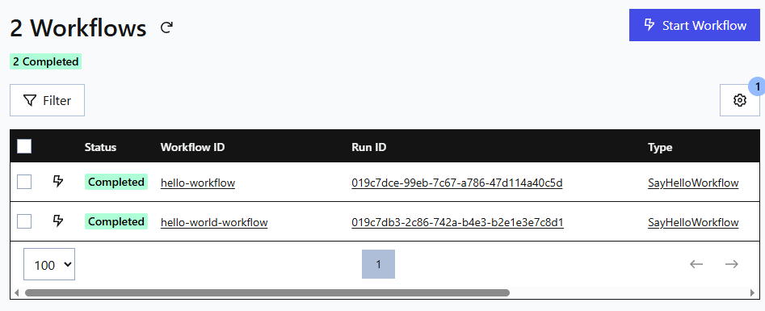
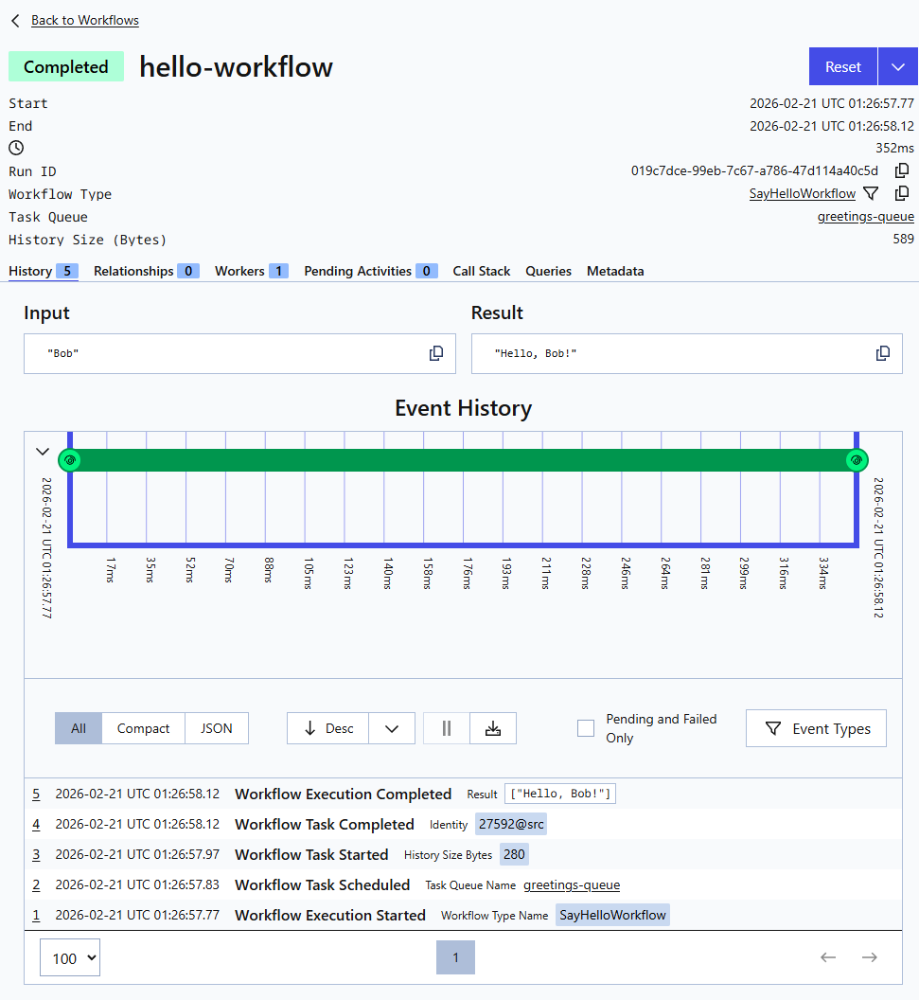

# Example 1 - Hello World

This example demonstrates how to run a simple Workflow that returns a greeting.

---

## 🧐 Overview

The project folder structure is as follows:

```text

example-1/
|
├── Example1.ConsoleClient/   # .NET 10 Console application that interacts with Temporal workflows
├── Example1.Shared/          # .NET 10 Class library that contains shared contracts for workflows (models and activities in the future)
├── Example1.Worker/          # .NET 10 Background Worker that hosts and executes the workflow
└── README.md

```

The solution consists of the following:

- **Example1.ConsoleClient**
  
  This project acts as a client application that interacts with Temporal workflows. It is responsible for starting, signaling, or querying workflows defined in the shared library and executed by the worker. It typically provides a command-line interface for users to initiate workflow operations.

- **Example1.Shared**
  
  This project contains the shared workflow and activity definitions, data contracts, and any common logic used by both the client and worker projects. It serves as a contract layer, ensuring that both the client and worker have a consistent understanding of workflow and activity signatures.

- **Example1.Worker**

  This project implements the Temporal worker, which hosts and executes the workflow and activity implementations defined in the shared project. The worker listens for tasks from the Temporal service and runs the actual business logic in response to workflow and activity invocations.

---

## ✅ Prerequisites

### Software

- Running instance of Docker
- .NET 10 Framework

### Reading

See related docs that accompany this guide:

- [Introduction](../../introduction/introduction.md)
- [Architecture](../../architecture/architecture.md)
- [Temporal CLI Cheatsheet](../../cheatsheet.md)

## 🚀 Run Example

### Start Temporal Service

This repo contains a [Temporal Service Quickstart](/quickstart-guides/temporal/README.md) that uses `docker compose`.

Start Temporal Service using `docker compose`:

```bash
cd ./quickstart-guides/temporal
docker compose up
```

The Temporal Service will be up and running within a minute.

Alternatively, if using VSCode:

- press `Ctrl+Shift+B` to open build task menu
- select `docker compose: temporal-service up`

This will start run the `docker compose: temporal-service up` that is defined in the [/.vscode/tasks.json](/.vscode/tasks.json) file.

### Start Worker

```pwsh
# 🖥️ open terminal at ./example-1/
dotnet run --project ./Example1.Worker

```

### Start Client

```pwsh
# 🖥️ open terminal at ./example-1
dotnet run --project Example1.Client

<< output >>
Workflow result: Hello, World!

```

### View Workflow

<br />

Open browser at [http://localhost:8081](http://localhost:8081)

<br />



<br />



### Start Workflow from command line

```bash
# 🖥️ open terminal
temporal workflow start \
    --type SayHelloWorkflow \
    --task-queue greetings-queue \
    --workflow-id hello-workflow \
    --input '"Bob"'

<< output >>
Running execution:
  WorkflowId  hello-workflow
  RunId       019c7dce-99eb-7c67-a786-47d114a40c5d
  Type        SayHelloWorkflow
  Namespace   default
  TaskQueue   greetings-queue
```

> [!NOTE]
>  - For the temporal client argument `--input '"Bob"'`, the input value has double quotes inside of single quotes. This is because the input to the temporal command must be provided in JSON format and the quoting used here helps ensure correct format.
> - This command starts the Workflow, but it does not wait for it to complete or show the result.

<br />

To view the Workflow result, use the following command:

```bash
# 🖥️ open terminal
temporal workflow show --workflow-id hello-workflow

<< output >>
Progress:
  ID           Time                     Type
    1  2026-02-21T01:26:57Z  WorkflowExecutionStarted
    2  2026-02-21T01:26:57Z  WorkflowTaskScheduled
    3  2026-02-21T01:26:57Z  WorkflowTaskStarted
    4  2026-02-21T01:26:58Z  WorkflowTaskCompleted
    5  2026-02-21T01:26:58Z  WorkflowExecutionCompleted

Results:
  Status          COMPLETED
  Result          "Hello, Bob!"
  ResultEncoding  json/plain
```

You can also view a list of workflows using:

```bash
# 🖥️ open terminal
temporal workflow list
```

Alternatively, open the Temporal Web UI at [http://localhost:8081](http://localhost:8081)



<br />



---
