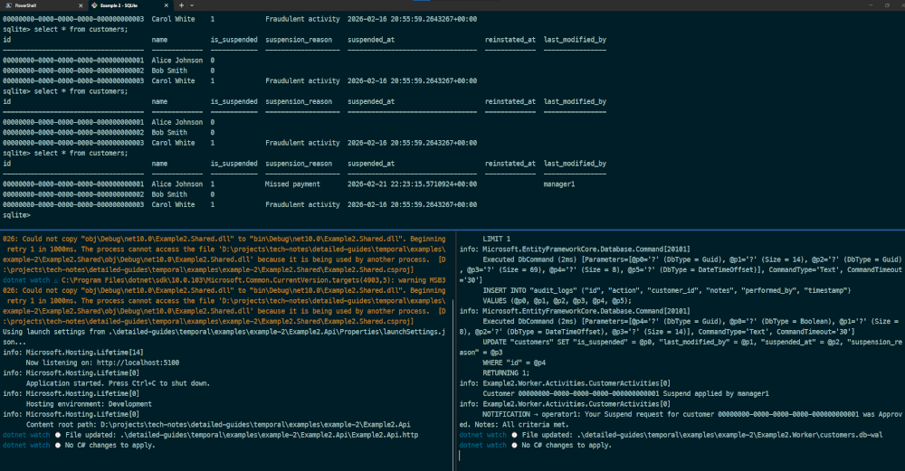

# ✨ Example 2 - Suspend/Reinstate Customer

A .NET 10 / C# 14 solution demonstrating a **manager-approval workflow** for customer suspension and reinstatement, built on [Temporal](https://temporal.io/).

Instead of a backoffice operator's request going straight to the database, it enters a durable workflow where a manager must approve or reject it within 48 hours. The workflow survives worker restarts, handles timeouts gracefully, and provides full auditability via Temporal's event history.

---

## 🏛️ Architecture

```
CustomerWorkflow.Shared (contracts — models, interfaces, constants)
        ▲                               ▲
        │                               │
CustomerWorkflow.Worker        CustomerWorkflow.Api
(Temporal worker,              (Minimal API,
 EF Core InMemory)              no Worker reference)
```

| Project                   | Responsibility                                                                          |
| ------------------------- | --------------------------------------------------------------------------------------- |
| `CustomerWorkflow.Shared` | Models, workflow/activity interfaces, constants. The only project both sides depend on. |
| `CustomerWorkflow.Worker` | Hosts the Temporal worker. Implements the workflow and activities. Owns the database.   |
| `CustomerWorkflow.Api`    | Exposes HTTP endpoints for submitting requests, approving/rejecting, and cancelling.    |

---

## 🧐 Overview

The project folder structure is as follows:

```text

Example2/
├── Example2.Api/           # Minimal API exposing HTTP endpoints for customer actions
│   └── Example2.Api.http   # Http requests for performing customer action requests
│
├── Example2.Shared/        # Shared contracts, models, interfaces, and constants
│
├── Example2.Worker/        # Temporal worker hosting workflows and activities, owns the database
│   └── customers.db        # SQLite database file created by migrations
│
└── README.md               # Project documentation and usage instructions

```

The solution consists of the following:

- **Example2.Api**
  
  This project acts as a client application that interacts with Temporal workflows. It is responsible for starting, signaling, or querying workflows defined in the shared library and executed by the worker.

- **Example2.Shared**
  
  This project contains the shared workflow and activity definitions, data contracts, and any common logic used by both the Api and Worker projects. It serves as a contract layer, ensuring that both the client and worker have a consistent understanding of workflow and activity signatures.

- **Example2.Worker**

  This project implements the Temporal worker, which hosts and executes the workflow and activity implementations defined in the shared project. The worker listens for tasks from the Temporal service and runs the actual business logic in response to workflow and activity invocations.

---

## ✅ Prerequisites

### Software

- [.NET 10 SDK](https://dotnet.microsoft.com/download)

- [Entity Framework Core Tools](https://learn.microsoft.com/en-us/ef/core/cli/dotnet)
  
  The command-line interface (CLI) tools for Entity Framework Core perform design-time development tasks. For example, they create migrations, apply migrations, and generate code for a model based on an existing database.

- [Docker Desktop](https://www.docker.com/products/docker-desktop/)

- [SQLite](https://sqlite.org/)
  
  SQLite is a C-language library that implements a small, fast, self-contained, high-reliability, full-featured, SQL database engine. SQLite is the most used database engine in the world. SQLite is built into all mobile phones and most computers and comes bundled inside countless other applications that people use every day. A Command Line Interface (CLI) called `sqlite3` is used to allow a user to manually enter and execute SQL statements against an SQLite database.

### Reading

See related docs that accompany this guide:

- [Introduction](../../introduction/introduction.md)
- [Architecture](../../architecture/architecture.md)
- [Temporal CLI Cheatsheet](../../cheatsheet.md)

## 🚀 Run Example

### ● Start Temporal Service

This repo contains a [Temporal Service Quickstart](/quickstart-guides/temporal/README.md) that uses `docker compose`.

Start Temporal Service using `docker compose`:

```bash
cd ./quickstart-guides/temporal
docker compose up
```

The Temporal Service will be up and running within a minute. It starts the following 3 containers:

| Container     | Purpose              | Port |
| ------------- | -------------------- | ---- |
| `postgresql`  | Temporal persistence | 5432 |
| `temporal`    | Temporal server      | 7233 |
| `temporal-ui` | Temporal Web UI      | 8081 |

<br />

Alternatively, if using VSCode:

- press `Ctrl+Shift+B` to open build task menu
- select `docker compose: temporal-service up`

This will start run the `docker compose: temporal-service up` that is defined in the [/.vscode/tasks.json](/.vscode/tasks.json) file.

### ● SQLite Install

Ensure SQLite is installed.

#### Windows

```bash
# Option 1
winget install -e --id SQLite.SQLite

# Option 2
choco install sqlite
```

#### Linux

```bash
# Debian/Ubuntu
sudo apt update
sudo apt install sqlite3

# Fedora/CentOS/RHEL
sudo dnf install sqlite
# or
sudo yum install sqlite
```

### ● Run Database Migrations

The **Worker** uses SQLite. Use [`.NET Entity Framework Core Tool`](https://learn.microsoft.com/en-us/ef/core/cli/dotnet) to generate sqlite database migration. If not installed use the following command to install it globally.

```bash
dotnet tool install --global dotnet-ef
```

<br />

Run database migrations and update. This will create `customers.db` sqlite databse with relevant tables.

<br />

```bash
# /Example2.Worker/

dotnet ef migrations add InitialMigration

dotnet ef database update
```

### ● Verify Database Migration

```bash
# /Example2.Worker
sqlite3 -header -column customers.db

sqlite3> .tables

__EFMigrationsHistory  audit_logs
__EFMigrationsLock     customers

sqlite3> .exit

```

### ● Start Worker

```pwsh
# 🖥️ open terminal at ./example-1/
dotnet run --project ./Example2.Worker

```

The worker connects to Temporal, seeds three demo customers into the in-memory database, and begins polling the `customer-action-queue` task queue.

View the seeded data as follows:

```bash
sqlite> select * from customers;

id                                    name           is_suspended  suspension_reason    suspended_at                       reinstated_at  last_modified_by
------------------------------------  -------------  ------------  -------------------  ---------------------------------  -------------  ----------------
00000000-0000-0000-0000-000000000001  Alice Johnson  0
00000000-0000-0000-0000-000000000002  Bob Smith      0
00000000-0000-0000-0000-000000000003  Carol White    1             Fraudulent activity  2026-02-16 20:55:59.2643267+00:00
```

### ● Start API (Client)

```pwsh
# 🖥️ open terminal at ./example-1
dotnet run --project Example2.Api

```

### Optional

Find the following convenience script to launch Worker, API, and Sqlite in a Windows terminal window in 3 separate panes:

```
# /examples/scripts
pwsh -File ./wt-example2.ps1
```



---

## 🌐 API Reference

See [./Example2.Api/Example2.Api.http](./Example2.Api/Example2.Api.http) for the http requests.

### 🔹 Submit a suspension or reinstatement request

```http
POST /api/customer-actions
Content-Type: application/json

{
  "customerId": "00000000-0000-0000-0000-000000000001",
  "actionType": "Suspend",
  "reason": "Multiple missed payments",
  "requestedBy": "alice.operator"
}
```

> `actionType`: `1` = Suspend, `2` = Reinstate

**Response `202 Accepted`:**

```json
{
  "workflowId": "customer-action-00000000-0000-0000-0000-000000000001-a3f1..."
}
```

Save the `workflowId` — you will need it for the subsequent calls.

```md
###
@workflow_id={{submitCustomerAction.response.body.workflowId}}
```

### 🔹 Get workflow state

```http
GET /api/customer-actions/{workflowId}/state
```

**Response:**
```json
{
  "workflowId": "customer-action-...",
  "status": "Running",
  "startedAt": "2026-02-22T10:00:00Z"
}
```

For richer state (pending/approved/rejected/cancelled), open the **Temporal Web UI** at http://localhost:8081 and inspect the workflow directly.

```text
# temporal
➜ temporal workflow list
  Status                                        WorkflowId                                                 Type             StartTime
  Running  customer-action-00000000-0000-0000-0000-000000000001-29d1403929d64b2eb996e1ab4b5d2456  CustomerActionWorkflow  33 seconds ago

➜ temporal workflow show --workflow-id customer-action-00000000-0000-0000-0000-000000000001-29d1403929d64b2eb996e1ab4b5d2456
Progress:
  ID           Time                     Type
    1  2026-02-21T22:12:55Z  WorkflowExecutionStarted
    2  2026-02-21T22:12:55Z  WorkflowTaskScheduled
    3  2026-02-21T22:12:55Z  WorkflowTaskStarted
    4  2026-02-21T22:12:55Z  WorkflowTaskCompleted
    5  2026-02-21T22:12:55Z  ActivityTaskScheduled
    6  2026-02-21T22:12:55Z  ActivityTaskStarted
    7  2026-02-21T22:12:56Z  ActivityTaskCompleted
    8  2026-02-21T22:12:56Z  WorkflowTaskScheduled
    9  2026-02-21T22:12:56Z  WorkflowTaskStarted
   10  2026-02-21T22:12:56Z  WorkflowTaskCompleted
   11  2026-02-21T22:12:56Z  TimerStarted

➜ temporal workflow describe --workflow-id customer-action-00000000-0000-0000-0000-000000000001-29d1403929d64b2eb996e1ab4b5d2456
Execution Info:
  WorkflowId            customer-action-00000000-0000-0000-0000-000000000001-29d1403929d64b2eb996e1ab4b5d2456
  RunId                 019c8243-4f18-72a5-a351-5e66b2ba4f8b
  Type                  CustomerActionWorkflow
  Namespace             default
  TaskQueue             customer-action-queue
  AssignedBuildId
  StartTime             2 minutes ago
  ExecutionTime         2 minutes ago
  SearchAttributes      map[BuildIds:metadata:{key:"encoding" value:"json/plain"} metadata:{key:"type" value:"KeywordList"} data:"[\"unversioned\",\"unversioned:380e85dc-baca-4a84-b136-7e4cfe1e6b89\"]"]
  StateTransitionCount  7
  HistoryLength         11
  HistorySize           1795
  RootWorkflowId        customer-action-00000000-0000-0000-0000-000000000001-29d1403929d64b2eb996e1ab4b5d2456
  RootRunId             019c8243-4f18-72a5-a351-5e66b2ba4f8b
Extended Execution Info:
  CancelRequested    false
  OriginalStartTime  2 minutes ago

Pending Activities: 0
Pending Child Workflows: 0
Pending Nexus Operations: 0

# sqlite
sqlite> select * from customers;
id                                    name           is_suspended  suspension_reason    suspended_at                       reinstated_at  last_modified_by
------------------------------------  -------------  ------------  -------------------  ---------------------------------  -------------  ----------------
00000000-0000-0000-0000-000000000001  Alice Johnson  0
00000000-0000-0000-0000-000000000002  Bob Smith      0
00000000-0000-0000-0000-000000000003  Carol White    1             Fraudulent activity  2026-02-16 20:55:59.2643267+00:00

```

### 🔹 Approve or reject the request

```http
POST /api/customer-actions/{workflowId}/approve
Content-Type: application/json

{
  "approved": true,
  "reviewedBy": "bob.manager",
  "reviewNotes": "Verified against fraud report. Suspension justified."
}
```

Set `"approved": false` to reject. Rejection sends a notification to the operator but leaves the customer record unchanged.

```text
➜ temporal workflow show --workflow-id customer-action-00000000-0000-0000-0000-000000000001-29d1403929d64b2eb996e1ab4b5d2456
Progress:
  ID           Time                     Type
    1  2026-02-21T22:12:55Z  WorkflowExecutionStarted
    2  2026-02-21T22:12:55Z  WorkflowTaskScheduled
    3  2026-02-21T22:12:55Z  WorkflowTaskStarted
    4  2026-02-21T22:12:55Z  WorkflowTaskCompleted
    5  2026-02-21T22:12:55Z  ActivityTaskScheduled
    6  2026-02-21T22:12:55Z  ActivityTaskStarted
    7  2026-02-21T22:12:56Z  ActivityTaskCompleted
    8  2026-02-21T22:12:56Z  WorkflowTaskScheduled
    9  2026-02-21T22:12:56Z  WorkflowTaskStarted
   10  2026-02-21T22:12:56Z  WorkflowTaskCompleted
   11  2026-02-21T22:12:56Z  TimerStarted
   12  2026-02-21T22:23:14Z  WorkflowExecutionSignaled
   13  2026-02-21T22:23:14Z  WorkflowTaskScheduled
   14  2026-02-21T22:23:14Z  WorkflowTaskStarted
   15  2026-02-21T22:23:14Z  WorkflowTaskCompleted
   16  2026-02-21T22:23:14Z  TimerCanceled
   17  2026-02-21T22:23:14Z  ActivityTaskScheduled
   18  2026-02-21T22:23:14Z  ActivityTaskStarted
   19  2026-02-21T22:23:15Z  ActivityTaskCompleted
   20  2026-02-21T22:23:15Z  WorkflowTaskScheduled
   21  2026-02-21T22:23:15Z  WorkflowTaskStarted
   22  2026-02-21T22:23:15Z  WorkflowTaskCompleted
   23  2026-02-21T22:23:15Z  ActivityTaskScheduled
   24  2026-02-21T22:23:15Z  ActivityTaskStarted
   25  2026-02-21T22:23:15Z  ActivityTaskCompleted
   26  2026-02-21T22:23:15Z  WorkflowTaskScheduled
   27  2026-02-21T22:23:15Z  WorkflowTaskStarted
   28  2026-02-21T22:23:16Z  WorkflowTaskCompleted
   29  2026-02-21T22:23:16Z  WorkflowExecutionCompleted

Results:
  Status          COMPLETED
  Result          {}
  ResultEncoding  json/plain

➜ temporal workflow describe --workflow-id customer-action-00000000-0000-0000-0000-000000000001-29d1403929d64b2eb996e1ab4b5d2456
Execution Info:
  WorkflowId            customer-action-00000000-0000-0000-0000-000000000001-29d1403929d64b2eb996e1ab4b5d2456
  RunId                 019c8243-4f18-72a5-a351-5e66b2ba4f8b
  Type                  CustomerActionWorkflow
  Namespace             default
  TaskQueue             customer-action-queue
  AssignedBuildId
  StartTime             15 minutes ago
  CloseTime             4 minutes ago
  ExecutionTime         15 minutes ago
  SearchAttributes      map[BuildIds:metadata:{key:"encoding" value:"json/plain"} metadata:{key:"type" value:"KeywordList"} data:"[\"unversioned\",\"unversioned:380e85dc-baca-4a84-b136-7e4cfe1e6b89\"]"]
  StateTransitionCount  18
  HistoryLength         29
  HistorySize           4297
  RootWorkflowId        customer-action-00000000-0000-0000-0000-000000000001-29d1403929d64b2eb996e1ab4b5d2456
  RootRunId             019c8243-4f18-72a5-a351-5e66b2ba4f8b
Extended Execution Info:
  CancelRequested    false
  OriginalStartTime  15 minutes ago

Results:
  RunTime         10m20.88s
  Status          COMPLETED
  Result          {}
  ResultEncoding  json/plain

# sqlite
sqlite> select * from customers;
id                                    name           is_suspended  suspension_reason    suspended_at                       reinstated_at  last_modified_by
------------------------------------  -------------  ------------  -------------------  ---------------------------------  -------------  ----------------
00000000-0000-0000-0000-000000000001  Alice Johnson  1             Missed payment       2026-02-21 22:23:15.5710924+00:00                 manager1
00000000-0000-0000-0000-000000000002  Bob Smith      0
00000000-0000-0000-0000-000000000003  Carol White    1             Fraudulent activity  2026-02-16 20:55:59.2643267+00:00
```

### 🔹 Cancel a pending request

```http
DELETE /api/customer-actions/{workflowId}
```

Sends a cancellation signal. The workflow exits without modifying the customer record.

---

## 🔀 Workflow Lifecycle

```
Operator submits request
        │
        ▼
Temporal starts CustomerActionWorkflow
        │
        ▼
SendApprovalNotificationAsync ──► Manager notified (logs to console)
        │
        ▼
Workflow waits up to 48 hours for a signal...
        │
   ┌────┴────────────────────────┐
   │                             │
Signal received              Timeout / Cancel
   │                             │
   ├─ Approved                   └─► SendTimeoutNotificationAsync
   │       │                              │
   │       ▼                              ▼
   │  ApplyCustomerActionAsync        Workflow ends
   │       │                        (no DB changes)
   │       ▼
   └─ Rejected
           │
           ▼
   SendOutcomeNotificationAsync
           │
           ▼
       Workflow ends
```

---
