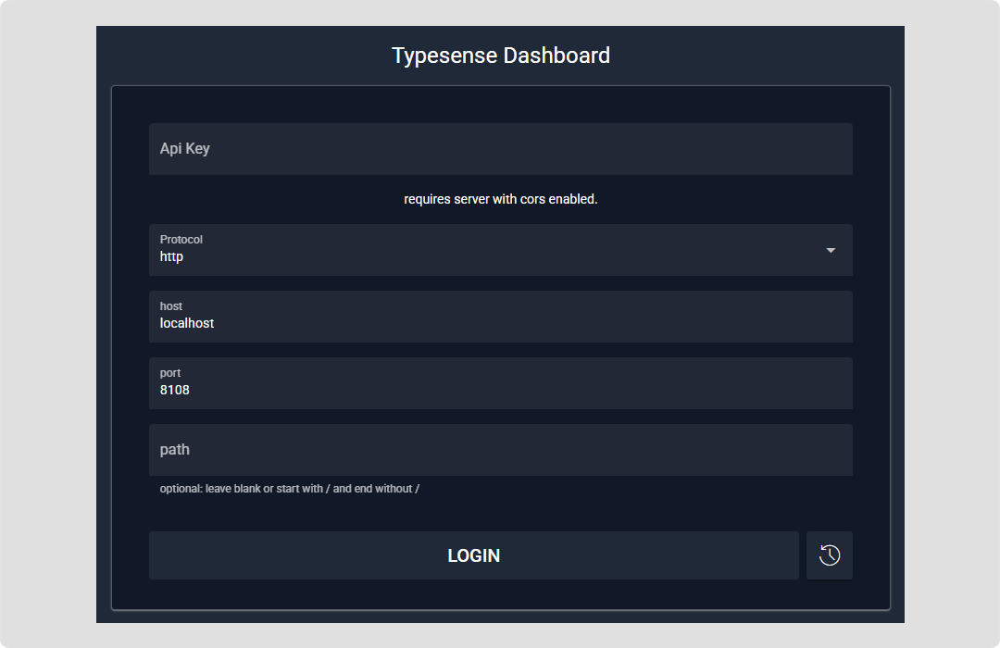

# 🗺️ Typesense Guide

This quickstart guide provides resources and examples for running Typesense locally using Docker Compose. It includes:

- A Docker Compose configuration for local development
- Example collections and documents
- Search queries and API examples
- Configuration options and best practices

## 🧩 Docker Compose Services

| Service | Role | Key Notes |
| --- | --- | --- |
| `typesense` | Core Typesense server | Built from the custom `Dockerfile` (adds `curl` for health checks), uses environment variables from `.env` (API key, data path), and exposes the API port for local access. |
| `typesense-init` | Seed/initialization helper | Runs the `.NET 10` project in `./init-service` to create collections and load sample documents. Typically depends on `typesense` being healthy before seeding, then exits once initialization completes. |
| `typesense-dashboard` | Typesense Dashboard UI | Typesense Dashboard UI served from image; exposes port `8109`, and is used to browse collections locally or via the hosted dashboard. |

<br />

> [!NOTE]
> For exact ports, volumes, and environment variables, see `compose.yaml` and `.env.example`.  
> &nbsp;

---

## 🗃️ Directory Structure

```
.
├── README.md              # This documentation file
├── compose.yaml           # Docker Compose configuration for Typesense services
├── .env                   # Environment file required to configure local environent variables
├── .env.example           # Environment sample file that specifies the required local environent variables
├── compose.sh             # Shell script to execute docker compose commands
├── Dockerfile             # Custom typesense docker file that is based on official typesense image but adds curl support. The curl command is used to provide a health check
├── init-service           # .NET 10 Project that is used to initialise/seed Typesense with sample data
├── scripts                # Collection of scripts to manage stack 
└── typesense-requests     # Sample Typesense API requests

```

---

## ☑ Prerequisites

- Docker and Docker Compose
- Shell environment (bash on linux / git bash on windows)
- Execute permissions on `compose.sh` (`chmod +x compose.sh`)
- Create `.env` file based on sample `.env.example` file and configure environment variables
- .NET10 SDK to run code locally

---

## 🚀 Getting Started

<br />

> [!IMPORTANT]
> &nbsp;  
> - Run these commands from a Git Bash / POSIX shell (on Windows use Git Bash or WSL).
>
> - Ensure that all scripts have execute (`x`) permissions. Run `chmod +x my-script.sh` to add execute permissions.

<br />

### Step 1 - Set environment variables

Ensure that a `.env` file is created at the root of the local folder (`./.env`). These environment variables are used by the various services.

See  [`./.env.example`](./.env.example).

```yaml

# provide any key of your choosing eg. xyz
TN_TYPESENSE_API_KEY=<your_api_key>

```

Once the `.env` file is created, run the following command to load environment variables:

```bash

# loads environment variables
source .env

```

### Step 2 - Run stack

```bash

# start stack
./scripts/stack.sh up

<< 📟 Output >>

 ✔ typesense-stack-typesense       Built   
 ✔ typesense-stack-typesense-init  Built   
 ✔ Container typesense-init        Started 
 ✔ Container typesense             Healthy 


NAME             STATUS
typesense        Up 15 seconds (healthy)
typesense-init   Up 1 second

✅  Script 'stack-up.sh' completed

```

### Step 3 - Run some queries

Run these commands from a Git Bash / POSIX shell (on Windows use Git Bash or WSL).


```bash

TYPESENSE_HOST=http://localhost:8108
TYPESENSE_API_KEY=<provide_your_api_key_here>

# List all collections
curl --silent "${TYPESENSE_HOST}/collections" -X GET -H "Content-Type: application/json" -H "X-TYPESENSE-API-KEY: $TYPESENSE_API_KEY" | jq

# Get products collection
curl --silent "${TYPESENSE_HOST}/collections/products" -X GET -H "Content-Type: application/json" -H "X-TYPESENSE-API-KEY: $TYPESENSE_API_KEY" | jq

# Delete collection
curl --silent "${TYPESENSE_HOST}/collections/products" -X DELETE -H "Content-Type: application/json" -H "X-TYPESENSE-API-KEY: $TYPESENSE_API_KEY" | jq

# Search all products
curl --silent "${TYPESENSE_HOST}/collections/products/documents/search?q=*&page=4&per_page=3" -H "X-TYPESENSE-API-KEY: $TYPESENSE_API_KEY" | jq

# Search with filters - by name field
curl --silent "${TYPESENSE_HOST}/collections/products/documents/search?q=kayak&query_by=name" -H "X-TYPESENSE-API-KEY: $TYPESENSE_API_KEY" | jq

```

Alternatively, see the [./typesense-requests/products.http](./typesense-requests/products.http) file and use [Rest Client](https://marketplace.visualstudio.com/items?itemName=humao.rest-client) VSCode extension to run commands. Below is a snippet of what the file looks like:

```bash
# file: ./typesense-requests/products.http


# See ./typesense.code-workspace for list of environments and variables

@host = http://localhost:8108
@api_key = {{$dotenv TN_TYPESENSE_API_KEY}}

### Get all collections

curl "{{host}}/collections" -X GET -H "Content-Type: application/json" -H "X-TYPESENSE-API-KEY: {{api_key}}"

### Get products collection

curl "{{host}}/collections/products" -X GET -H "Content-Type: application/json" -H "X-TYPESENSE-API-KEY: {{api_key}}"

.
.
.

```

### Step 4 - Access the dashboard

There are 2 ways to access the Typesense Dashboard:

- You can use the hosted Typesense Dashboard at `https://bfritscher.github.io` — no local setup needed.

- Or run it locally via Docker Compose at `http://localhost:8109` after starting the stack.

<br />

> [!NOTE]
> &nbsp;  
> Find more information about the project at [https://github.com/bfritscher/typesense-dashboard](https://github.com/bfritscher/typesense-dashboard)  
> &nbsp;  

<br />




---

## 🧠 Manage Stack

Use the `./scripts/stack.sh` script to manage the stack.

### 📚 Get Help

```text

./scripts/stack.sh help

<< 📟 Output >>

Usage: stack.sh <command> [options]

Commands:
    up          Bring up the Docker Compose stack
    down        Bring down the Docker Compose stack (removes volumes)
    ps          Show status of all containers
    logs        Show logs for all containers (or specify service name)
    reinit      Recreate the typesense-init container
    help        Show this help message

Examples:
    stack.sh up
    stack.sh down
    stack.sh ps
    stack.sh logs
    stack.sh logs typesense-init
    stack.sh reinit

```

### 👨‍💻 Use Script

```bash

# Bring up the Docker Compose stack
./scripts/stack.sh up          

# Bring down the Docker Compose stack (removes volumes)
./scripts/stack.sh down        

# Show status of all containers
./scripts/stack.sh ps          

# Show logs for all containers (or specify service name)
./scripts/stack.sh logs        

# Recreate the typesense-init container
./scripts/stack.sh reinit      

```

---

## 🔮 Other

The [`books.http`](./typesense-requests/books.http) file in the `typesense-requests` directory provides sample HTTP requests for interacting with a "books" collection in Typesense. It demonstrates common API operations such as creating a collection, retrieving collections, indexing documents, and performing searches.

To use this file:

1. Ensure the Typesense stack is running (see Step 2 in Getting Started).
2. Install the [REST Client](https://marketplace.visualstudio.com/items?itemName=humao.rest-client) extension in VS Code.
3. Open the `books.http` file in VS Code.
4. Set the `@api_key` variable to your Typesense API key (it loads from the `.env` file via `{{$dotenv TN_TYPESENSE_API_KEY}}`).
5. Click the "Send Request" link above each request to execute it.

This file serves as a quick reference for testing and learning Typesense API endpoints related to book data.

---
