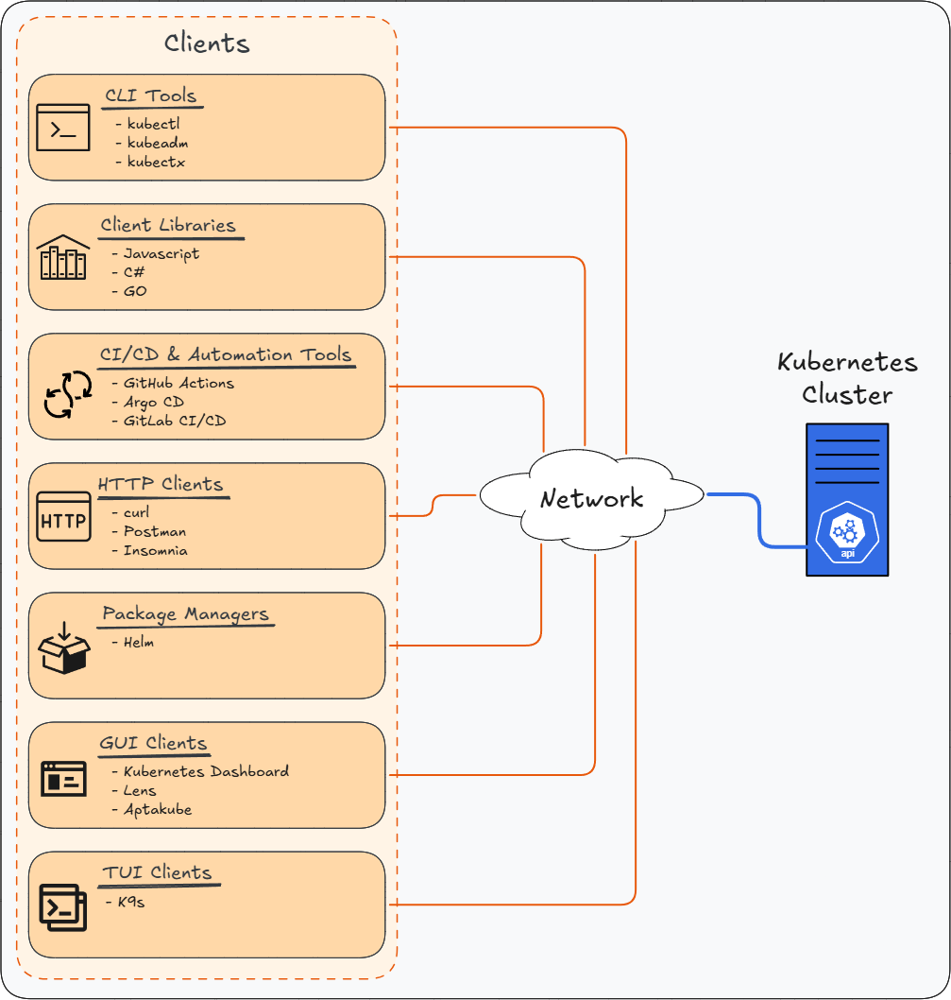

# Kubernetes Architecture Overview

Kubernetes, a container orchestration engine/platform, provides a host of features and capabilities to run and scale workloads (applications, services). These capabilities and features are made possible by the modular nature of the Kubernetes architecture. Having an understanding of the Kubernetes architecture will help to enable and empower one to leverage these capabilities and truly benefit from the full Kubernetes offering.

The contents are as follows:

- [🎯 Goals](#-goals)
- [👋 Introduction](#-introduction)
  - [Why Understanding Kubernetes Architecture Matters](#why-understanding-kubernetes-architecture-matters)
  - [Architecture Importance by Role](#architecture-importance-by-role)
- [🏛️ Architecture Summary](#️-architecture-summary)
  - [Kubernetes High-Level Architecture](#kubernetes-high-level-architecture)
  - [Kubernetes Cluster Architecture](#kubernetes-cluster-architecture)
- [✈️ Kubernetes Control Plane / Data Plane Overview](#️-kubernetes-control-plane--data-plane-overview)
  - [Control Plane](#control-plane)
  - [Data Plane](#data-plane)
  - [Control Plane / Data Plane Key Differences](#control-plane--data-plane-key-differences)
  - [Interactions Between Components](#interactions-between-components)
- [🧱 Kubernetes Objects](#-kubernetes-objects)
  - [Kubernetes Object vs Kubernetes Resource](#kubernetes-object-vs-kubernetes-resource)
  - [Key Kubernetes Resources](#key-kubernetes-resources)
  - [Key Characteristics](#key-characteristics)
  - [How Kubernetes Objects Work](#how-kubernetes-objects-work)
  - [Where Do Kubernetes Objects Fit in the Architecture?](#where-do-kubernetes-objects-fit-in-the-architecture)
- [모 Kubernetes Networking](#모-kubernetes-networking)
  - [Kubernetes Network Model](#kubernetes-network-model)
    - [1. Container-to-Container Networking](#1-container-to-container-networking)
    - [2. Pod-to-Pod Networking (same Node)](#2-pod-to-pod-networking-same-node)
    - [3. Pod-to-Pod Networking (across Nodes)](#3-pod-to-pod-networking-across-nodes)
    - [4. Pod-to-Service Networking](#4-pod-to-service-networking)
      - [Key concepts in Pod-to-Service communication](#key-concepts-in-pod-to-service-communication)
      - [Pod-to-Service Packet Trace](#pod-to-service-packet-trace)
        - [Pod to Cluster IP (Single Node)](#pod-to-cluster-ip-single-node)
        - [Pod to Cluster IP (Cross-Node)](#pod-to-cluster-ip-cross-node)

---

## 🎯 Goals

The goals for the _Architecture Overview_ are as follows:

- Architecture Importance: Explain the importance of Kubernetes Architecture and why undestanding it matters.

- Architecture Summary: Introduce high-level architecture, concepts, and key components.

- Key Abstractions and Workloads: Explain workloads (and workload management), and highlight the core Kubernetes Objects and how they relate to resources (and understanding the key differences).

- Networking: Cover connectivity fundamentals, and summarize networking and service discovery.

- High-Level Workflow and Interactions: Provide examples of how components interact to deploy and manage workloads.

---

## 👋 Introduction

> [!NOTE]
>
> According to [official Kubernetes documentation](https://kubernetes.io/docs/home/):  
> 
> "Kubernetes is an open source container orchestration engine for automating deployment, scaling, and management of containerized applications. The open source project is hosted by the Cloud Native Computing Foundation ([CNCF](https://www.cncf.io/projects/kubernetes/))."

Kubernetes (often abbreviated as K8s) is an open-source platform for deploying containerised applications. It provides automation of deployments, scaling, and management of containerised applications. Furthermore, it provides a modular and robust architecture that is essential to enabling orchestration of a large number of containers across a cluster of machines. This architecture helps ensure reliability, efficient resource use, high availability, self-healing, and simplified operations.

### Why Understanding Kubernetes Architecture Matters

Kubernetes architecture is the backbone of modern containerized application management, enabling scalability, resilience, and efficiency in deploying and running software. This importance is further highlighted as follows:

- **Effective Management of Distributed Systems**: Kubernetes orchestrates containers across clusters of nodes, handling tasks like scheduling, scaling, and load balancing. Understanding the cluster components (like the Control Plane, Data Plane, and add-ons) helps you design, troubleshoot, and optimize workloads (containerised applications).

- **Scalability and Resilience**: The architecture’s design, with features like pod replication, auto-scaling, and self-healing (restarting failed containers or rescheduling pods), ensures applications stay available and performant. Understanding these mechanisms allows one to configure systems to handle varying loads or failures effectively.

- **Resource Optimization**: Kubernetes abstracts infrastructure, allowing efficient resource allocation (e.g., CPU, memory) via namespaces, resource quotas, and scheduling policies. Understanding these elements helps minimize costs and maximize performance in cloud or on-premise environments.

- **Debugging and Troubleshooting**: Familiarity with components like the API server, kubelet, or etcd enables one to identify issues (e.g., pod crash, network misconfiguration, or control plane failure) and resolve them faster.

- **Customization and Extensibility**: Kubernetes supports custom resources, operators, and plugins. Understanding its architecture allows one to extend functionality, integrate with CI/CD pipelines, or tailor it to specific workloads (e.g., machine learning, serverless).

- **Industry Relevance**: Due to it's mass adoption ([see CNCF 2023 Annual Survey](https://www.cncf.io/reports/cncf-annual-survey-2023/)), Kubernetes expertise is a high-demand skill. Knowing its architecture equips one to design robust systems and stay competitive in DevOps, SRE, or cloud engineering roles.

### Architecture Importance by Role

The applicability of the Kubernetes architecture varies across different engineering roles. The section above _[Why Understanding Kubernetes Architecture Matters](#21-why-understanding-kubernetes-architecture-matters)_ highlights the general importance of understanding kubernetes architecture. However, this section provides additional context as to how understanding Kubernetes architecture applies to specific roles.

👨‍💻 <u>**For a Backend Developer**</u>:

A developer focuses on building and deploying applications. Understanding Kubernetes architecture directly impacts their ability to:

- **Design and Build**: Knowing about Kubernetes Objects/Resources like Pods, Services, and Deployments helps a developer structure their application for the platform. Services can be designed to be stateless and scalable, knowing Kubernetes will manage their lifecycle.

- **Troubleshooting**: When a container fails to start or a service is unreachable, a developer with architectural knowledge can diagnose whether the problem is in their code, a misconfiguration in the Pod manifest, or an underlying issue with the Kubelet or Kube-Proxy. This reduces the time spent on debugging.

- **Optimize Resource Consumption**: By understanding how the Scheduler allocates resources, developers can specify appropriate CPU and memory requests and limits in their manifests. This prevents their applications from being killed for exceeding resource limits and helps the cluster run efficiently.

♾️👷 <u>**For a DevOps Engineer**</u>:

A DevOps engineer is responsible for the entire software delivery pipeline, from code to production. Understanding Kubernetes architecture is helpful for:

- **Building Resilient CI/CD Pipelines**: A DevOps engineer leverages Kubernetes' declarative nature to automate deployments. Understanding how the Controller Manager maintains a desired state allows them to implement sophisticated deployment strategies like rolling updates and blue-green deployments with confidence, ensuring zero-downtime releases.

- **Ensuring High Availability and Scalability**: By knowing how a Replication Controller or ReplicaSet works, a DevOps engineer can configure applications to have a specific number of replicas. They can also implement Horizontal Pod Autoscalers (HPA), which automatically scale applications based on demand, guaranteeing performance and reliability.

- **Implementing Security and Monitoring**: The architecture guides a DevOps engineer in setting up proper security controls. They can use role-based access control (RBAC) to manage permissions and integrate monitoring tools like Prometheus and Grafana by understanding how the API Server exposes metrics and logs.

🛠️👷 <u>**For a Platform/Infrastructure Engineer**</u>:

A platform or infrastructure engineer designs and maintains the underlying Kubernetes cluster. Their knowledge of the architecture is the foundation of their work, enabling them to:

- **Design and Build the Platform**: They are the ones who set up and configure the Control Plane components—the API Server, etcd, and Scheduler. A deep understanding of each component's role and its interactions is necessary to build a secure, stable, and high-performing platform.

- **Manage Cluster Health and Performance**: They must be able to diagnose issues at the cluster level, such as a failing etcd quorum or a misbehaving scheduler. They optimize the cluster by configuring networking policies, choosing the right Container Network Interface (CNI), and managing storage classes to meet application demands.

- **Provide a Developer-Friendly Experience**: Their goal is to abstract away complexity for developers. By knowing the architecture, they can create self-service tools and internal developer platforms (IDPs) with guardrails, allowing developers to deploy applications without needing to understand the underlying infrastructure.

🗺️📐👷 **<u>For a Systems Architect</u>**:

A systems architect is responsible for the high-level design and long-term strategy of an organization's technology landscape. For them, understanding Kubernetes architecture means:

**Making Strategic Technology Decisions**: They must decide how and where to use Kubernetes. This involves assessing if the microservices-based, container-orchestrated model aligns with the organization's goals for scalability, cost, and resilience. They evaluate whether to use a managed service (EKS, GKE, AKS) or a self-hosted solution.

**Designing Comprehensive System Landscapes**: An architect integrates Kubernetes into the broader ecosystem. They design how Kubernetes clusters will interact with other systems, like databases, message queues, and external services. They define networking and security boundaries, ensuring the entire system is cohesive and secure.

**Planning for the Future**: Knowing Kubernetes' extensibility and its role in the cloud-native ecosystem, an architect can plan for future growth and adoption of technologies like operators, service meshes (e.g., Istio), and custom resource definitions (CRDs). This ensures the architecture remains flexible and future-proof.

👮 **<u>Security Engineers</u>**:

Security engineers are responsible for enforcing least-privilege access and protecting workloads. Understanding the architecture ensures that the following areas covered:

- **Granular Access Control**: Kubernetes uses Role-Based Access Control (RBAC) to manage who can do what. Security engineers must understand the API server, controllers, and etcd to prevent privilege escalation and limit access to sensitive resources.

- **Network Segmentation & Isolation**: Pods can communicate freely unless restricted. Engineers use NetworkPolicies to define which pods can talk to each other, reducing lateral movement in case of compromise.

- **Secrets Management**: Kubernetes stores secrets (like API keys and passwords) in etcd. Without proper encryption and access controls, these secrets can be exposed. Knowing the architecture helps secure them using tools like Vault or cloud-native equivalents.

- **Container Image Integrity**: Containers are built from images that may contain vulnerabilities. Engineers integrate image scanning tools (e.g., Trivy, Grype) into CI/CD pipelines to ensure only trusted images are deployed.

- **Runtime Monitoring & Threat Detection**: Tools like Falco monitor system calls and detect suspicious behavior in real time. Understanding how containers run inside pods and how the kubelet interacts with the control plane helps engineers set up effective runtime defenses.

- **Audit & Compliance**: Kubernetes generates audit logs from the API server. Engineers use these logs to detect anomalies, investigate incidents, and meet compliance requirements.

- **Attack Surface Awareness**: Misconfigured clusters can expose the Kubernetes dashboard, API server, or etcd to attackers. Knowing the architecture helps identify and lock down these vulnerable entry points.

## 🏛️ Architecture Summary

This section provides an overview of the Kubernetes architecture, emphasizing its _Client/Server Architecture_ and the division of the Kubernetes cluster into the _Control Plane and Data Plane Model_.

<br />

> [!IMPORTANT]
> 
> **Key Points:**  
>  
> - The general Kubernetes architecture is based on the **_Client-Server Architecture_** where Clients (e.g., CLI, CI/CD, GUI) interact with the Server (Kubernetes cluster). This model enables centralized management, scalability, and efficient resource sharing.  
>   
> - Kubernetes cluster architecture is further divided into the **_Control Plane / Data Plane Model_**. The **_Control Plane_** acts as the cluster's brain, managing state, resource allocation, and workload orchestration. The **_Data Plane_** executes application workloads and handles networking and storage.  

<br />

### Kubernetes High-Level Architecture

Kubernetes follows a _Client/Server Architecture_. The _Client/Server Architecture_ is a computing model where tasks are divided between service/resource requesters (clients) and service/resource providers (servers). Clients send requests for data or services over a network, and the server responds by processing these requests and delivering the required resources back to the clients. The server hosts, manages, and delivers most resources, while the client consumes services/resource. This setup enables multiple clients to access resources from a centralized server, commonly seen in web applications, email, and file sharing. This model enables centralized management, scalability, and efficient resource sharing.

The following diagram provides a high-level view of the primary components and interactions of a _Client/Server Architecture_:


<br />

> [!IMPORTANT]
> 
> The key points of a _Client-Server Architecture_ center around dividing roles between clients requesting resources and servers providing them, with communication over a network using standard protocols.
>
> See [Client-Server Model](https://en.wikipedia.org/wiki/Client%E2%80%93server_model) on Wikipedia for more information.

<br />

More specific to Kubernetes, the _Client/Server Architecture_ further translates into the following diagram where clients (e.g., CLI, CI/CD, GUI, TUI, Package Managers) interact with the Kubernetes cluster via the Kubernetes api-server.



As can be seen from the diagram, Kubernetes supports a broad range of Clients:

- </:> Command Line Interface (CLI) Tools:
  
  These are interactive tools used by humans to manage Kubernetes clusters.

  - [kubectl](https://kubernetes.io/docs/reference/kubectl/): a command-line tool that allows users to run commands against Kubernetes clusters to deploy applications, inspect and manage cluster resources, and view logs.
  - [kubeadm](https://kubernetes.io/docs/reference/setup-tools/kubeadm/): a command-line tool that simplifies the process of setting up and managing Kubernetes clusters. It is designed to bootstrap a Kubernetes cluster, initialize the control plane, and join worker nodes with minimal manual configuration.
  - [kubectx](https://github.com/ahmetb/kubectx): a command-line tool that simplifies switching between Kubernetes clusters and namespaces when using `kubectl`.

- 📚 Client Libraries ([See supported libraries](https://github.com/kubernetes-client))
  
  These are libraries used by developers to interact with the Kubernetes API programmatically in their applications. For example:

  - [Javascript](https://github.com/kubernetes-client/javascript): Used for Node.js applications or web-based tools interacting with Kubernetes.
  - [C#](https://github.com/kubernetes-client/csharp): Used for .NET applications interacting with Kubernetes.
  - [Java](https://github.com/kubernetes-client/java): Used for Java applications interacting with Kubernetes.

- 🛠️ CI/CD and Automation Tools
  
  Tools and/or platforms that automate deployments or manage Kubernetes resources as part of a pipeline.

  - [GitHub Actions](https://github.com/features/actions): Automates workflows (defined in YAML files within GitHub repository) that interact with Kubernetes clusters to build, test, and deploy applications.
  - [Jenkins](https://www.jenkins.io/): Uses plugins (e.g., Kubernetes plugin) to interact with the Kubernetes API for deploying applications.
  - [Argo CD](https://argo-cd.readthedocs.io/en/stable/): A GitOps tool that continuously reconciles the cluster state with Git repository manifests.
  - [GitLab CI/CD](https://about.gitlab.com/): Integrates with Kubernetes to deploy applications and/or manage resources via Helm or direct API calls.

- 🌐 HTTP Clients
  
  Act as Kubernetes clients by directly interacting with the Kubernetes API server using HTTP/REST requests. These are not Kubernetes-specific.

  - [curl](https://curl.se/): A command-line tool for making HTTP requests to API's (including the Kubernetes API server).
  - [Postman](https://www.postman.com): GUI-based tool for designing, testing, and debugging APIs, and supporting HTTP requests.
  - [Insomnia](https://insomnia.rest): An alternative to Postman, designed for API testing with support for REST, GraphQL, and more.

- 📦 Package Managers
  
  These tools manage complex applications or resources on Kubernetes by interacting with the API server.

  - [helm](https://helm.sh): A package manager for Kubernetes that uses Helm charts to define, install, and upgrade applications, communicating with the API server to apply resources.

- 📟 Graphical User Interface (GUI) Clients
  
  Graphical user interfaces that allow users to manage Kubernetes clusters visually.

  - [Kubernetes Dashboard](https://kubernetes.io/docs/tasks/access-application-cluster/web-ui-dashboard/): The official web-based UI for Kubernetes, allowing users to view and manage resources like pods, deployments, and services.
  - [Lens](https://k8slens.dev): A popular desktop application for managing multiple Kubernetes clusters with a rich interface for monitoring and debugging.
  - [Aptakube](https://aptakube.com): A lightweight, modern and multi-cluster GUI client for Kubernetes to help manage your cluster from your desktop.

- 💻 Terminal User Interface (TUI) Clients
  
  Terminal based UI that allow users to manage Kubernetes clusters.
  
  - [K9s](https://k9scli.io): terminal-based, open-source user interface tool for managing and interacting with Kubernetes clusters. It provides a visually rich, interactive dashboard to monitor and control Kubernetes resources.

- ☰ Other Tools
  
  - [Terraform](https://developer.hashicorp.com/terraform): An Infrastructure-as-code tool that can interact with Kubernetes clusters via the Kubernetes provider to manage resources.
  - [Ansible](https://docs.ansible.com/): Uses Kubernetes modules to automate cluster management tasks.
  - [Skaffold](https://skaffold.dev/): A development tool that automates building, pushing, and deploying applications to Kubernetes.

### Kubernetes Cluster Architecture

As mentioned before, Kubernetes is based on the _Client/Server Architecture_. Within the Kubernetes cluster, this architecture is further divided into the **_Control Plane_** and **_Data Plane_** model as is illustrated below:


A **_"plane"_** is like a layer or domain that provides a separation of concerns (responsibilities). The **_Control Plane_**, which includes components like the `API Server`, `etcd`, `Controller Manager`, and `Scheduler`, acts as the cluster’s brain, managing its state and making decisions about resource allocation and workload orchestration. The **_Data Plane_**, consisting of `kubelet`, `kube-proxy`, and the `Container Runtime` on worker nodes, executes the actual application workloads and handles networking and storage. The separation of _Control Plane_ and _Data Plane_ helps to ensure scalability, reliability, and fault tolerance. Together, these layers ensure Kubernetes can efficiently manage and run containerized applications at scale. A Kubernetes cluster typically consists of at least one Control Plane node (master node) and multiple Data Plane nodes (worker/minion nodes), which communicate via the Kubernetes API.

<br />

> [!TIP]
>
> **What is a "plane"?**
> 
> - In network architecture, the term "plane" signifies an abstract layer or domain where certain operational processes occur.
> 
> - It is not a physical component, but instead a conceptual area used to organize and separate network responsibilities. 
> 
> - Planes help define where tasks like routing, traffic management, and policy enforcement take place, allowing clearer organization and management of complex network functions.
> 
> - Working concurrently, planes ensure efficient and reliable network performance.

<br />

---

## ✈️ Kubernetes Control Plane / Data Plane Overview

There are 2 fundamental domains that comprise the Kubernetes cluster architecture, namely the _Control Plane_ and the _Data Plane_. The following section provides a high-level overview of these domains.

### Control Plane

The Control Plane is the brain of the Kubernetes cluster, and is responsible for managing the cluster's state, orchestrating resources, and ensuring the desired state of applications is maintained. It handles all the decision-making processes and maintains the cluster's configuration and state in a consistent manner. The _Control Plane_ components are typically hosted on _Master Nodes_ but can also run on other nodes in highly available setups.

<br />

> [!TIP]
> 
> **Master nodes** are the machines (physical or virtual) that run the control plane components. They are responsible for hosting and executing the control plane processes to manage the entire Kubernetes cluster.

<br />

The core components of the Control Plane include:  

- 1️⃣ **API Server (kube-apiserver)**: The central hub of the Kubernetes API. It exposes the Kubernetes API over HTTP/HTTPS, validates and processes API requests, and serves as the entry point for all administrative tasks, such as creating or updating resources like Pods, Services, and Deployments. 

- 2️⃣ **etcd**: A distributed key-value store that acts as the cluster's "brain." It persistently stores all cluster data, including configuration, state, and metadata, ensuring consistency and high availability through mechanisms like Raft consensus. 

- 3️⃣ **Scheduler (kube-scheduler)**: Watches for newly created Pods without an assigned node and selects the optimal node for them based on factors like resource availability, affinity/anti-affinity rules, and hardware constraints. 

- 4️⃣ **Controller Manager (kube-controller-manager)**: Runs a set of background controllers (e.g., Deployments, StatefulSets) that regulate the cluster's state by comparing the desired state (from API objects) with the actual state and making adjustments, such as scaling replicas or handling node failures. 

- 5️⃣ **Cloud Controller Manager (cloud-controller-manager)**: This component is optional depending on usage circumstances. It integrates Kubernetes with cloud providers (e.g., AWS, GCP, Azure) for cloud-specific features like load balancers, storage, and node management. This component is only relevant in cloud environments and allows for vendor-specific extensions. 

<br />

🎨 The diagram below further illustrates the primary components of the _Control Plane_ (the numbers correlate with description):

<br />


### Data Plane

Worker nodes (also called minions) are the machines where application workloads run. Each node hosts Pods (the smallest deployable units in Kubernetes, consisting of one or more containers) and provides the runtime environment.

Key components on each node include:

- 1️⃣ **kubelet**: The primary agent on each node that communicates with the control plane. It ensures containers in Pods are running and healthy by pulling images, starting/stopping containers, and reporting node and Pod status back to the API server. 

- 2️⃣ **kube-proxy**: Manages network rules on the node to enable communication between Pods, Services, and external traffic. It implements Service abstractions (e.g., load balancing) using mechanisms like iptables or IPVS. 

- 3️⃣ **Container Runtime**: The software that runs and manages containers, such as containerd, CRI-O, or Docker (via a shim). It handles low-level tasks like image pulling, container execution, and lifecycle management, adhering to the Container Runtime Interface (CRI). 

- 4️⃣ **Pod**: The smallest deployable units, encapsulating one or more containers. Pods and their containers are the actual workloads running user applications.

<br />

🎨 The diagram below further illustrates the primary components of the _Data Plane_ (the numbers correlate with description):

<br />


### Control Plane / Data Plane Key Differences

<br />

> [!TIP]
> As an analogy, think of the Kubernetes Cluster as an Airport:
> - **Control Plane:** Think of it as the "air traffic control" of the Kubernetes cluster. It monitors, plans, and directs all activities, ensuring everything runs smoothly.  
>   
> - **Data Plane:** Think of it as the "runway and planes" where the actual flights (workloads) take off, land, and operate, following instructions from air traffic control.

<br />

|                 | **Control Plane**                                | **Data Plane**                                |
| --------------- | ------------------------------------------------ | --------------------------------------------- |
| **Purpose**     | Manages and orchestrates the cluster.            | Runs and manages application workloads.       |
| **Components**  | API server, etcd, scheduler, controller manager. | Kubelet, container runtime, kube-proxy, pods. |
| **Location**    | Runs on master/control plane nodes.              | Runs on worker/compute nodes.                 |
| **Function**    | Decision-making, state management.               | Execution of containers, networking, storage. |
| **Workloads**   | Does not run user applications.                  | Runs user applications (pods).                |
| **Operational Rhythm** | Slower, less frequent operations (e.g., policy updates, scheduling). | High-volume, performance-critical operations (e.g., packet forwarding, data processing). |
| **Scalability** | Limited to a few control plane nodes (HA setup). | Scales with additional worker nodes.
| **Capacity Needs** | Relatively low capacity needs; typically runs on a few instances. | Requires the most compute capacity; can scale to thousands of nodes. |
| **Data Handling** | Handles metadata and instructions only. | Processes and transports live, structured, or sensitive data. |
| **Security Profile** | Lower attack surface due to reduced data exposure. | Higher security risk; requires robust isolation and compliance. | 

### Interactions Between Components

Kubernetes operates as a distributed system where components (control plane and node-level) interact primarily through the `kube-apiserver` (located in control plane) and work in a control loop to continuously monitor and reconcile the cluster's state. The workflow involves creating, updating, and managing Kubernetes objects (e.g., `Pods`, `Deployments`, `Services`) to run workloads, handle networking, and enforce policies. These interactions are asynchronous, event-driven, and rely on the following principles:

- **API-Centric Design**: All components interact through the `kube-apiserver`. For example, when a user deploys an application via `kubectl` (command-line tool used to interact with and manage Kubernetes clusters), the request goes to the API server, which stores the desired state in `etcd`. The `scheduler` then assigns `Pods` to `nodes`, and `controllers` ensure reconciliation.

- **Declarative Model**: Kubernetes operates declaratively where users define the desired state (e.g., Deployments, Services) in YAML/JSON manifests, which are sent to `kube-apiserver`, and the system continuously works to achieve and maintain that state.

- **Networking and Add-ons**: Beyond core components, Kubernetes relies on add-ons like CoreDNS for service discovery, a dashboard for UI management, and monitoring tools (e.g., Prometheus). Networking is handled by plugins conforming to the Container Network Interface (CNI), ensuring Pods can communicate across nodes.

- **Scalability and Extensibility**: The architecture supports horizontal scaling (adding more nodes) and extensibility via Custom Resource Definitions (CRDs), webhooks, and operators.

- **Control Loop**: Controllers (via kube-controller-manager) and the scheduler monitor etcd for changes, ensuring the actual state matches the desired state. For example, if a Pod crashes, the ReplicaSet controller creates a replacement.

- **Event-Driven Architecture**: Components watch for changes (e.g., new Pods, node failures) and react accordingly, often triggered by updates in etcd.

The following interaction diagram demonstrates a simply workflow the includes the following actions:

🐾 Step 1 - User applies a `Deployment`  
🐾 Step 2 - User applies a `Service`  
🐾 Step 3 - `Control Plane` creates and schedules `Pods`  
🐾 Step 4 - `Data Plane` runs `Pods` and configures `Service`  
🐾 Step 5 - User accesses `Service`  


---

## 🧱 Kubernetes Objects

<br />

> [!NOTE]
> 
> 📄 According to the [official Kubernetes documentation (Understanding Kubernetes Objects)](https://kubernetes.io/docs/concepts/overview/working-with-objects/#kubernetes-objects):  
> 
> Kubernetes objects are persistent entities in the Kubernetes system. Kubernetes uses these entities to represent the state of your cluster.
>
> Specifically, they can describe:
> - What containerized applications are running (and on which nodes)
> - The resources available to those applications
> - The policies around how those applications behave, such as restart policies, upgrades, and fault-tolerance

<br />

Kubernetes Objects are the fundamental building blocks that are used to represent the desired state of a Kubernetes cluster. These objects are defined using `YAML` or `JSON` manifests, created via the _API Server (`kube-apiserver`)_, and are stored in the Kubernetes _API Server data store (`etcd`)_. The Kubernetes control plane then continuously reconciles current state with state described in these objects.  

Kubernetes Objects are not physical components like Control Plane Nodes (Master Nodes) or Data Plane Nodes (Worker Nodes). Instead, they are declarative constructs that represent the configuration and state of resources within the cluster. ie., They are not part of the _Control Plane_ or _Data Plane_ but are managed by the _Control Plane_ and executed on the _Data Plane_.

<br />

> [!TIP]
> 
> Think of Kubernetes Objects as the blueprints for your applications and the infrastructure they run on.
> 
> - **Control Plane:** The architect that reads the blueprints (objects) and issues instructions to make them reality.  
> 
> - **Data Plane:** The construction workers that build and maintain what the blueprints describe.  
> 
> - **Objects:** The YAML/JSON blueprints that specify what the cluster should look like.  

<br />

In summary, Kubernetes Objects are the building blocks for managing containerized workloads. They enable declarative management, scalability, and automation, allowing one to focus on defining what one wants rather than how to achieve it. The Control Plane handles the rest, ensuring reliability and consistency.

### Kubernetes Object vs Kubernetes Resource

It is common to find _"Kubernetes Object"_ being used interchangedly with _"Kubernetes Resource"_. In this scenario, the term "resource" is usually intended to mean a "generic resource (or object)" and not an "API Resource". To avoid confusion, it is important to understand the difference between an "object" and an "API resource" as they are quite different in their meaning and application. Therefore, this section explains the differences by comparing a _"resource"_ to an _"object"_.

<br />

> [!TIP]
>
> In short, a resource is a category or type of object that is managed in Kubernetes, while an object is a concrete instance of that resource.

<br />

**Kubernetes Resource:**

- A general term referring to an abstraction (type or kind of entity) in the Kubernetes system that represents a component of the cluster's state or functionality.

- Defined by the Kubernetes API and includes things like `Pods`, `Services`, `Deployments`, `ConfigMaps`, etc. Therefore, a resource refers to a specific API endpoint or type in the Kubernetes API.

- Resources are usually accessed via RESTful URLs, such as:
  - `/api/v1/pods` to fetch all pods
  - `/api/v1/namespaces` to fetch all namespaces

- Think of a resource as a template or category that defines what kind of thing you can create or interact with.

- Not all Kubernetes resources are objects; there are also virtual resources or sub-resources that perform operations (e.g., /pods/status) rather than representing persistent entities.


**Kubernetes Object:**

- An object is a specific instance of a resource that has been created in the Kubernetes cluster. For example, when you create a Pod by submitting a YAML file with `kind: Pod`, the resulting entity (with a specific name, namespace, and configuration) is a Kubernetes object.

- Objects are persistent entities in the cluster's state, stored in the `etcd` database, and represent the actual, concrete realization of a resource.

- Objects have a spec (desired state) and status (current state), which Kubernetes uses to manage them.

**Usage Comparison Table:**

| Term | What It Refers To | Example |
| --- | --- | --- |
| Resource | API endpoint/type | `/api/v1/pods` (Pod resource endpoint) |
| Object | Persistent instance of a resource | A Pod named `nginx-pod` (object of Pod resource) |

<br />

🎨 The following diagram illustrates how objects and resources are used:

<br />


**Analogy:**

- Food
  
  - Resource - The menu item and the waiter’s route to the kitchen
  - Object - The actual dish you ordered

- Vehicle
  
  - Resource - Blueprint of a car is a resource (a type of vehicle), 
  - Object - "my specific red Ferrari F355" representing a concrete instance of a car (built from blueprint). You interact with the "Car" resource type to create or manage "Car" objects.

- Object Oriented Programming

  - Resource - A resource is the class or type (e.g., Deployment, Service).
  - Object - An instance of that class, with its own unique data and state (e.g., a specific Deployment named nginx-deployment with 3 replicas).

### Key Kubernetes Resources

The following table provides a list of commonly used Kubernetes resources:

<br />

| Category | Resource | Description |
| --- | --- | --- |
| **Workload** | Pod | The smallest deployable units, typically containing one or more containers. |
| | DaemonSet | Ensures a pod runs on every (or a subset of) nodes in the cluster. |
| | Deployment | Manage replica sets and ensure a specified number of pod replicas are running. |
| | Job & CronJob | Manage one-time or scheduled tasks, running pods to completion. |
| | StatefulSet | Manages stateful applications with persistent identities. |
| **Configuration & Management** | ConfigMap | Stores configuration data as key-value pairs for use by pods or other objects. |
| | Namespace | Logical partitions for organizing resources within a cluster. They're like virtual clusters. |
| **Metadata** | Labels | Labels are key-value pairs that you attach to Kubernetes objects (like Pods, Services, Deployments, and Nodes) to identify and categorize them. They are essentially tags that provide meaningful metadata. |
| | Selectors | Selectors are queries that use labels to identify a specific group of objects. |
| **Service & Networking** | Service | An abstraction for exposing Pods to internal or external traffic. ie., define how to access a set of pods (e.g., via load balancing). |
| | Ingress | Manages external access to services, typically via HTTP/HTTPS, with routing rules. |
| **Security** | Secret | Stores sensitive data (e.g., passwords, tokens) securely for use by pods. |
| **Storage** | PersistentVolume (PV)/PersistentVolumeClaim (PVC) | Manage storage resources for pods, decoupling storage from pod lifecycles. |

<br />

> [!TIP]
> Use the kubectl command-line tool to view a list of resources.
> 
> ➤ To list common resources in the current namespace:  
>   
> ```
> kubectl get all
> ```
>
> ➤ To list common resources across all namespaces:  
>   
> ```
> kubectl get all --all-namespaces
> ```
>
> ➤ To list all available API resource types:  
>   
> ```
> kubectl api-resources
> ```

<br />

### Key Characteristics

- **Abstraction Layer:** Kubernetes objects are the user-facing abstractions that define workloads, networking, storage, and policies. They are not part of the _Control Plane_ or _Data Plane_ but are managed by the _Control Plane_ and executed on the _Data Plane_.

- **Storage:** Objects are stored in etcd (via the API server) as the source of truth for the cluster’s desired state.

- **Reconciliation Loop:** The _Control Plane_ continuously reconciles the actual state (worker node resources) with the desired state (objects).  

- **Extensibility:** Custom objects (via Custom Resource Definitions, or CRDs) allow users to extend Kubernetes functionality, integrating seamlessly with the architecture.  

- **Declarative Configuration:** Objects are defined using YAML or JSON manifests, specifying the desired state (e.g., number of replicas, container images, networking rules).

- **API Primitives:** They are part of the Kubernetes API and are managed by the Kubernetes control plane to ensure the actual state matches the desired state.

- **Namespaced or Cluster-Scoped:** Objects can belong to a namespace (e.g., for isolating resources) or be cluster-wide (e.g., nodes, persistent volumes).

- **Metadata and Spec:** Each object has metadata (name, namespace, labels, annotations) and a spec defining its desired configuration.

<br />

> [!NOTE]
>
> - Objects are not tied to a specific node type (master or worker) but are cluster-wide constructs managed centrally by the _Control Plane_.
>
> - Some objects, like `ClusterRole` or `Namespace`, affect cluster-wide behavior, while others, like Pods, directly influence workloads on worker nodes.
>
> - To explore objects further, you can use `kubectl get <object-type>` (e.g., `kubectl get pods`, `kubectl get deployments`) to see their state or `kubectl describe <object-type> <name>` for detailed information.

<br />

### How Kubernetes Objects Work

- **Creation:** Define objects in YAML/JSON manifests and apply them using kubectl apply or the Kubernetes API.

- **Reconciliation:** The Kubernetes Control Plane (via controllers) continuously monitors and reconciles the actual state with the desired state defined in the object’s spec.

- **Extensibility:** Custom Resource Definitions (CRDs) allow users to create custom objects to extend Kubernetes functionality.

### Where Do Kubernetes Objects Fit in the Architecture?

Kubernetes objects act as the interface between users and the Kubernetes system, bridging the Control Plane and data plane. Here’s how they integrate:

**Control Plane Interaction:** 

- The API Server (a Control Plane component) is the entry point for Kubernetes objects. When you create or update an object (e.g., via `kubectl apply -f manifest.yaml`), the API server receives the request, validates it, and stores the object’s desired state in `etcd`.

- The Controller Manager runs controllers (e.g., Deployment Controller, ReplicaSet Controller) that monitor the cluster’s current state (via the API server) and reconcile it with the desired state defined in the objects. For example, a Deployment object specifies how many pod replicas to run, and the Deployment Controller ensures that number is maintained.

- The Scheduler uses object metadata (e.g., resource requirements, node selectors in a Pod spec) to assign pods to worker nodes based on resource availability and constraints.

**Data Plane Interaction:**

- Worker nodes (data plane) execute the workloads defined by Kubernetes objects, primarily pods. The Kubelet on each worker node communicates with the API server to read pod specifications and ensure the containers described in those pods are running on the node.

- The Kube-Proxy manages networking for Service objects, implementing rules to route traffic to the appropriate pods based on the Service’s configuration (e.g., ClusterIP, NodePort).

- Other objects, like PersistentVolumeClaims, interact with storage systems on worker nodes to provide persistent storage for pods.

**Objects as the Desired State:**

- Kubernetes objects encapsulate the desired state of the cluster. For example, a Deployment object might specify “3 replicas of a web app with a specific container image.” The control plane works to make the actual state (what’s running on worker nodes) match this desired state.

- This declarative model means you define what you want (via objects), and Kubernetes figures out how to achieve it using the control plane and data plane components.

---

## 모 Kubernetes Networking

Kubernetes networking is a foundational aspect of its architecture. At a high level, Kubernetes networking abstracts away the underlying connectivity complexity, and is designed to enable seamless communication between Pods, Services, and external systems. It creates a flat, routable network where every Pod gets its own unique IP address. It also allows direct communication without the need for port mapping or NAT (Network Address Translation). This model simplifies communication by allowing Pods to interact as if they were on the same physical network, regardless of the node they're on.

### Kubernetes Network Model

Kubernetes provides a networking model that defines a set of core principals that enable and govern communication and connectivity within a Kubernetes Cluster.These principles are summarized as follows:

- **Every Pod Gets a Unique IP**:
  - Each pod is assigned its own IP address.
  - Containers within a pod share the same network namespace and IP address.
  - This allows containers in the same pod to communicate via `localhost`.

- **Flat, Routable Network**:
  - Pods can communicate with any other pod in the cluster (regardless of the node they’re on) using their IPs.
  - No need for NAT (Network Address Translation) between pods.
  - This flat network simplifies service discovery and traffic routing.

- **Service Abstraction**:
  - Kubernetes Services provide stable virtual IPs to access groups of pods.
  - Services handle load balancing and allow pods to be replaced without changing client configurations.

- **Network Policies for Isolation**
  - By default, all pods can talk to all other pods.
  - You can restrict traffic using network policies, which define allowed ingress and egress rules based on pod labels.

- **CNI Plugins Implement the Model**:
  - Kubernetes delegates actual network setup to **CNI (Container Network Interface)** plugins like Calico, Flannel, or Cilium.
  - These plugins handle IP assignment, routing, and policy enforcement.

Furthermore to the aforementioned networking model principles, the [official Kubernetes documentation on Cluster Networking](https://kubernetes.io/docs/concepts/cluster-administration/networking/) states that there are a number of primary networking problems to solve. They are listed as follows:

- **1. Container-to-Container Networking**: Relates to communication between containers residing within the same Pod. It primarily uses localhost communication that allows containers to communicate as though they are on the same machine.

- **2. Pod-to-Pod Networking (Same Node)**: Relates to communication between different Pods running on the same Worker Node.

- **3. Pod-to-Pod Networking (Cross-Node)**: Relates to communication between different Pods running on the same Worker Node.

- **4. Pod-to-Service Networking**: Relates to how Pods communicate directly with Services (and indirectly with other Pods via routing). The Services provide an abstraction layer that simplifies networking and enables routing to the relevant Pods.

- **5. External-to-Service Networking**: Relates to communication from external systems to Services within the Kubernetes Cluster.

<br />

🎨 The diagram below illustrates a high-level view of the networking problems solved:

<br />


The following sections explore each of these networking problems in detail and how they are addressed.

#### 1. Container-to-Container Networking

<br />

> [!NOTE]
> 🤔 **Problem**: How do multiple containers in the same pod talk to each other?  
> 
> 🤓☝️ **Solution**: Containers in a pod share the same **network namespace** and **IP address**. They communicate via `localhost`, just like processes on the same machine.

<br />

_Container-to-Container_ networking is enabled by allowing all containers within a Pod to share the same network namespace. Network namespaces allow one to have separate network interfaces and routing tables that are isolated from the rest of the system and operate independently.

The shared network namespace includes the following:

- `localhost` Interface: Each container can communicate with any other container in the same pod using `localhost` and the respective port. For example, a web server container running on port 8080 can be accessed by a logging sidecar container at `localhost:8080`.

- IP Address: All containers in a pod share the same pod-level IP address. This single IP is assigned to the pod, not to individual containers.

- Port Space: While containers share the same IP, they must use different ports if they need to expose a service. If two containers in the same pod try to bind to the same port, one will fail.


The core principle is that the containers are co-located and act as if they are different processes running on the same host, which is why they can use `localhost` for communication. This model simplifies communication and service discovery between tightly coupled application components.

<br />

> [!TIP]
> The primary use case for this this communication is the sidecar pattern, where a main application container and one or more helper containers work together.
> Some examples include:
>
> - Logging Sidecar: A main application container sends its logs to a local file, and a separate sidecar container reads that file and streams the logs to a centralized logging service like Elasticsearch or Splunk.
>
> - Data Synchronization: An application container might need to pull data from a remote source, and a sidecar container handles this data fetching and synchronization, making the data available to the main application on a local volume.
>
> - Configuration Management: A sidecar container can monitor a configuration source (e.g., Consul or etcd) and update a local file, which the main application can then use.

<br />

#### 2. Pod-to-Pod Networking (same Node)

<br />

> [!NOTE]
>
> 🤔 **Problem**: How do pods on the same node communicate directly?
>
> 🤓☝️ **Solution**: Pods on the same node in Kubernetes communicate directly over the node’s virtual network bridge, using their assigned IP addresses.

<br />

A single Worker Node can have multiple Pods communcating directly with each other. This is known as **_"intra node Pod network communication"_**. The following diagram provides a high-level illustration of the network model:

<br />


<br />

> [!TIP]
> **Q:** <u>What is a network namespace?</u>  
> **A:** A Network namespace provides isolation for network devices like interfaces and bridges.
> 
> **Q:** <u>What is `eth0`?</u>  
> **A:** By convention (Linux based systems), `eth0` is the name of the first Ethernet (wired) network interface detected by a system. It represents the primary wired connection for network communication.

<br />

The diagram shows:

- A single Worker Node: Each Worker Node has a _root network namespace_ that is assigned a network interface (`eth0`) and attached to the Kubernetes cluster network. The _root namespace_ is the default namespace for networking devices on Linux.

- Multiple Pods on the single node (`Pod 1`, `Pod 2`, and `Pod 3`): Every pod has an IP address and network namespace. Pod network namespaces are connected back to the root network namespace with a virtual ethernet pair that serves as a tunnel between the two namespaces with an interface on each as follows:
  - `eth0` in `Pod 1` network namespace --> `veth-pod1` in root network namespace
  - `eth0` in `Pod 2` network namespace --> `veth-pod2` in root network namespace
  - `eth0` in `Pod 3` network namespace --> `veth-pod3` in root network namespace

- Custom Bridge (`cbr0`): Communication between Pods is enabled by by a network custom bridge (`cbr0`). The bridge is like an ethenet switch that directs network traffic using either ARP (address resolution protocol) or IP-based routing.

The following steps summarise the flow of a request sent from `Pod 1` to `Pod 2`:

- `Pod 1` sends request through Nodes `eth0` interface to `Pod 2` IP address
- The request travels over the virtual ethernet pair (`eth0/veth0-pod1`) to the root network namespace.
- The request continues to the bridge cbr0 that sends request to `Pod 2` virtual ethernet pair (`veth-pod2/eth0`)
- The request travels through the virtual ethernet pair (`veth-pod2/eth0`) and into `Pod 2` network namespace network interface (`eth0`).
- Once the request reaches the `Pod 2`, the request resolves at the pod level.

#### 3. Pod-to-Pod Networking (across Nodes)

<br />

> [!NOTE]
>
> 🤔 **Problem**: How do pods on different nodes communicate directly?
>
> 🤓☝️ **Solution**: Pods on different nodes in a Kubernetes cluster communicate directly through a cluster-wide virtual network established by the Container Network Interface (CNI) plugin. This setup ensures that every pod can reach any other pod—regardless of which node it's on—using its IP address, without requiring NAT

<br />

For multiple Worker Nodes having multiple Pods communicating with each other across nodes, this is known as **_"inter node Pod network communication"_**. The following diagram provides a high-level illustration of the network model:


Recall that each Pod in a Kubernetes cluster has a unique IP address, and can communicate directly to any other Pod in the cluster (without NAT). Therefore, the flow of requests is very similar to [Pod-to-Pod Networking (same node)](#2-pod-to-pod-networking-same-node). However, the custom bridge (cbr0) cannot resolve requests to Pods on different nodes. Therefore, in this scenario, requests are sent to cluster level network to establish node-to-node communication.

Below is a summary of steps involved with requests being sent from a Pod on Worker Node 1 to Pods on Worker Node 2:

- `Pod 1` sends request to `Pod 4` IP address.
- The request flows through the virtual ethernet pair (`eth0/veth-pod1`) to the root network namespace
- The request continues to the custom bridge `cbr0`
- The bridge fails to find a matching route, and the request is sent out the default root network namespace route `eth0`
- The request progresses to the cluster network and is routed to the correct node (`Worker Node 2`).
- The request continues to `Worker Node 2` on `eth0`
- The request continues to bridge `cbr0` on `Worker Node 2`
- The bridge routes the request to the matching Pod’s virtual ethernet pair (`veth-pod4/eth0`)
- The request continues through the virtual ethernet pair to the `Pod 4` `eth0` interface
- The Container running within `Pod 4` on the appropriate port receives the request

#### 4. Pod-to-Service Networking

<br />

> [!NOTE]
> 🤔 **Problem:** How do pods discover and communicate with services (i.e., groups of pods)?
> 
> 🤓☝️ **Solution:** Kubernetes Services provide a stable virtual IP and DNS name. Traffic is load-balanced across the backing pods using kube-proxy or other mechanisms.

<br />

Pods are ephemeral (they can be created, scaled, restarted, or deleted dynamically), which means their IP addresses change frequently. This makes direct Pod-to-Pod communication unreliable without an abstraction layer. A Service solves this by being that abstraction that provides a stable, virtual endpoint for accessing a set of Pods.

A Kubernetes Service can be summarized as follows:

- A Kubernetes Service isn't a process that runs on a specific node. Instead, it is an abstraction that defines a logical set of Pods and a policy to access them.

- It provides a stable/static IP address and DNS name to access Pods, even if Pod IPs change. In other words, it creates a single endpoint (static IP address and hostname), and forwards requests to a pod in that service. This allows other Pods (or external clients, depending on the Service type) to communicate with the backend Pods without knowing their individual IPs or handling failures/load balancing themselves.

- The definition of a Service (like its IP address, port, and Pod selectors) is stored as a Kubernetes API object in the cluster's distributed key-value store, etcd.

##### Key concepts in Pod-to-Service communication

- **Service Discovery**: Services are discoverable via DNS (e.g., `my-service.my-namespace.svc.cluster.local`) or environment variables injected into Pods.

- **Endpoints**: A Service is backed by an Endpoints object, which lists the actual Pod IPs and ports that match the Service's selector labels.

- **Routing Mechanism**: Kubernetes uses components like kube-proxy (which implements iptables, IPVS, or userspace proxy modes) to handle traffic routing from the Service's virtual IP to the real Pod IPs.

- **Service Types**:
  - **ClusterIP** (default): Internal only, accessible from within the cluster.
  - **NodePort**: Exposes the Service on each node's IP at a static port (for external access).
  - **LoadBalancer**: Provisions an external load balancer (e.g., from cloud providers like AWS ELB).
  - **ExternalName**: Maps to an external DNS name (no internal routing).
  - **Headless**: Bypasses load balancing, returning Pod IPs directly via DNS for stateful apps.

##### Pod-to-Service Packet Trace

This example demonstrates the process involved when submitting a curl request to an endpoint running nginx.

- Pod 1 is running a container (curlimages/curl) that allows submitting a curl query to the Service endpoint
- Pod 2a, 2b, 2c are Pods running an nginx container on port 80
- The Service points to Pod 2a, 2b and 2c

There are 2 ways to send a request to a `Service`:

- Send request to Service DNS name:
  - `curl my-app` eg. `curl nginx`
  - `curl my-app.my-namespace.svc.cluster.local` eg. `curl nginx.default.svc.cluster.local`
- Send request to Service Cluster IP:
  - `curl <cluster-ip-address>:<port>`

The following example will focus on sending a request from a `Pod` to a `Service` using the `Service Cluster IP address`. The assumption is that DNS resolution has already taken place.

<br />

> [!TIP]
>
> **DNS Resolution**
>
> When you run `curl nginx` or `curl nginx.default.svc.cluster.local` from `Pod 1`, the packet's journey involves several steps, from DNS resolution to service routing, before it reaches one of the Nginx pods.
>
> - The first step is for the Curl client in `Pod 1` to resolve the DNS name `nginx.default.svc.cluster.local` to an IP address.
>
> - DNS Request: The Curl command sends a DNS query to the local DNS server, which is typically CoreDNS in a Kubernetes cluster. This request is sent to the DNS server's cluster IP (IP configured for the kube-dns service). The client's `resolv.conf` file is configured to use this DNS server.
>
> - CoreDNS Resolution: CoreDNS, which is aware of all the services and pods in the cluster, receives the request. It recognizes the format of the DNS query as a Kubernetes service name. The format `service-name.namespace.svc.cluster.local` is a standard convention.
>
> - Returning Cluster IP: CoreDNS looks up the nginx-service and returns its cluster IP address. This is a virtual IP that doesn't belong to any physical network interface.
>
> - Once the DNS resolution is complete, the client in Pod 1 now knows to send its request to the cluster IP of the nginx-service.

<br />

###### Pod to Cluster IP (Single Node)

The following diagram illustrates the flow of a packet from pod-to-pod via a Service on the same worker node:

<br />


<br />

Below is a summary of steps involved with requests being sent from a `Pod 1` on `Node 1` to a Service that load balances requests to `Pod 2a, 2b, and 2c`:

- `Pod 1` initiates a curl request to the Service Cluster IP.
  
  ```
  curl 10.43.224.108:80
  ```

- An IP packet is created with the following details:
  
  Source IP: Pod 1's IP address (e.g., `10.42.1.5`)  
  Destination IP: Service 1's Cluster IP (e.g., `10.43.224.108`).  
  Destination Port: 80.

- The request flows through the virtual ethernet pair (`eth0/veth-pod1`) to the root network namespace

- The request continues to the custom bridge `cbr0`

- The bridge fails to find a matching route because the packet's destination IP (`10.43.224.108`) doesn't match a Pod on the node. The `cbr0` bridge, unable to forward it directly, passes it up to the host's network stack. This is where `iptables` takes over. The `kube-proxy` component has populated the host's `iptables` with rules that intercept traffic destined for a Service's Cluster IP.

- `iptables` matches the destination IP to Service 1's Cluster IP.

- The `iptables` rule performs a Destination Network Address Translation (DNAT). It randomly selects one of the backing Pods (Pod 2a, Pod 2b, or Pod 2c) and rewrites the packet's destination IP to the IP of the chosen Pod. For example, the destination IP `10.43.224.108` might be changed to `10.42.1.20` (Pod 2c's IP).

- The source IP remains Pod 1's IP (`10.42.1.5`).

- The packet, now with its new destination IP (e.g., `10.42.1.20`), is routed back through the cbr0 bridge.

- The bridge forwards the packet to the veth interface (`veth-pod2c`) of the selected Pod.

- The packet enters the Pod 2c network namespace via its `eth0` interface.

- The Pod's network stack delivers the packet to the nginx container listening on port 80.

###### Pod to Cluster IP (Cross-Node)

The steps are similar to the single-node example, except where the `cbr0` is unable to match a route to `10.42.3.20` because this IP address belongs to `Pod 2c` that resides on `Node 2`. Therefore, for Pods running on different Nodes, the flow of a request will be as follows:


- `Pod 1` initiates a curl request to the Service Cluster IP.
  
  - `curl 10.43.224.108:80`

- An IP packet is created with the following details:
  
  - Source IP: Pod 1's IP address (e.g., `10.42.1.5`)  
  - Destination IP: Service 1's Cluster IP (e.g., `10.43.224.108`).  
  - Destination Port: 80.

- The request flows through the virtual ethernet pair (`eth0/veth-pod1`) to the root network namespace

- The request continues to the custom bridge `cbr0`

- The bridge fails to find a matching route because the packet's destination IP (`10.43.224.108`) doesn't match a Pod on the node. The `cbr0` bridge, unable to forward it directly, passes it up to the host's network stack. This is where `iptables` takes over. The `kube-proxy` component has populated the host's `iptables` with rules that intercept traffic destined for a Service's Cluster IP.

- `iptables` matches the destination IP to Service 1's Cluster IP.

- The `iptables` rule performs a Destination Network Address Translation (DNAT). It randomly selects one of the backing Pods (Pod 2a, Pod 2b, or Pod 2c) and rewrites the packet's destination IP to the IP of the chosen Pod. For example, the destination IP `10.43.224.108` might be changed to `10.42.1.20` (Pod 2c's IP).

- The source IP remains Pod 1's IP (`10.42.1.5`)

- The packet, now with its new destination IP (e.g., `10.42.3.20`), is routed back through the cbr0 bridge.

- The bridge does not find a direct path to the IP address `10.42.3.20` because it belongs to `Pod 2c` on `Node 2`. Therefore it then forwards the packet to the default gateway, which is the physical network interface of `Node 1`.

- A Container Native Interface (CNI) like Flannel handles the cross-node communication by creating an overlay network. Flannel encapsulates the original packet within a new packet (usually using UDP with VXLAN). The outer packet has a new header with the following information:
  
  - Source IP: The IP address of Node 1.
  - Destination IP: The IP address of Node 2.

  This encapsulation allows the packet to be treated as standard network traffic between the two nodes by the underlying physical network.

- The encapsulated packet is now a regular IP packet on the physical network. It travels from `Node 1` to `Node 2`, routed by network infrastructure just like any other traffic between servers.

- The encapsulated packet arrives at the physical network interface of `Node 2`. The Flannel daemon running on Node 2 intercepts this packet, recognizes that it's an encapsulated packet for the overlay network, and decapsulates it. The outer UDP/VXLAN header is stripped off, revealing the original packet with its original source (Pod 1's IP) and destination (Pod 3's IP).

- The packet, now with its new destination IP (e.g., `10.42.1.20`), is routed back through the cbr0 bridge.

- The bridge forwards the packet to the veth interface (`veth-pod2c`) of the selected Pod.

- The packet enters the Pod 2c network namespace via its `eth0` interface.

- The Pod's network stack delivers the packet to the nginx container listening on port 80.