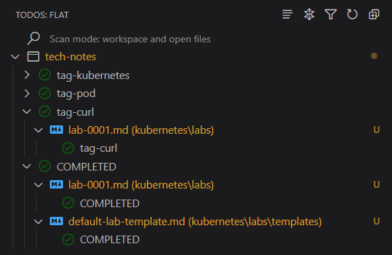

# Lab: `LAB TITLE`

> [!NOTE]
> For **"Status"** and **"Tags"** you can use the Visual Studio Extension called "[TODO Tree]()".
> 
> Typically, this extension quickly searches your workspace for comment tags like TODO and FIXME, and displays them in a tree view in the activity bar. However, one can add your own custom comment tags in order to highlight them in the tree view. This helps improve discoverability of the labs.
> 
> Clicking a comment tag within the tree will open the file and put the cursor on the line containing the comment tag.
> 
> To add a custom tag: Open "Show all commands (Ctrl+Shift+P), type `TODO Tree: Add Tag`, and enter your tag name.
> 
> 

**Status (e.g., DRAFT, WIP, COMPLETED, FAILED)**

- COMPLETED

**Tags**:

- TAG-X
- TAG-Y
- TAG-Z

---

## Objective

Describe the purpose of the experiment. What are you trying to achieve or test?  

- Example: "Test the performance of a Kubernetes cluster under high load with auto-scaling enabled."

- Hypothesis: [What do you expect to happen?]

---

## Background

Provide context or prerequisites for the experiment.  

- Why is this experiment relevant?  

- Any prior knowledge, tools, or concepts required?  

- Links to related documentation or resources.

---

## Environment Setup

Detail the environment used for the experiment.  

- **Hardware**: [e.g., Local machine, AWS EC2 t3.micro, Raspberry Pi]  
- **Operating System**: [e.g., Ubuntu 22.04, Windows Server 2022]  
- **Software/Tools**: [e.g., Docker v24.0, Terraform v1.5, Python 3.11]  
- **Network**: [e.g., Local network, VPC configuration, firewall rules]  
- **Configuration Files**: [Include relevant snippets or link to files in the repo]

---

## Procedure

Step-by-step instructions to replicate the experiment. 

- [Step 1: e.g., Install dependencies]
- [Step 2: e.g., Configure the environment]
- [Step 3: e.g., Run the test script]

Include commands, scripts, or configurations.

## Results

Document the outcome of the experiment.

- **Observations**: [What happened during the experiment?]  
- **Metrics**: [e.g., Latency, CPU usage, error rates]  
  ```plaintext
  # Example: Latency results
  Request 1: 120ms
  Request 2: 135ms
  ```
- **Screenshots/Logs**: [Embed or link to visuals, if applicable]  
- **Success Criteria**: [Did it meet the objective? Why or why not?]

---

## Analysis

Interpret the results.  

- Did the hypothesis hold true?  
- What worked well?  
- What challenges or errors occurred?  
- Any unexpected behaviors?

---

## Lessons Learned

Summarize key takeaways.  

- What did you learn about the technology or process?  
- Best practices or pitfalls to avoid in future experiments.  
- Potential improvements or follow-up experiments.

---

## Next Steps

Outline future actions or experiments.  

- [e.g., Test with a different configuration]  
- [e.g., Scale up the infrastructure]  
- [e.g., Automate part of the setup with a script]

---

## References

List any resources, tutorials, or documentation used.  

- [Link to tool documentation]  
- [Link to related experiment in this repo]  
- [External article or blog post]

---

## Appendix

Optional section for additional details.  

- Full logs, extended configurations, or scripts.  
- Example:
  
  ```yaml
  # Example: Kubernetes deployment YAML
  apiVersion: apps/v1
  kind: Deployment
  metadata:
    name: test-app
  ...
  ```

### How to Use This Template

1. **Create a Repo**: Set up a Git repository (e.g., on GitHub, GitLab) for your experiments.

2. **File Structure**: Store each experiment as a separate `.md` file, named descriptively (e.g., `2025-08-17-kubernetes-autoscaling.md`). Organize by category or date in folders if needed (e.g., `infrastructure/`, `software/`).

3. **Version Control**: Commit changes to track experiment history. Include scripts, configs, or logs in the repo for reproducibility.

4. **Customization**: Adapt the template based on the experiment. For example, add sections for specific metrics (e.g., "Network Throughput") or tools (e.g., "Ansible Playbook").

5. **Readability**: Use Markdown features like code blocks, tables, or images for clarity. Link to external files in the repo for large configs or logs.

6. **Searchability**: Use consistent tags and a `README.md` in the repo with a table of experiments for easy navigation.

### Example Usage

For an experiment testing a CI/CD pipeline with Jenkins:
- **Title**: Experiment: Optimizing Jenkins Pipeline for Parallel Builds
- **Objective**: Reduce build time by parallelizing tasks.
- **Environment**: AWS EC2, Jenkins 2.426, Maven 3.9.
- **Procedure**: Steps to configure Jenkinsfile for parallel stages.
- **Results**: Build time reduced from 10m to 6m; include pipeline logs.
- **Lessons Learned**: Parallel builds require careful dependency management.
