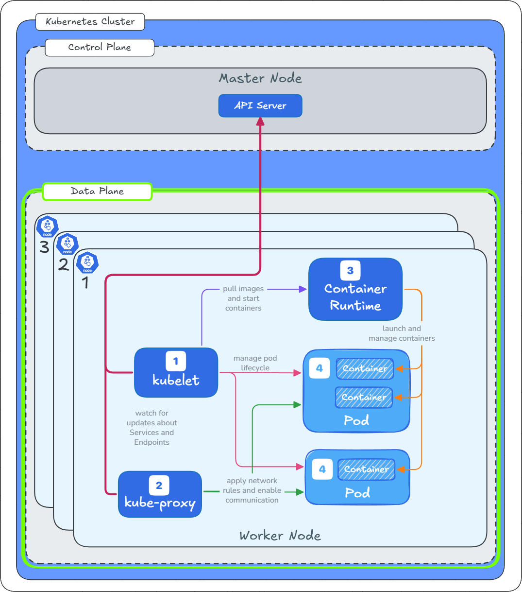

# Kubernetes Pod in Detail

- [Overview](#overview)
- [Where do Pods fit into the Cluster Architecture](#where-do-pods-fit-into-the-cluster-architecture)
  - [Deployment in the Data Plane](#deployment-in-the-data-plane)
  - [Interaction with Control Plane](#interaction-with-control-plane)
  - [Example Pod Workflow](#example-pod-workflow)
  - [Pods and Higher-Level Abstractions](#pods-and-higher-level-abstractions)
- [Key Components of a Kubernetes Pod Architecture](#key-components-of-a-kubernetes-pod-architecture)
- [Key Characteristics of a Pod](#key-characteristics-of-a-pod)
- [Common Use Cases](#common-use-cases)
  - [Single-container Pod](#single-container-pod)
  - [Multi-container Pod](#multi-container-pod)
  - [Init Containers](#init-containers)
- [Lifecycle and Management](#lifecycle-and-management)
- [Examples](#examples)
  - [Example 1 - Run Pod](#example-1---run-pod)
  - [Example 2 - Run Multiple Pods](#example-2---run-multiple-pods)
  - [Example 3 - Run Multi-Container Pod (sidecar)](#example-3---run-multi-container-pod-sidecar)
    - [Pod Spec: Multi-Container](#pod-spec-multi-container)
    - [Deploy Steps: Multi-Container Pod](#deploy-steps-multi-container-pod)
  - [Example 4 - Init Container](#example-4---init-container)
    - [Pod Spec: Init Container](#pod-spec-init-container)
    - [Deploy Steps: Init Container](#deploy-steps-init-container)

---

## Overview

> [!TIP]
> **Grok AI Prompt:** Explain a Kubernetes Pod to me like I'm 5 years old.  
> 
> Imagine a Pod as a tiny spaceship in a big space station called Kubernetes. This spaceship is the smallest thing that can fly on its own. Inside the spaceship, there are one or more little robots (called containers) that work together to do a job, like carrying cargo or sending messages. 
> 
> All the robots in the spaceship share the same space, so they can talk to each other easily and use the same tools, like a shared radio or fuel tank. Kubernetes makes sure the spaceship stays safe, has enough power, and gets to the right place in the space station.
> 
> If something goes wrong, like the spaceship breaks, Kubernetes can fix it or make a new one to keep the job going! **So, a Pod is just a cozy home for robots working as a team.**

To better understand what "smallest deployable unit" means, the information below compares Kubernetes, VMWare and Docker. By understanding how these three technologies handle workload scheduling and management, one is able to better understand what a Pod is, and how it is scheduled (deployed).

This can be broken down as follows:

- **VMware**: Smallest deployable unit is the Virtual Machine (VM)

  Using the hypervisor, the hypervisor's primary job is to create and manage virtual machines (VMs). The hypervisor allocates CPU, memory, and storage to each VM. When you need to scale or move a workload, you're moving the entire VM. The VM is the smallest, indivisible component that the system can schedule and run.

- **Docker**: Smallest deployable unit is the Container

  While Docker can schedule and run multiple containers on a single host, the core unit it manages is the container. The docker run command starts a single container. Docker doesn't have a built-in concept of grouping multiple containers together as a single deployable unit. To the Docker engine, each container is an independent entity that it schedules and manages.

- **Kubernetes**: Smallest deployable unit is the Pod

  Kubernetes is designed to orchestrate and manage containerized applications at a higher level. While Kubernetes uses containers, it doesn't schedule them directly. Instead, it schedules Pods.

---

## Where do Pods fit into the Cluster Architecture

Pods operate in the data plane, managed by the Kubelet and container runtime on worker nodes, while the control plane (API Server, Scheduler, Controller Manager, etcd) orchestrates their creation, scheduling, and lifecycle.

🎨 The following diagram represents a view of the Kubernetes Data Plane. The primary components of the Data Plane are highlighted with `Pod` represented by number ❹.



### Deployment in the Data Plane

- Pods are scheduled by the Scheduler (control plane) to run on specific worker nodes in the data plane.

- The Kubelet on each node interacts with the container runtime to create, monitor, and manage pods.

- Kube-proxy ensures network connectivity to pods, using services to expose them internally or externally.

### Interaction with Control Plane

- Pods are defined via YAML/JSON manifests submitted to the API Server.

- The Controller Manager uses higher-level abstractions like Deployments or ReplicaSets to manage pods, ensuring the desired number of replicas are running.

- The Scheduler decides which node a pod runs on based on resource availability, node affinity, or taints/tolerations.

- Pod status is stored in etcd and updated by the Kubelet through the API Server.

### Example Pod Workflow

- A user defines a pod in a YAML file (e.g., specifying a container image like nginx).
- The manifest is sent to the API Server.
- The Scheduler assigns the pod to a suitable node.
- The Kubelet on that node pulls the container image and starts the pod.
- Kube-proxy sets up networking rules to allow traffic to the pod.
- The pod runs, and its status is reported back to the API Server and stored in etcd.

### Pods and Higher-Level Abstractions

Pods are rarely managed directly in production. Instead, they are orchestrated by controllers like:

- **Deployments**: Manage pod replicas and updates.
- **ReplicaSets**: Ensure a specified number of pod replicas are running.
- **StatefulSets**: Manage pods with stable identities for stateful applications.
- **DaemonSets**: Run one pod per node for system-level tasks.

---

## Key Components of a Kubernetes Pod Architecture

A Kubernetes Pod is designed to encapsulate application containers, their shared resources, and policies for managing those containers. The following are the core architectural components found within a Pod:

1. Containers

   - The principal component of any Pod; these contain your application code and run the workload.

   - A Pod may consist of a single container or multiple, tightly coupled containers (sidecars, helpers).

2. Init Containers and Ephemeral Containers

   - Init Containers: Run before main application containers start, often used for initialization tasks.

   - Ephemeral Containers: Can be injected for debugging purposes without restarting the Pod.

3. Shared Storage Volumes

   - All containers in a Pod can access shared filesystem volumes.

   - These allow persistent data sharing among containers and can attach to persistent storage for data retention.

4. Pod Network Namespace (and Resources)

   - Every Pod has a unique IP address shared by all its containers.

   - Containers in a Pod share the same network namespace, enabling communication via localhost and shared port space.

   - Communication outside the Pod requires service exposure or networking configuration.

5. Pod Specification (PodSpec)

   - Defines the containers, storage, networking, and scheduling details of the Pod.

   - Includes resource requests/limits, environment variables, and lifecycle hooks.

6. Linux Namespaces and cgroups

   - Provides isolation among containers through OS-level mechanisms for resource separation and security.

7. Labels and Metadata

   - Every Pod carries metadata such as labels, used for organization, scheduling, and managing the Pod via higher-level controllers.

---

## Key Characteristics of a Pod

1. **Container Grouping**: A Pod can contain one or multiple containers (e.g., a main app container and a sidecar like a logging agent). These containers share resources like network (localhost communication) and storage volumes.

2. **Shared Life Cycle**: A Pod's containers are all created, started, and destroyed together. If one container fails, the entire Pod is considered failed and is handled by Kubernetes' control plane.

3. **Shared Network**: All containers in a Pod share a single IP address and port space, communicating via `localhost`. Kubernetes assigns a unique IP to each Pod for cluster-wide communication.

4. **Shared Storage**: Containers in a Pod can share storage volumes, enabling data exchange or persistent storage access.

5. **Ephemeral Nature**: Pods are designed to be short-lived and disposable/expendable (ie. not persistent). If a Pod fails, Kubernetes (via controllers like Deployments and ReplicaSet) does not try to restart the Pod; instead it replaces it with a new one.

6. **Lifecycle**: A Pod's lifecycle is managed by Kubernetes through use of high-level controllers like Deployments, StatefulSets, and Jobs. It goes through various states like Pending, Running, Succeeded, and Failed.

7. **Atomic Scheduling**: Kubernetes schedules Pods as a single unit to a node, ensuring all containers in a Pod run together on the same machine.

8. **Single Responsibility**: The best practice is to design Pods with a single responsibility. This means one Pod usually runs one main application or process. Use multiple containers in a single Pod only when they are highly dependent on each other and/or tightly coupled.
   
9. **Security and Isolation**: Pods implement Linux namespaces and cgroups, providing isolation between containers. You can further control security using SecurityContext and network policies (NetworkPolicy objects restrict Pod traffic).

10. **Pod Metadata and Management**:
   
   - **Labels and selectors**: Pods use labels for identification and grouping, which controllers use to select and manage them.
   - **Affinities, priorities, and disruption budgets**: Control where Pods are placed, their importance during resource crunch, and their resilience during voluntary disruptions.

11. **Best Practice**:
    
    - Don’t create Pods directly for production workloads; use Deployments, StatefulSets, Jobs, etc., to manage desired state and scaling.
    - Use probes (liveness, readiness, startup) for robust health checks.
    - Manage configuration with ConfigMaps and secrets, and attach Volumes for persistent storage.

## Common Use Cases

### Single-container Pod
  
Runs one container that encapsulates an entire application. This could be anything from a web server like Nginx, a database like PostgreSQL, or a microservice for a larger application. These Pods are often managed by a higher-level controller like a Deployment, ReplicaSet or a StatefulSet to ensure they are always running and scalable.

Example Pod Definition:

```yaml
apiVersion: v1
kind: Pod
metadata:
  name: my-pod
spec:
  containers:
  - name: webapp
    image: nginx:latest
```

### Multi-container Pod
  
- Runs multiple containers that are tighly coupled and need to work closely together (dependant on one or the other), like an app with a logging sidecar or a proxy. Typically, a Pod uses the Sidecar Pattern.

> [!TIP]
>
> The sidecar pattern in Kubernetes is a design approach where a secondary container, called a sidecar, runs alongside the main application container within the same pod to provide additional functionality or enhance the primary container's capabilities. The sidecar container shares the same lifecycle, resources, and network namespace as the main container, enabling tight integration while maintaining modularity.
> See [official Kubernetes documentation on Sidecar Pattern](https://kubernetes.io/blog/2025/04/22/multi-container-pods-overview/#the-origins-of-the-sidecar-pattern).

- Essential multi-container patterns:

  - Init Container Pattern (Architectural Pattern): used to run setup tasks before the main application container starts. This is a broader architectural concept or design pattern that describes the practice of using a separate, short-lived process or container to perform initialization or setup tasks for a main application. The Kubernetes Init Container feature is a direct implementation of this pattern within the Kubernetes ecosystem.
  
  - Ambassador Pattern: uses a dedicated sidecar container to act as a proxy for the main application container within the same Pod. This proxy container intercepts and manages network requests, handling tasks like routing, load balancing, or TLS termination. The main application container then communicates with the proxy on localhost, simplifying its own code.

  - Configuration Helper: uses a sidecar container to dynamically fetch and update configuration for the main application container. Instead of baking configuration files into the application image, the sidecar container pulls the latest configuration from an external source and places it in a shared volume. The main application then reads this configuration from the volume.

  - Adapter Pattern: uses a sidecar container to standardize the output of the main application container. The adapter container runs alongside the main application and translates its output into a format that is expected by other services, a monitoring system, or an external log aggregator.

Example Pod Definition:

```yaml
apiVersion: v1
kind: Pod
metadata:
  name: my-pod
spec:
  containers:
  - name: webapp
    image: nginx:latest
  - name: sidecar
    image: fluentd:latest
```

### Init Containers

> [!NOTE]
> 
> Kubernetes provides a built-in mechanism (Init Containers) to easily implement the _Init Container Pattern (general architectural pattern)_.

Init Containers can be summarised as follows:

- Special containers in a Pod that run setup tasks (e.g., database initialization) before the main containers start.
- Unlike regular containers, init containers run to completion and then terminate, ensuring that initialization conditions for the main application are met.
- They are useful for tasks that need to be performed once at startup, such as setting up a database or cloning a Git repository to a shared volume.
  - Pre-populating a database: An Init Container runs a script to create a database schema or load initial data before the main application container, which relies on that database, starts.
  - Preparing a file system: An Init Container clones a Git repository into a shared volume so the main container can access the code or configuration files.
  - Waiting for a service: An Init Container can wait until a dependent service, like a database or another microservice, is available before allowing the main application to start.
- The main application container won't start until all Init Containers have successfully finished.

> [!NOTE]
>
> [See Example 4: Init Containers](#example-4---init-container) for an example of how to configure an init container.

Example Pod Definition:

```yaml
apiVersion: v1
kind: Pod
metadata:
  name: my-pod
spec:
  initContainers:
  - name: init-setup
    image: busybox:latest
    command: ['sh', '-c', 'echo "Initializing..." && sleep 5']
  containers:
  - name: webapp
    image: nginx:alpine
```

## Lifecycle and Management

- If a node fails, Kubernetes reschedules Pods to healthy nodes (managed by higher-level controllers).

- Pods are ephemeral by design. They are created by controllers (`Deployments`, `StatefulSets`) or directly via YAML/JSON manifests. 

- A Pod will run until completion (for one-off tasks like Jobs) or replacement/termination (for long running apps), and not intended to be restarted directly if they fail (controllers are used for that).

- Through a process of "binding", Pod's are scheduled to nodes based on resource availability, affinities, taints/tolerations, and other constraints; once bound, they stay on that node until deleted or evicted (e.g., due to node failure or resource shortages). 

- Direct Pod creation is rare; instead, use higher-level abstractions like Deployments (for stateless apps), StatefulSets (for stateful ones), or Jobs (for batch tasks) to manage replication, updates, and self-healing. 

- Updates are limited. Metadata like name/namespace is immutable, but you can patch fields like container images or add ephemeral containers; major changes often require recreating the Pod via its controller. 

- Phases include Pending (scheduling), Running (containers active), Succeeded/Failed (completed), and Unknown; track status with conditions like PodReady.

  According to [official Kubernetes documentation](https://kubernetes.io/docs/concepts/workloads/pods/pod-lifecycle/#pod-phase): "A Pod's status field is a [PodStatus](https://kubernetes.io/docs/reference/generated/kubernetes-api/v1.33/#podstatus-v1-core) object, which has a phase field."

  | Phase | Description |
  | ---| --- |
  | Pending | The Pod has been accepted, but waiting for containers to be set up and made ready to run. |
  | Running |  The Pod is bound to a node, all containers are created, and at least one container is running, starting, or restarting. |
  | Succeeded | All containers in the Pod have terminated successfully and will not be restarted. |
  | Failed | All containers have terminated, but at least one failed (e.g., exited with non-zero status or terminated by the system), and no restarts are planned. |
  | Unknown | The Pod's state cannot be determined, typically due to communication errors with the node. |

- Static Pods are a special case: Managed directly by the kubelet on a node (e.g., for control plane components), with read-only mirror Pods in the API server for visibility. 

- Other lifecycle aspects: `Init containers` for initialization tasks, `ephemeral containers` for debugging, and `lifecycle hooks` for custom behaviors.

---

## Examples

### Example 1 - Run Pod

1️⃣ **Start web server running Nginx:**

```bash
kubectl run webapp --image=nginx:alpine
```

2️⃣ **Verify Pod status:**

```bash
kubectl get pod/webapp -o wide
```

> [!NOTE]
> Notice:
> - how `STATUS` changes from `ContainerCreating` to `Running`
> - how `READY` changes from `0/1` to `1/1`
> - how `IP` address `10.1.0.30` is assigned

```console
🖥️ <<output>> 🖥️

NAME     READY   STATUS              RESTARTS   AGE   IP          NODE          
webapp   0/1     ContainerCreating   0          7s   <none>      docker-desktop
-
-
-
NAME     READY   STATUS    RESTARTS   AGE   IP          NODE          
webapp   1/1     Running   0          32s   10.1.0.30   docker-desktop
```

3️⃣ Test `webapp` Pod:

- Get `webapp` IP Address:

  ```bash
  WEBAPP_IP=$(kubectl get pod/webapp -o wide | awk '/webapp/ { print $6 }') && echo $WEBAPP_IP
  ```

  ```console
  🖥️ <<output>> 🖥️

  10.1.0.30
  ```

- Ping IP Address from Pod running BusyBox container:

  ```bash
  kubectl run -it --rm busy --image=busybox:latest --restart=Never -- ping -c 5 $WEBAPP_IP
  ```

  ```console
  🖥️ <<output>> 🖥️

  64 bytes from 10.1.0.30: seq=1 ttl=64 time=0.055 ms
  64 bytes from 10.1.0.30: seq=2 ttl=64 time=0.055 ms
  64 bytes from 10.1.0.30: seq=3 ttl=64 time=0.121 ms
  64 bytes from 10.1.0.30: seq=4 ttl=64 time=0.087 ms
  64 bytes from 10.1.0.30: seq=5 ttl=64 time=0.055 ms

  --- 10.1.0.30 ping statistics ---
  5 packets transmitted, 5 packets received, 0% packet loss
  ```

- Curl IP Address from Pod running Curl container:

  ```bash
  kubectl run -it --rm curl --image=curlimages/curl:latest --restart=Never -- http://$WEBAPP_IP
  ```

  ```console
  🖥️ <<output>> 🖥️

  <!DOCTYPE html>
  <html>
  <head>
  <title>Welcome to nginx!</title>
  <style>
  html { color-scheme: light dark; }
  body { width: 35em; margin: 0 auto;
  font-family: Tahoma, Verdana, Arial, sans-serif; }
  </style>
  </head>
  <body>
  <h1>Welcome to nginx!</h1>
  <p>If you see this page, the nginx web server is successfully installed and
  working. Further configuration is required.</p>

  <p>For online documentation and support please refer to
  <a href="http://nginx.org/">nginx.org</a>.<br/>
  Commercial support is available at
  <a href="http://nginx.com/">nginx.com</a>.</p>

  <p><em>Thank you for using nginx.</em></p>
  </body>
  </html>
  pod "curl" deleted
  ```

4️⃣ Delete `webapp` Pod

```bash
kubectl delete pod/webapp --now
```

---

### Example 2 - Run Multiple Pods

The objective of this example is to show how to create containers in separate Pods and enable communication between the 2 Pods.

This example demonstrates the following:

- create a web server Pod (Nginx container) using a Pod definition
- create a logging Pod (Busybox container) using a Pod definition
  - pass in web server IP address as environment variables
  - continuously ping web server using web server IP address


1️⃣ **Generate Pod definitions:**

The following kubectl commands using `--dry-run=client` flag, is used to preview Pod that would be sent to the cluster, without actually submitting it to the Kubernetes API server. It will perform client-side validation and generate the Pod's definition (`YAML` in this instance), but it won't actually be submitted to API Server.

Furthermore, the command `tee webapp.yaml` reads the Pod yaml and writes it to both standard output (terminal) and a file.

- Save `webapp` Pod preview to `webapp.yaml`

  ```bash
  kubectl run webapp --image=nginx:alpine --dry-run=client -o yaml | tee webapp.yaml
  ```

  ```console
  🖥️ <<output>> 🖥️

  apiVersion: v1
  kind: Pod
  metadata:
    creationTimestamp: null
    labels:
      run: webapp
    name: webapp
  spec:
    containers:
    - image: nginx:alpine
      name: webapp
      resources: {}
    dnsPolicy: ClusterFirst
    restartPolicy: Always
  status: {}
  ```

- Apply `webapp.yaml` Pod spec:

  ```bash
  kubectl apply -f ./webapp.yaml
  ```

  ```console
  🖥️ <<output>> 🖥️

  pod/webapp created
  ```

- Save `busyapp` Pod preview to `busyapp.yaml`
  
  ```bash
  WEBAPP_ID=$(kubectl get pod/webapp -o wide | awk '/webapp/ { print $6 }')

  kubectl run busyapp --image=busybox:latest --env="WEBAPP_ID=$WEBAPP_ID" --dry-run=client -o yaml -- bin/sh -c 'while true; do ping -c 1 $WEBAPP_ID; sleep 5; done' | tee busyapp.yaml
  ```

  ```console
  🖥️ <<output>> 🖥️

  apiVersion: v1
  kind: Pod
  metadata:
    creationTimestamp: null
    labels:
      run: busyapp
    name: busyapp
  spec:
    containers:
    - args:
      - bin/sh
      - -c
      - while true; do ping -c 1 $WEBAPP_ID; sleep 5; done
      env:
      - name: WEBAPP_ID
        value: 10.1.0.51
      image: busybox:latest
      name: busyapp
      resources: {}
    dnsPolicy: ClusterFirst
    restartPolicy: Always
  status: {}
  ```

- Apply `busyapp.yaml` Pod spec:

  ```bash
  kubectl apply -f ./busyapp.yaml
  ```

  ```console
  🖥️ <<output>> 🖥️

  pod/busyapp created
  ```

2️⃣ **View Pods:**

```bash
kubectl get pods -o wide
```

```console
🖥️ <<output>> 🖥️

NAME      READY   STATUS    RESTARTS   AGE     IP          NODE          
busyapp   1/1     Running   0          8m57s   10.1.0.53   docker-desktop
webapp    1/1     Running   0          32m     10.1.0.51   docker-desktop
```

3️ **View `busyapp` logs:**

```bash
kubectl logs pod/busyapp
```

```console
🖥️ <<output>> 🖥️

PING 10.1.0.51 (10.1.0.51): 56 data bytes
64 bytes from 10.1.0.51: seq=0 ttl=64 time=0.311 ms

--- 10.1.0.51 ping statistics ---
1 packets transmitted, 1 packets received, 0% packet loss
round-trip min/avg/max = 0.311/0.311/0.311 ms
PING 10.1.0.51 (10.1.0.51): 56 data bytes
64 bytes from 10.1.0.51: seq=0 ttl=64 time=0.065 ms

--- 10.1.0.51 ping statistics ---
1 packets transmitted, 1 packets received, 0% packet loss
round-trip min/avg/max = 0.065/0.065/0.065 ms
PING 10.1.0.51 (10.1.0.51): 56 data bytes
64 bytes from 10.1.0.51: seq=0 ttl=64 time=0.108 ms
```

4️⃣ **Delete both Pods (`webapp` and `busyapp`):**

```bash
kubectl delete -f ./webapp.yaml --now
kubectl delete -f ./busyapp.yaml --now
```

5️⃣ **Create multipod file (`combined.yaml`):**

```bash
{ cat webapp.yaml; echo "---"; cat busyapp.yaml; } | tee combined.yaml
```

```console
🖥️ <<output>> 🖥️

apiVersion: v1
kind: Pod
metadata:
  creationTimestamp: null
  labels:
    run: webapp
  name: webapp
spec:
  containers:
  - image: nginx:alpine
    name: webapp
    resources: {}
  dnsPolicy: ClusterFirst
  restartPolicy: Always
status: {}
---
apiVersion: v1
kind: Pod
metadata:
  creationTimestamp: null
  labels:
    run: busyapp
  name: busyapp
spec:
  containers:
  - args:
    - bin/sh
    - -c
    - while true; do ping -c 1 $WEBAPP_ID; sleep 5; done
    env:
    - name: WEBAPP_ID
      value: 10.1.0.51
    image: busybox:latest
    name: busyapp
    resources: {}
  dnsPolicy: ClusterFirst
  restartPolicy: Always
status: {}
```

6️⃣ **Create pods using combined yaml file (`combined.yaml`):**

```
kubectl apply -f ./combined.yaml
```

```console
🖥️ <<output>> 🖥️

pod/webapp created
pod/busyapp created
```

7️⃣ **View Pods:**

```batch
kubectl get -f ./combined.yaml -o wide
```

```console
🖥️ <<output>> 🖥️

NAME      READY   STATUS    RESTARTS        AGE     IP          NODE          
busyapp   1/1     Running   1 (6m33s ago)   3h4m    10.1.0.59   docker-desktop
webapp    1/1     Running   1 (6m34s ago)   3h28m   10.1.0.56   docker-desktop
```

8️⃣ **Cleanup Resources:**

```bash
kubectl delete -f ./combined.yaml --now
rm ./combined.yaml
```

---

### Example 3 - Run Multi-Container Pod (sidecar)

In this example we create a single Pod that contains a web server container and a logging sidecar container.

I'll provide an example of a Kubernetes Pod configuration that uses an Nginx container with a sidecar container for logging purposes. This example demonstrates a common pattern where a sidecar container collects and processes logs from the main Nginx application.

#### Pod Spec: Multi-Container

```yaml
apiVersion: v1
kind: Pod
metadata:
  name: webapp
  labels:
    app: webapp-demo
spec:
  containers:
  # Nginx web server
  - name: web-server
    image: nginx:alpine
    ports:
    - containerPort: 80
    volumeMounts:
    - name: log-volume
      mountPath: /var/log/nginx
    resources:
      limits:
        memory: "256Mi"
        cpu: "500m"
      requests:
        memory: "128Mi"
        cpu: "250m"

  # Sidecar for log processing
  - name: log-sidecar
    image: busybox:latest
    command: ["/bin/sh"]
    args: ["-c", "tail -f /logs/access.log"]
    volumeMounts:
    - name: log-volume
      mountPath: /logs
    resources:
      limits:
        memory: "128Mi"
        cpu: "200m"
      requests:
        memory: "64Mi"
        cpu: "100m"

  volumes:
  - name: log-volume
    emptyDir: {}
```

Pod Definition:

- The Pod is named `webapp` and labeled with app: `webapp-demo` for easy identification and selection.

Primary Container (Nginx Web Server):

- Uses the `nginx:alpine` image.
- Exposes `port 80` for web traffic.
- Mounts a shared `emptyDir` volume at `/var/log/nginx` to store Nginx logs.
- Resource limits and requests are set to ensure reasonable resource allocation.

Sidecar Container (Log Processor):

- Uses the lightweight `busybox:latest` image for simplicity.
- Runs a `tail -f` command to continuously monitor the Nginx access log (access.log) from the shared volume.
- Mounts the same `emptyDir` volume at `/logs` to access Nginx logs.
- Has its own resource limits and requests to avoid resource contention. Note that this container has been configured to use less resources

Shared Volume:

- An `emptyDir` volume named `log-volume` is used to share log files between the Nginx container and the sidecar.
- The Nginx container writes logs to `/var/log/nginx`, and the sidecar reads them from `/logs`.

#### Deploy Steps: Multi-Container Pod

1️⃣ **Create Pod spec file (yaml):**

```bash
cat <<EOF > webapp.yaml
apiVersion: v1
kind: Pod
metadata:
  name: webapp
  labels:
    app: webapp-demo
spec:
  containers:
  # Nginx web server
  - name: web-server
    image: nginx:alpine
    ports:
    - containerPort: 80
    volumeMounts:
    - name: log-volume
      mountPath: /var/log/nginx
    resources:
      limits:
        memory: "256Mi"
        cpu: "500m"
      requests:
        memory: "128Mi"
        cpu: "250m"

  # Sidecar for log processing
  - name: log-sidecar
    image: busybox:latest
    command: ["/bin/sh"]
    args: ["-c", "tail -f /logs/access.log"]
    volumeMounts:
    - name: log-volume
      mountPath: /logs
    resources:
      limits:
        memory: "128Mi"
        cpu: "200m"
      requests:
        memory: "64Mi"
        cpu: "100m"

  volumes:
  - name: log-volume
    emptyDir: {}
EOF
```

2️⃣ **Apply Pod definition:**

```bash
kubectl apply -f ./webapp.yaml
```

```console
🖥️ <<output>> 🖥️

pod/webapp created
```

3️⃣ **Verify Pod is running:**

```bash
kubectl get pod/webapp -o wide
```

> [!NOTE]
> Notice:
> - how `STATUS` changes from `ContainerCreating` to `Running`
> - how `READY` changes from `0/2` to `2/2`
> - how IP address `10.1.0.49` is assigned

```console
🖥️ <<output>> 🖥️

NAME     READY   STATUS              RESTARTS   AGE   IP       NODE          
webapp   0/2     ContainerCreating   0          10s   <none>   docker-desktop


NAME     READY   STATUS    RESTARTS   AGE   IP          NODE          
webapp   2/2     Running   0          25s   10.1.0.49   docker-desktop
```

4️⃣ **Describe Pod:**

```bash
kubectl describe pod/webapp
```

```console
🖥️ <<output>> 🖥️

Name:             webapp
Namespace:        default
Priority:         0
Service Account:  default
Node:             docker-desktop/192.168.65.3
Start Time:       Sat, 09 Aug 2025 08:43:21 +1200
Labels:           app=webapp-demo
Annotations:      <none>
Status:           Running
IP:               10.1.0.49
IPs:
  IP:  10.1.0.49
Containers:
  web-server:
    Container ID:   docker://bfd2c6f0edf915ccde5a6d025033390afd5832ec423f779905ccb5f023360f4f
    Image:          nginx:alpine
    Image ID:       docker-pullable://nginx@sha256:d67ea0d64d518b1bb04acde3b00f722ac3e9764b3209a9b0a98924ba35e4b779
    Port:           80/TCP
    Host Port:      0/TCP
    State:          Running
      Started:      Sat, 09 Aug 2025 08:43:34 +1200
    Ready:          True
    Restart Count:  0
    Limits:
      cpu:     500m
      memory:  256Mi
    Requests:
      cpu:        250m
      memory:     128Mi
    Environment:  <none>
    Mounts:
      /var/log/nginx from log-volume (rw)
      /var/run/secrets/kubernetes.io/serviceaccount from kube-api-access-6rj7v (ro)
  log-sidecar:
    Container ID:  docker://5f43060f433695c2c4b013766935daa4fb9c4282bdc35bd0ee9aa32b0f20e7d4
    Image:         busybox:latest
    Image ID:      docker-pullable://busybox@sha256:f9a104fddb33220ec80fc45a4e606c74aadf1ef7a3832eb0b05be9e90cd61f5f
    Port:          <none>
    Host Port:     <none>
    Command:
      /bin/sh
    Args:
      -c
      tail -f /logs/access.log
    State:          Running
      Started:      Sat, 09 Aug 2025 08:43:39 +1200
    Ready:          True
    Restart Count:  0
    Limits:
      cpu:     200m
      memory:  128Mi
    Requests:
      cpu:        100m
      memory:     64Mi
    Environment:  <none>
    Mounts:
      /logs from log-volume (rw)
      /var/run/secrets/kubernetes.io/serviceaccount from kube-api-access-6rj7v (ro)
Conditions:
  Type                        Status
  PodReadyToStartContainers   True
  Initialized                 True
  Ready                       True
  ContainersReady             True
  PodScheduled                True
Volumes:
  log-volume:
    Type:       EmptyDir (a temporary directory that shares a pod's lifetime)
    Medium:
    SizeLimit:  <unset>
  kube-api-access-6rj7v:
    Type:                    Projected (a volume that contains injected data from multiple sources)
    TokenExpirationSeconds:  3607
    ConfigMapName:           kube-root-ca.crt
    Optional:                false
    DownwardAPI:             true
QoS Class:                   Burstable
Node-Selectors:              <none>
Tolerations:                 node.kubernetes.io/not-ready:NoExecute op=Exists for 300s
                             node.kubernetes.io/unreachable:NoExecute op=Exists for 300s
Events:
  Type    Reason     Age   From               Message
  ----    ------     ----  ----               -------
  Normal  Scheduled  69s   default-scheduler  Successfully assigned default/webapp to docker-desktop
  Normal  Pulled     62s   kubelet            Container image "nginx:alpine" already present on machine
  Normal  Created    59s   kubelet            Created container: web-server
  Normal  Started    57s   kubelet            Started container web-server
  Normal  Pulling    57s   kubelet            Pulling image "busybox:latest"
  Normal  Pulled     54s   kubelet            Successfully pulled image "busybox:latest" in 2.956s (2.956s including waiting). Image size: 4277910 bytes.
  Normal  Created    53s   kubelet            Created container: log-sidecar
  Normal  Started    52s   kubelet            Started container log-sidecar
```

5️⃣ **Verify status of both containers (`web-server`, and `log-sidecar`):**

There is currently no support to query status of Pod containers directly. Therefore, try one of the following methods to get more information on the containers running within the Pod.

- <ins>**Method 1**</ins>: Use [jq (lightweight command-line JSON processor)](https://jqlang.org/download/) for the following command.

  ```bash
  kubectl get pod/webapp -o json | jq '[.spec.containers[] as $container | .status.containerStatuses[] | select(.name == $container.name) | {"name": .name, "image": $container.image, "status": .state, "ready": .ready, "restarts": .restartCount}]'
  ```

  ```json
  🖥️ <<output>> 🖥️

  [
    {
      "name": "web-server",
      "image": "nginx:alpine",
      "status": {
        "running": {
          "startedAt": "2025-08-12T00:00:00Z"
        }
      },
      "ready": true,
      "restarts": 0
    },
    {
      "name": "log-sidecar",
      "image": "busybox:latest",
      "status": {
        "running": {
          "startedAt": "2025-08-12T00:00:00Z"
        }
      },
      "ready": true,
      "restarts": 0
    }
  ]
  ```

- <ins>**Method 2**</ins>: Use `grep` (linux command-line utility for searching plaintext datasets for lines that match a regular expression).

> [!TIP]
>
> Learn more about `grep` using AI prompt:
>
> Explain the Linux grep utility, including its purpose, basic syntax, and common use cases? Provide examples of how to use grep for tasks like searching for a pattern in files, case-insensitive searches, and recursive searches in directories.
>
> - [Grok](https://x.com/i/grok/share/edNBcRpOrfEpEkhaq1uOIVGU1)
> - [Gemini](https://g.co/gemini/share/45cfdea36926)

  ```bash
  kubectl describe pod/webapp | grep -A 20 -E "web-server:|log-sidecar:"
  ```

  ```console
  🖥️ <<output>> 🖥️

    web-server:
      Container ID:   docker://bfd2c6f0edf915ccde5a6d025033390afd5832ec423f779905ccb5f023360f4f
      Image:          nginx:alpine
      Image ID:       docker-pullable://nginx@sha256:d67ea0d64d518b1bb04acde3b00f722ac3e9764b3209a9b0a98924ba35e4b779
      Port:           80/TCP
      Host Port:      0/TCP
      State:          Running
        Started:      Wed, 09 Aug 2025 08:43:34 +1200
      Ready:          True
      Restart Count:  0
      Limits:
        cpu:     500m
        memory:  256Mi
      Requests:
        cpu:        250m
        memory:     128Mi
      Environment:  <none>
      Mounts:
        /var/log/nginx from log-volume (rw)
        /var/run/secrets/kubernetes.io/serviceaccount from kube-api-access-6rj7v (ro)
    log-sidecar:
      Container ID:  docker://5f43060f433695c2c4b013766935daa4fb9c4282bdc35bd0ee9aa32b0f20e7d4
      Image:         busybox:latest
      Image ID:      docker-pullable://busybox@sha256:f9a104fddb33220ec80fc45a4e606c74aadf1ef7a3832eb0b05be9e90cd61f5f
      Port:          <none>
      Host Port:     <none>
      Command:
        /bin/sh
      Args:
        -c
        tail -f /logs/access.log
      State:          Running
        Started:      Wed, 09 Aug 2025 08:43:39 +1200
      Ready:          True
      Restart Count:  0
      Limits:
        cpu:     200m
        memory:  128Mi
      Requests:
        cpu:        100m
        memory:     64Mi
  ```

- <ins>**Method 3**</ins>: Use `sed` (Unix utility that parses and transforms text, using a simple, compact programming language).

> [!TIP]
>
> Learn more about `sed` using AI prompt:
>
> Explain the Linux sed utility, including its purpose, basic syntax, and common use cases? Provide examples of how to use sed for tasks like text substitution, deleting lines, and pattern matching in files.
>
> - [Grok](https://x.com/i/grok/share/JSV3qU97fSf9ps5nU3mmB2zFn)
> - [Gemini](https://g.co/gemini/share/9b758ee36137)


  ```bash
  kubectl describe pod/webapp | sed -n '/Containers:/,/Conditions:/p' | sed '$d'
  ```

  ```yaml
  🖥️ <<output>> 🖥️
  Containers:
    web-server:
      Container ID:   docker://bfd2c6f0edf915ccde5a6d025033390afd5832ec423f779905ccb5f023360f4f
      Image:          nginx:alpine
      Image ID:       docker-pullable://nginx@sha256:d67ea0d64d518b1bb04acde3b00f722ac3e9764b3209a9b0a98924ba35e4b779
      Port:           80/TCP
      Host Port:      0/TCP
      State:          Running
        Started:      Wed, 09 Aug 2025 08:43:34 +1200
      Ready:          True
      Restart Count:  0
      Limits:
        cpu:     500m
        memory:  256Mi
      Requests:
        cpu:        250m
        memory:     128Mi
      Environment:  <none>
      Mounts:
        /var/log/nginx from log-volume (rw)
        /var/run/secrets/kubernetes.io/serviceaccount from kube-api-access-6rj7v (ro)
    log-sidecar:
      Container ID:  docker://5f43060f433695c2c4b013766935daa4fb9c4282bdc35bd0ee9aa32b0f20e7d4
      Image:         busybox:latest
      Image ID:      docker-pullable://busybox@sha256:f9a104fddb33220ec80fc45a4e606c74aadf1ef7a3832eb0b05be9e90cd61f5f
      Port:          <none>
      Host Port:     <none>
      Command:
        /bin/sh
      Args:
        -c
        tail -f /logs/access.log
      State:          Running
        Started:      Wed, 09 Aug 2025 08:43:39 +1200
      Ready:          True
      Restart Count:  0
      Limits:
        cpu:     200m
        memory:  128Mi
      Requests:
        cpu:        100m
        memory:     64Mi
      Environment:  <none>
      Mounts:
        /logs from log-volume (rw)
        /var/run/secrets/kubernetes.io/serviceaccount from kube-api-access-6rj7v (ro)
  ```

6️⃣ **Test Logging:**

Kubernetes defaults to showing the logs of the **first container** defined in the pod specification (`web-server` in our example). Therefore, the following command will output logs for the `web-server` container.

```bash
kubectl logs pod/webapp
```

 If you want to view the logs for a specific container, you must explicitly specify its name using the `-c` flag.

```bash
kubectl logs pod/webapp -c web-server
kubectl logs pod/webapp -c log-sidecar
```

Let's generate some web server logs by sending a few http requests to the webserver app. First, enable port forwarding as follows:

```bash
kubectl port-forward pod/webapp 8080:80
```

```console
🖥️ <<output>> 🖥️

Forwarding from 127.0.0.1:8080 -> 80
Forwarding from [::1]:8080 -> 80
```

Send 3 requests to `web-server`:

```bash
seq 3 | xargs -Iz curl http://localhost:8080
```

View `log-sidecar` container logs:

```bash
k logs pod/webapp -c log-sidecar
```

```console
🖥️ <<output>> 🖥️

127.0.0.1 - - [09/Aug/2025:22:15:54 +0000] "GET / HTTP/1.1" 200 615 "-" "curl/8.5.0" "-"
127.0.0.1 - - [09/Aug/2025:22:15:54 +0000] "GET / HTTP/1.1" 200 615 "-" "curl/8.5.0" "-"
127.0.0.1 - - [09/Aug/2025:22:15:54 +0000] "GET / HTTP/1.1" 200 615 "-" "curl/8.5.0" "-"
```

7️⃣ **Cleanup Resources:**

```bash
kubectl delete -f ./webapp.yaml --now
rm ./webapp.yaml
```

---

### Example 4 - Init Container

#### Pod Spec: Init Container

```yaml
apiVersion: v1
kind: Pod
metadata:
  name: webapp
  labels:
    app: webapp-demo
spec:
  initContainers:
  # Initialization and Setup
  - name: init-setup
    image: busybox:latest
    resources:
      limits:
        memory: "128Mi"
        cpu: "200m"
      requests:
        memory: "64Mi"
        cpu: "100m"
    command: ['sh', '-c', 'echo "Initializing..." && sleep 5']
  containers:
  # Nginx web server
  - name: web-server
    image: nginx:alpine
    ports:
    - containerPort: 80
    volumeMounts:
    - name: log-volume
      mountPath: /var/log/nginx
    resources:
      limits:
        memory: "256Mi"
        cpu: "500m"
      requests:
        memory: "128Mi"
        cpu: "250m"

  # Sidecar for log processing
  - name: log-sidecar
    image: busybox:latest
    command: ["/bin/sh"]
    args: ["-c", "tail -f /logs/access.log"]
    volumeMounts:
    - name: log-volume
      mountPath: /logs
    resources:
      limits:
        memory: "128Mi"
        cpu: "200m"
      requests:
        memory: "64Mi"
        cpu: "100m"

  volumes:
  - name: log-volume
    emptyDir: {}
```

#### Deploy Steps: Init Container

1️⃣ **Create Pod spec file (yaml):**

> [!NOTE]
> Take notice of:
> - `initContainers` section

```bash
cat <<EOF > webapp.yaml
apiVersion: v1
kind: Pod
metadata:
  name: webapp
  labels:
    app: webapp-demo
spec:
  initContainers:
  # Initialization and Setup
  - name: init-setup
    image: busybox:latest
    resources:
      limits:
        memory: "128Mi"
        cpu: "200m"
      requests:
        memory: "64Mi"
        cpu: "100m"
    command: ['sh', '-c', 'echo "Initializing..." && sleep 5']
  containers:
  # Nginx web server
  - name: web-server
    image: nginx:alpine
    ports:
    - containerPort: 80
    volumeMounts:
    - name: log-volume
      mountPath: /var/log/nginx
    resources:
      limits:
        memory: "256Mi"
        cpu: "500m"
      requests:
        memory: "128Mi"
        cpu: "250m"

  # Sidecar for log processing
  - name: log-sidecar
    image: busybox:latest
    command: ["/bin/sh"]
    args: ["-c", "tail -f /logs/access.log"]
    volumeMounts:
    - name: log-volume
      mountPath: /logs
    resources:
      limits:
        memory: "128Mi"
        cpu: "200m"
      requests:
        memory: "64Mi"
        cpu: "100m"

  volumes:
  - name: log-volume
    emptyDir: {}
EOF
```

2️⃣ **Apply Pod definition:**

```bash
kubectl apply -f ./webapp.yaml
```

```console
🖥️ <<output>> 🖥️

pod/webapp created
```

3️⃣ **Verify Pod is running:**

```bash
kubectl get pod/webapp -o wide
```

> [!NOTE]
> Notice:
> - how `STATUS` changes from `Init:0/1` to `PodInitializing` to `Running`
> - how `READY` changes from `0/2` to `2/2`
> - how `IP` address `10.1.0.50` is assigned

```console
🖥️ <<output>> 🖥️

NAME     READY   STATUS     RESTARTS   AGE   IP       NODE          
webapp   0/2     Init:0/1   0          7s    <none>   docker-desktop

-
-
-

NAME     READY   STATUS            RESTARTS   AGE   IP          NODE          
webapp   0/2     PodInitializing   0          35s   10.1.0.50   docker-desktop

-
-
-

NAME     READY   STATUS    RESTARTS   AGE   IP          NODE          
webapp   2/2     Running   0          66s   10.1.0.50   docker-desktop
```

4️⃣ **Describe Pod:**

```bash
kubectl describe pod/webapp
```

```console
🖥️ <<output>> 🖥️

Name:             webapp
Namespace:        default
Priority:         0
Service Account:  default
Node:             docker-desktop/192.168.65.3
Start Time:       Sat, 09 Aug 2025 15:31:08 +1200
Labels:           app=webapp-demo
Annotations:      <none>
Status:           Running
IP:               10.1.0.50
IPs:
  IP:  10.1.0.50
Init Containers:
  init-setup:
    Container ID:  docker://c9a01439b2ae9ddd97b61f29f6ee848a5711ff6b47917390f6743221918bf4fe
    Image:         busybox:latest
    Image ID:      docker-pullable://busybox@sha256:f9a104fddb33220ec80fc45a4e606c74aadf1ef7a3832eb0b05be9e90cd61f5f
    Port:          <none>
    Host Port:     <none>
    Command:
      sh
      -c
      echo "Initializing..." && sleep 5
    State:          Terminated
      Reason:       Completed
      Exit Code:    0
      Started:      Sat, 09 Aug 2025 15:31:26 +1200
      Finished:     Sat, 09 Aug 2025 15:31:35 +1200
    Ready:          True
    Restart Count:  0
    Limits:
      cpu:     200m
      memory:  128Mi
    Requests:
      cpu:        100m
      memory:     64Mi
    Environment:  <none>
    Mounts:
      /var/run/secrets/kubernetes.io/serviceaccount from kube-api-access-g6lxz (ro)
Containers:
  web-server:
    Container ID:   docker://fdd1b2d1253189da7df65479f1d3e6c5550d47638a9d06522b53e9da0d34d601
    Image:          nginx:alpine
    Image ID:       docker-pullable://nginx@sha256:d67ea0d64d518b1bb04acde3b00f722ac3e9764b3209a9b0a98924ba35e4b779
    Port:           80/TCP
    Host Port:      0/TCP
    State:          Running
      Started:      Sat, 09 Aug 2025 15:31:40 +1200
    Ready:          True
    Restart Count:  0
    Limits:
      cpu:     500m
      memory:  256Mi
    Requests:
      cpu:        250m
      memory:     128Mi
    Environment:  <none>
    Mounts:
      /var/log/nginx from log-volume (rw)
      /var/run/secrets/kubernetes.io/serviceaccount from kube-api-access-g6lxz (ro)
  log-sidecar:
    Container ID:  docker://0d5750f8a5c25a0f34cb67b58c24170c388c92a52f32789dbe1474592c5564eb
    Image:         busybox:latest
    Image ID:      docker-pullable://busybox@sha256:f9a104fddb33220ec80fc45a4e606c74aadf1ef7a3832eb0b05be9e90cd61f5f
    Port:          <none>
    Host Port:     <none>
    Command:
      /bin/sh
    Args:
      -c
      tail -f /logs/access.log
    State:          Running
      Started:      Sat, 09 Aug 2025 15:31:45 +1200
    Ready:          True
    Restart Count:  0
    Limits:
      cpu:     200m
      memory:  128Mi
    Requests:
      cpu:        100m
      memory:     64Mi
    Environment:  <none>
    Mounts:
      /logs from log-volume (rw)
      /var/run/secrets/kubernetes.io/serviceaccount from kube-api-access-g6lxz (ro)
Conditions:
  Type                        Status
  PodReadyToStartContainers   True
  Initialized                 True
  Ready                       True
  ContainersReady             True
  PodScheduled                True
Volumes:
  log-volume:
    Type:       EmptyDir (a temporary directory that shares a pod's lifetime)
    Medium:
    SizeLimit:  <unset>
  kube-api-access-g6lxz:
    Type:                    Projected (a volume that contains injected data from multiple sources)
    TokenExpirationSeconds:  3607
    ConfigMapName:           kube-root-ca.crt
    Optional:                false
    DownwardAPI:             true
QoS Class:                   Burstable
Node-Selectors:              <none>
Tolerations:                 node.kubernetes.io/not-ready:NoExecute op=Exists for 300s
                             node.kubernetes.io/unreachable:NoExecute op=Exists for 300s
Events:
  Type    Reason     Age   From               Message
  ----    ------     ----  ----               -------
  Normal  Scheduled  17m   default-scheduler  Successfully assigned default/webapp to docker-desktop
  Normal  Pulling    17m   kubelet            Pulling image "busybox:latest"
  Normal  Pulled     17m   kubelet            Successfully pulled image "busybox:latest" in 4.646s (4.646s including waiting). Image size: 4277910 bytes.
  Normal  Created    17m   kubelet            Created container: init-setup
  Normal  Started    17m   kubelet            Started container init-setup
  Normal  Pulled     16m   kubelet            Container image "nginx:alpine" already present on machine
  Normal  Created    16m   kubelet            Created container: web-server
  Normal  Started    16m   kubelet            Started container web-server
  Normal  Pulling    16m   kubelet            Pulling image "busybox:latest"
  Normal  Pulled     16m   kubelet            Successfully pulled image "busybox:latest" in 2.878s (2.878s including waiting). Image size: 4277910 bytes.
  Normal  Created    16m   kubelet            Created container: log-sidecar
  Normal  Started    16m   kubelet            Started container log-sidecar
```


5️⃣ **Verify status of init container (`init-setup`):**

There is currently no support to query status of init containers directly. Therefore, try one of the following methods to get more information on the containers running within the Pod.

- <ins>**Method 1**</ins>: Use [jq (lightweight command-line JSON processor)](https://jqlang.org/download/) for the following command.

  ```bash
  kubectl get pod/webapp -o json | jq '[.spec.initContainers[] as $container | .status.initContainerStatuses[] | select(.name == $container.name) | {"name": .name, "image": $container.image, "status": .state, "ready": .ready, "restarts": .restartCount}]'
  ```

  ```json
  🖥️ <<output>> 🖥️

  [
    {
      "name": "init-setup",
      "image": "busybox:latest",
      "status": {
        "terminated": {
          "containerID": "docker://c9a01439b2ae9ddd97b61f29f6ee848a5711ff6b47917390f6743221918bf4fe",
          "exitCode": 0,
          "finishedAt": "2025-08-13T03:31:35Z",
          "reason": "Completed",
          "startedAt": "2025-08-13T03:31:26Z"
        }
      },
      "ready": true,
      "restarts": 0
    }
  ]
  ```

- <ins>**Method 2**</ins>: Use `sed` (Unix utility that parses and transforms text, using a simple, compact programming language).

> [!TIP]
>
> Learn more about `sed` using AI prompt:
>
> Explain the Linux sed utility, including its purpose, basic syntax, and common use cases? Provide examples of how to use sed for tasks like text substitution, deleting lines, and pattern matching in files.
>
> - [Grok](https://x.com/i/grok/share/JSV3qU97fSf9ps5nU3mmB2zFn)
> - [Gemini](https://g.co/gemini/share/9b758ee36137)

  ```bash
  kubectl describe pod/webapp | sed -n '/Init Containers:/,/Containers:/p' | sed '$d'
  ```

  ```console
  🖥️ <<output>> 🖥️

  Init Containers:
  init-setup:
    Container ID:  docker://c9a01439b2ae9ddd97b61f29f6ee848a5711ff6b47917390f6743221918bf4fe
    Image:         busybox:latest
    Image ID:      docker-pullable://busybox@sha256:f9a104fddb33220ec80fc45a4e606c74aadf1ef7a3832eb0b05be9e90cd61f5f
    Port:          <none>
    Host Port:     <none>
    Command:
      sh
      -c
      echo "Initializing..." && sleep 5
    State:          Terminated
      Reason:       Completed
      Exit Code:    0
      Started:      Wed, 13 Aug 2025 15:31:26 +1200
      Finished:     Wed, 13 Aug 2025 15:31:35 +1200
    Ready:          True
    Restart Count:  0
    Limits:
      cpu:     200m
      memory:  128Mi
    Requests:
      cpu:        100m
      memory:     64Mi
    Environment:  <none>
    Mounts:
      /var/run/secrets/kubernetes.io/serviceaccount from kube-api-access-g6lxz (ro)
  ```

6️⃣ **Get logs from init container `init-setup`:**

> [!NOTE]
>
> Notice that we use the same command to inspect logs of both containers and init containers.

```bash
kubectl logs pod/webapp -c init-setup
```

```console
🖥️ <<output>> 🖥️

Initializing...
```

7️⃣ **Cleanup Resources:**

```bash
kubectl delete -f ./webapp.yaml --now
rm ./webapp.yaml
```

---
