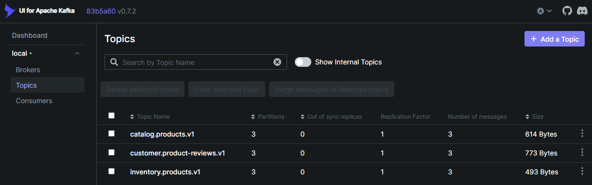

# 🗺️ Kafka Guide

This quickstart guide provides resources and examples for running Kafka locally using Docker Compose. It includes:

- **Zookeeper:** Coordination service for Kafka

- **Kafka Broker:** Single broker configuration suitable for development

- **Kafka UI:** Web interface at http://localhost:8080 for easy management

---

## 🗃️ Directory Structure

```

.
├── README.md                   # This documentation file
├── compose.yaml                # Docker Compose configuration for Kafka
├── .env                        # Environment file required to configure local environent variables
├── .env.example                # Environment sample file that specifies the required local environent variables
├── compose.sh                  # Shell script to execute docker compose commands
├── docs                        # Directory containing other docs relating to kafka
|   ├── cheatsheet.md           # Basic guide of commonly used kakfa cli commands
|   ├── install-kafka-client.md # Basic guide on how to install kafka client tools locally
└── examples                    # Directory containing collection of various examples on using Kafka
    ├── example-1.sh            # Example script to create catalog product topic and use producer to send events to topic
    ├── example-1.json          # Sample catalog product data
    ├── example-2.sh            # Example script to create inventory product topic and use producer to send events to topic
    ├── example-2.json          # Sample inventory product data
    ├── example-3.sh            # Example script to create product reviews topic and use producer to send events to topic
    └── example-3.json          # Sample product review data

```

---

## 🛠️ Usage

### Prerequisites

- Docker and Docker Compose
- Shell environment (bash)
- Execute permissions on `compose.sh` (`chmod +x compose.sh`)
- Create `.env` file based on sample `.env.example` file and configure environment variables

### Configure ".env" File

Create `.env` file based on sample `.env.example` file and configure environment variables.

After creating and configuring `.env` file, run the following command to load environment variables from `.env` file:

```bash
source ./.env
```

### Manage Kafka

Run the following command to manage Kafka using docker compose:

```bash
# Run from ./kafka

# start kafka stack
docker compose up --detach

# view all service logs
docker compose logs -f

# view kafka service logs
docker compose logs -f kafka

# show running containers
docker compose ps

# destroy kafka stack
docker compose down --volumes --remove-orphans

```

Alternatively, use the provided utility script `compose.sh` to run common commands like `up`, `down`, `logs`, `ps` and `exec`.

```bash
# start kafka
./compose.sh up

# destroy kafka
./compose.sh down

# view kafka logs
./compose.sh logs -f kafka

# list containers for this stack
./compose.sh ps
```

> [!IMPORTANT]
> &nbsp;  
> Access Kafka UI at: http://localhost:8080  
> &nbsp;  
> 

### Connect To Kafka

```bash
docker exec -it kafka kafka-broker-api-versions --bootstrap-server localhost:9092
```

---

## 📢 Creating Topics

### Using Docker Exec

Create a topic for catalog product events:

```bash
docker exec -it kafka kafka-topics --create \
  --bootstrap-server localhost:9092 \
  --topic catalog.products.v1 \
  --partitions 3 \
  --replication-factor 1 \
  --config retention.ms=604800000 \
  --config segment.ms=86400000
```

Create a topic for product inventory:

```bash
docker exec -it kafka kafka-topics --create \
  --bootstrap-server localhost:9092 \
  --topic inventory.products.v1 \
  --partitions 3 \
  --replication-factor 1
```

Create a topic for product reviews:

```bash
docker exec -it kafka kafka-topics --create \
  --bootstrap-server localhost:9092 \
  --topic customer.product-reviews.v1 \
  --partitions 2 \
  --replication-factor 1
```

---

## 🏭✉️ Producing E-commerce Product Data

### Producing Catalog Updates

Produce catalog product events (JSON format):

```bash
docker exec -it kafka kafka-console-producer \
  --bootstrap-server localhost:9092 \
  --topic catalog.products.v1 \
  --property "parse.key=true" \
  --property "key.separator=:"
```

Then enter data (format is `key:value`):

```json
PROD001:{"product_id":"PROD001","name":"Wireless Headphones","category":"Electronics","price":79.99,"brand":"AudioTech","timestamp":"2025-11-04T10:30:00Z","event_type":"created"}
PROD002:{"product_id":"PROD002","name":"Running Shoes","category":"Sports","price":129.99,"brand":"SpeedFit","timestamp":"2025-11-04T10:31:00Z","event_type":"created"}
PROD001:{"product_id":"PROD001","name":"Wireless Headphones","category":"Electronics","price":69.99,"brand":"AudioTech","timestamp":"2025-11-04T11:00:00Z","event_type":"price_updated"}
```

Press `Ctrl+D` to exit.

### Producing Inventory Updates

```bash
docker exec -it kafka kafka-console-producer \
  --bootstrap-server localhost:9092 \
  --topic inventory.products.v1 \
  --property "parse.key=true" \
  --property "key.separator=:"
```

Sample inventory data:

```json
PROD001:{"product_id":"PROD001","warehouse_id":"WH01","quantity":150,"reserved":20,"available":130,"last_updated":"2025-11-04T10:35:00Z"}
PROD002:{"product_id":"PROD002","warehouse_id":"WH01","quantity":85,"reserved":5,"available":80,"last_updated":"2025-11-04T10:36:00Z"}
PROD001:{"product_id":"PROD001","warehouse_id":"WH02","quantity":200,"reserved":30,"available":170,"last_updated":"2025-11-04T10:37:00Z"}
```

Press `Ctrl+D` to exit.

### Producing Product Reviews

```bash
docker exec -it kafka kafka-console-producer \
  --bootstrap-server localhost:9092 \
  --topic customer.product-reviews.v1 \
  --property "parse.key=true" \
  --property "key.separator=:"
```

Sample review data:
```json
REV001:{"review_id":"REV001","product_id":"PROD001","user_id":"USER123","rating":5,"title":"Excellent sound quality!","comment":"Best headphones I've ever owned. Crystal clear audio.","timestamp":"2025-11-04T12:00:00Z"}
REV002:{"review_id":"REV002","product_id":"PROD001","user_id":"USER456","rating":4,"title":"Great value","comment":"Good quality for the price, comfortable to wear.","timestamp":"2025-11-04T12:15:00Z"}
REV003:{"review_id":"REV003","product_id":"PROD002","user_id":"USER789","rating":5,"title":"Perfect fit!","comment":"Very comfortable running shoes, excellent cushioning.","timestamp":"2025-11-04T12:30:00Z"}
```

---

## 🕵✉️ Consuming Messages

### Basic Console Consumer

Consume from the beginning:

```bash
docker exec -it kafka kafka-console-consumer \
  --bootstrap-server localhost:9092 \
  --topic catalog.products.v1 \
  --from-beginning \
  --property print.key=true \
  --property key.separator=" => "
```

Consume only new messages:

```bash
docker exec -it kafka kafka-console-consumer \
  --bootstrap-server localhost:9092 \
  --topic catalog.products.v1 \
  --property print.key=true \
  --property key.separator=" => "
```

### Consumer with Group

```bash
docker exec -it kafka kafka-console-consumer \
  --bootstrap-server localhost:9092 \
  --topic catalog.products.v1 \
  --group catalog-product-analytics-group \
  --property print.key=true
```

---

## Managing Consumer Groups

### List Consumer Groups

```bash
docker exec -it kafka kafka-consumer-groups \
  --bootstrap-server localhost:9092 \
  --list
```

### Describe Consumer Group

```bash
docker exec -it kafka kafka-consumer-groups \
  --bootstrap-server localhost:9092 \
  --group catalog-product-analytics-group \
  --describe
```

### Reset Consumer Group Offset

```bash
docker exec -it kafka kafka-consumer-groups \
  --bootstrap-server localhost:9092 \
  --group catalog-product-analytics-group \
  --topic catalog.products.v1 \
  --reset-offsets \
  --to-earliest \
  --execute
```

---

## Useful Commands

### Delete Topic

```bash
docker exec -it kafka kafka-topics --delete \
  --bootstrap-server localhost:9092 \
  --topic catalog.products.v1
```

### Alter Topic Configuration

```bash
docker exec -it kafka kafka-configs --alter \
  --bootstrap-server localhost:9092 \
  --entity-type topics \
  --entity-name catalog.products.v1 \
  --add-config retention.ms=1209600000
```

### Check Topic Size

```bash
docker exec -it kafka kafka-log-dirs \
  --bootstrap-server localhost:9092 \
  --describe \
  --topic-list catalog.products.v1
```

---

## 💡 Examples

After running the examples in this section, there will be 3 topics created and can be viewed using the [Kafka UI (http://localhost:8080/ui/clusters/local/all-topics)](http://localhost:8080/ui/clusters/local/all-topics)



### Example 1

Create product catalog topic and produce related data.

See [example-1.sh](./examples/example-1/example-1.sh)

```bash
# ./examples/example-1/example-1.sh

docker exec -it kafka kafka-topics --create \
  --bootstrap-server localhost:9092 \
  --topic catalog.products.v1 \
  --partitions 3 \
  --replication-factor 1

cat example-1.json | \
  docker exec -i kafka kafka-console-producer \
  --bootstrap-server localhost:9092 \
  --topic catalog.products.v1 \
  --property "parse.key=true" \
  --property "key.separator=:"
```

### Example 2

Create product inventory topic and produce related data.

See [example-2.sh](./examples/example-2/example-2.sh)

```bash
# ./examples/example-2/example-2.sh

docker exec -it kafka kafka-topics --create \
  --bootstrap-server localhost:9092 \
  --topic inventory.products.v1 \
  --partitions 3 \
  --replication-factor 1

cat example-1.json | \
  docker exec -i kafka kafka-console-producer \
  --bootstrap-server localhost:9092 \
  --topic inventory.products.v1 \
  --property "parse.key=true" \
  --property "key.separator=:"
```

### Example 3

Create product reviews topic and produce related data.

See [example-3.sh](./examples/example-3/example-3.sh)

```bash
# ./examples/example-3/example-3.sh

docker exec -it kafka kafka-topics --create \
  --bootstrap-server localhost:9092 \
  --topic customer.product-reviews.v1 \
  --partitions 3 \
  --replication-factor 1

cat example-3.json | \
  docker exec -i kafka kafka-console-producer \
  --bootstrap-server localhost:9092 \
  --topic customer.product-reviews.v1 \
  --property "parse.key=true" \
  --property "key.separator=:"
```

---

## 📝 Notes

- **Topic Naming**: Use hierarchical naming based on `domain.subdomain.entity` format (e.g., `catalog.products`, `sales.orders`)
- **Partitioning**: Start with 3 partitions for development, adjust based on testing
- **Replication Factor**: Use 1 for local development (3+ for production)
- **Keys**: Always use meaningful keys for proper partitioning and compaction
- **Retention**: Configure appropriate retention policies based on your use case
- **Monitoring**: Use Kafka UI at http://localhost:8080 for easy monitoring
- **Consumer Groups**: Use descriptive group IDs that indicate the consumer's purpose

---
