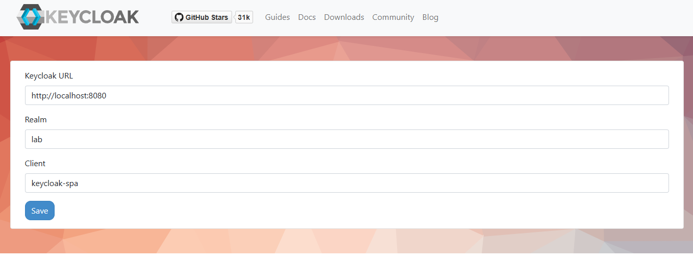

# 🗺️ Keycloak Guide

This quickstart guide provides resources and examples for running Keycloak locally using Docker Compose. It includes:

- **Keycloak Service**: Runs a Keycloak instance with default realm, clients and users (using realm import on initialization).

- **Keycloak Configuration Service (optional)**: An optional service that can be enabled to run an initialization script on container startup

> [!NOTE]
> &nbsp;
> Learn more about Keycloak:  
>   
> - [Official Website](https://www.keycloak.org/)
> - [Official Docs](https://www.keycloak.org/documentation)

---

## 🗃️ Directory Structure

```
.
├── README.md               # This documentation file
├── auth.http               # Http request file to help test authentication
└── stack                   # Directory containing files to run a local instance of Keycloak using Docker
    ├── compose.yaml        # Docker Compose configuration for services
    ├── .env                # Environment file required to configure local environent variables
    ├── .env.example        # Environment sample file that specifies the required local environent variables
    ├── compose.sh          # Shell script to execute docker compose commands
    ├── kcadmn.sh           # Shell script to execute open bash session on keycloak container to run kcadm commands
    ├── setup.sh            # Shell script to execute setup initialization script
    └── realms              # Directory containing realm files that can be imported as part of container initialization
        └── lab-realm.json  # A sample realm file that defines a realm, clients, and users

```

---

## 🛠️ Usage

### Prerequisites

- Docker and Docker Compose
- Shell environment (bash)
- Execute permissions on `compose.sh` (`chmod +x compose.sh`)
- Execute permissions on `shell.sh` (`chmod +x mongosh.sh`)
- Execute permissions on `kcadm.sh` (`chmod +x mongosh.sh`)
- Create `.env` file based on sample `.env.example` file and configure environment variables

### Configure ".env" File

Create `.env` file based on sample `.env.example` file and configure environment variables.

```yaml
LAB_KC_BOOTSTRAP_ADMIN_USERNAME=admin
LAB_KC_BOOTSTRAP_ADMIN_PASSWORD=admin
```

After creating and configuring `.env` file, run the following command to load environment variables from `.env` file:

```bash
source ./.env
```

### Manage Keycloak Stack

Run the following command to manage Keycloak using docker compose:

```bash
# Run from ./stack folder

# start keycloak stack
docker compose up --detach --build

# watch logs
docker compose logs -f

# show running containers
docker compose ps

# destroy keycloak stack
docker compose down --volumes --remove-orphans

```

Alternatively, use the provided utility script `compose.sh` to run common commands like `up`, `down`, `logs`, `ps` and `exec`.

```bash
# start keycloak stack
./compose.sh up

# destroy keycloak stack
./compose.sh down

# view logs
./compose.sh logs -f mongo

# list containers for this stack
./compose.sh ps
```

> [!NOTE]
> &nbsp;  
> As a quick test to verify that Keycloak is running, run the following curl command:
> &nbsp;  
> &nbsp;  
> `curl -sS http://localhost:8080/realms/master`

### Connect To Keycloak

1. Access Keycloak administrator console via web app: [http://localhost:8080](http://localhost:8080):

2. Alternatively, access keycloak using `kcadm.sh` cli admin tool:

    ```bash
    # Start interactive shell in keycloak container using provided ./kcadm.sh script
    # Remember to ensure execute permissions: chmod +x ./kcadm.sh

    ./kcadmin.sh

    pwd # should display /opt/keycloak/bin

    ./kcadm.sh get realms --fields id,realm,enabled
    ./kcadm.sh get users -r lab --fields username,email,enabled

    ```

> [!NOTE]
> See also: [https://www.keycloak.org/getting-started/getting-started-zip](https://www.keycloak.org/getting-started/getting-started-zip)

---

## Test Auth

The `./stack/realms/lab-realm.json` file defines default setup for the following resources:

- new realm called `lab`
- 2 clients
  - A Keycloak SPA client that can be used using Keycloak SPA found at [https://www.keycloak.org/app/](https://www.keycloak.org/app/)
  - An HTTP client that can be used via HTTP tools like curl, postman, insomnia etc.
- 1 user


### Test using Keycloak SPA

In your browser, navigate to [https://www.keycloak.org/app/](https://www.keycloak.org/app/) and enter the following information:

  - Keycloak URL: http://localhost:8080
  - Realm: lab
  - Client: keycloak-spa

Click `Save` when you're done.



Click `Sign in`


Provide Credentials:

- username: testuser
- password: password


Successfully signed in


### Test Using HTTP Client

Using VSCode, ensure that the [Rest Client](https://marketplace.visualstudio.com/items?itemName=humao.rest-client) extension is installed.

Open the `./auth.http` file and execute the request

Alternatively, use the curl command as follows:

```bash
curl --request POST \
  --url http://localhost:8080/realms/lab/protocol/openid-connect/token \
  --header 'content-type: application/x-www-form-urlencoded' \
  --data grant_type=password \
  --data password=password \
  --data username=testuser \
  --data client_id=http-client \
  --data client_secret=secret
```

---
