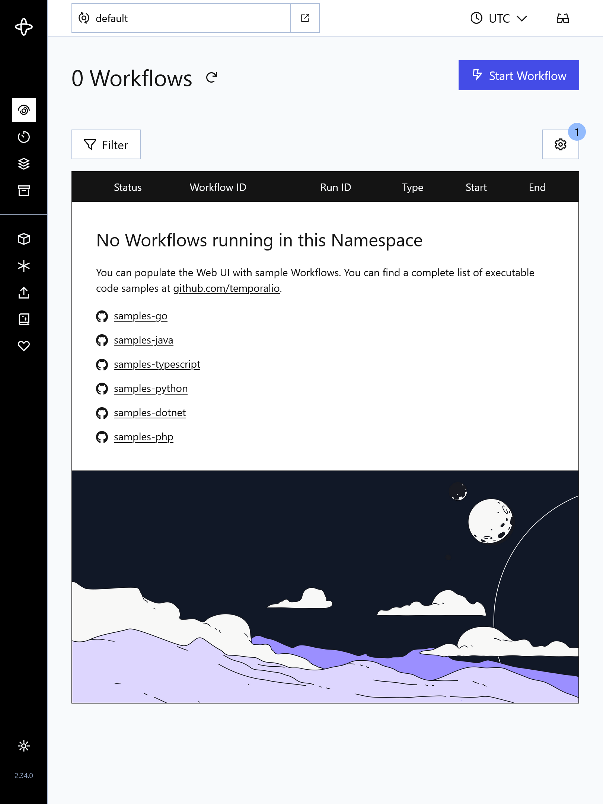

# 🗺️ Temporal Quickstart Guide

This quickstart guide provides resources and examples for running Temporal Server locally using Docker Compose.

[temporal.io](https://temporal.io/) provides a guide for running a sample-server:

  - See [Samples-Server](https://github.com/temporalio/samples-server)
  - See [official docker compose repo](https://github.com/temporalio/samples-server/tree/main/compose)

This quickstart guide is a trimmed down version of the offical offering. It uses the following configuration:
  - Postgresql
  - Elasticsearch

---

## 🗃️ Directory Structure

```
|
├── README.md              # This documentation file
├── compose.yaml           # Docker Compose configuration for Temporal Server
├── .env                   # Environment file required to configure local environent variables
├── dynamicconfig/         # Configuration folder used during temporal server initialization
└── scripts/               # Scripts folder used during temporal server initialization

```

---

## ✅ Prerequisites

To use these files, you must first have the following installed:

- [Docker](https://docs.docker.com/engine/install/) (includes Docker Compose)

---

## 🛠️ Usage

### Manage Temporal Server

The following steps will run a local instance of the Temporal Server using the default configuration file (`docker-compose.yml`):

1. Clone this repository.
2. Change directory into the `/quickstart-guides/temporal` folder.
3. Run the `docker compose up` command.

```bash

gh repo clone temporalio/samples-server
cd samples-server/compose
docker compose up [--detach]

```

After the Server has started, you can open the Temporal Web UI in your browser: [http://localhost:8081](http://localhost:8081).

> [!NOTE]
> By default, the Temporal Web UI is available at http://localhost:8080. This configuration uses http://localhost:**8081** as the port 8080 is commonly in use by other apps.



To stop and remove containers and volumes:

```bash
docker compose down --volumes --remove-orphans
```

You can also interact with the Server using the [Temporal CLI](https://docs.temporal.io/cli).

### Temporal CLI

To install the Temporal CLI, see [https://docs.temporal.io/cli#install](see https://docs.temporal.io/cli#install)

```bash

➜ temporal --version
temporal version 1.5.1 (Server 1.29.1, UI 2.42.1)

```

The following is an example of how to create a new namespace `test-namespace` with 1 day of retention:

```bash
temporal operator namespace create --namespace test-namespace --retention 1d
```

### Use SDK

Get started building Workflows with the SDK samples:

- [Go](https://github.com/temporalio/samples-go)
- [Java](https://github.com/temporalio/samples-java)
- [Python](https://github.com/temporalio/samples-python)
- [TypeScript](https://github.com/temporalio/samples-typescript)
- [.NET](https://github.com/temporalio/samples-dotnet)
- [PHP](https://github.com/temporalio/samples-php)
- [Ruby](https://github.com/temporalio/samples-ruby)

For the most up-to-date SDK references, see [https://docs.temporal.io/develop](https://docs.temporal.io/develop).

---
